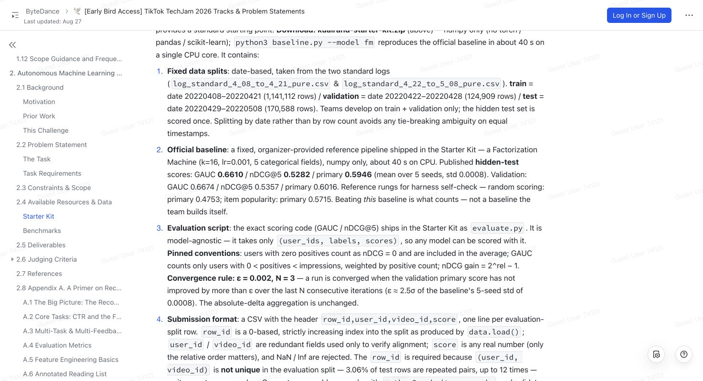

# Part 1: Milestone 0

## KuaiRand Autonomous ML Research Agent — trustworthy measurement

This project will eventually build an AI research agent that proposes, trains,
and compares recommender-system experiments. Milestone 0 does **not** build that
agent yet. It first proves that we can measure future experiments correctly.

If you are new to machine learning, remember one number for now:

> The organizer's official FM baseline has a test `primary` score of **0.5946**
> when averaged over five repeatable training runs. Future models must beat this
> score under the same evaluator and data split.

### What happens from data to result?

```text
KuaiRand CSV files
        |
        v
data.py: loads rows and creates train / validation / test splits
        |
        v
baseline.py: trains a model and gives every shown video a score
        |
        v
evaluate.py: ranks videos within each user and calculates the metrics
        |
        v
submit.py: writes or validates the final prediction CSV
```

The [benchmark contract](configs/benchmarks/kuairand_pure.yaml) records these
rules in one machine-readable place. The
[verification script](scripts/verify_starter_kit.py) detects changes to the
organizer-supplied files, and the [tests](tests/) prove that the baseline and
submission rules behave as expected.

## The official source and expected result

The screenshot below is from the official
[TikTok TechJam problem statement](https://bytedance.larkoffice.com/wiki/DNtSwxgeciCS2nkiUefc5qqtnkf).
It is the external reference for the fixed split sizes, official baseline,
evaluator, convergence rule, and submission format that Milestone 0 freezes.



The published machine-readable values included with the Starter Kit live in
[`baseline_scores.json`](kuairand-starter-kit/baseline_scores.json). The same
values are copied into our frozen
[`kuairand_pure.yaml`](configs/benchmarks/kuairand_pure.yaml) contract so later
agent code can read them without hardcoding metric names.

| Model | Test GAUC | Test nDCG@5 | Test primary | Purpose |
| --- | ---: | ---: | ---: | --- |
| Random | 0.4996 | 0.4511 | 0.4753 | Sanity-check lower rung |
| Item popularity | 0.6308 | 0.5121 | 0.5715 | Simple non-ML comparison |
| Official FM | 0.6610 | 0.5282 | **0.5946** | Baseline to beat |

These FM values are the mean of five runs. A single run may be slightly above
or below them.

## One dataset, three chronological splits

There are not five datasets. There is one KuaiRand-Pure dataset, divided by
date:

| Split | Dates | Rows | Users | Responsibility |
| --- | --- | ---: | ---: | --- |
| Train | 2022-04-08 to 2022-04-21 | 1,141,112 | 26,210 | Teach the model |
| Validation | 2022-04-22 to 2022-04-28 | 124,909 | 22,377 | Check progress and choose when to stop |
| Test | 2022-04-29 to 2022-05-08 | 170,588 | 23,875 | Report an honest final result |

The FM fits its parameters only on `train`. After every training epoch, it
checks `validation` and remembers the best version. It evaluates `test` only
after restoring that best validation version. See
[`data.py`](kuairand-starter-kit/data.py) for the split and
[`baseline.py`](kuairand-starter-kit/baseline.py) for training and early
stopping.

The downloaded reference archive contains labels for its local test period so
we can reproduce the baseline. A separately supplied competition-final hidden
test must remain private and must never be used to tune the model. This boundary
is tracked in [the organizer questions](docs/organizer_questions.md).

## What are the five seeds?

A **seed** is a repeat number that makes a computer's pseudo-random choices
repeatable. It is not new data and does not change the split.

The integration test uses seeds `0, 1, 2, 3, 4`. Each seed:

1. Loads the same 1,141,112 training rows.
2. Initializes the FM model slightly differently.
3. Shuffles the same training rows in a repeatable order.
4. Trains one independent model.
5. Evaluates on the same validation and test rows.

We average the five results because one run can be a little lucky or unlucky.
The test checks that this average matches the organizer's published result
within `0.0002`. The exact loop is in
[`test_benchmark_contract.py`](tests/test_benchmark_contract.py).

## What do the model metrics mean?

The model gives each video impression a score. The exact score is not important;
the order is. A larger score means “show this video higher for this user.”

- **GAUC** checks how often a user's positive videos rank above that user's
  negative videos. Around `0.5` is random; higher is better.
- **nDCG@5** rewards putting useful videos near the top five positions. Higher
  positions matter more. The realistic ceiling in this dataset is below `1.0`
  because some users have no positive videos.
- **primary** is `(GAUC + nDCG@5) / 2`. This is the main score we compare.

For example:

```text
valid  GAUC 0.6671 | nDCG@5 0.5358 | primary 0.6015
test   GAUC 0.6621 | nDCG@5 0.5286 | primary 0.5953
```

`valid` is the practice-exam result and `test` is the final-exam result for that
one seed. It is normal for seed 0's `0.5953` to differ slightly from the
five-seed published mean of `0.5946`.

## The nine quick checks

Run them with:

```bash
uv run pytest -q -m "not integration"
```

Expected summary:

```text
.........  [100%]
9 passed, 1 deselected
```

Each dot is one passing check:

1. Run the verifier and confirm all five protected Starter Kit files match
   their hashes and the primary formula is frozen.
2. Give the verifier a deliberately wrong hash and confirm it fails.
3. Score a tiny two-user example and confirm the evaluator's exact GAUC,
   nDCG@5, primary, user count, and row count.
4. Write and read a valid submission containing a duplicate user-video pair.
5. Reject a submission with the wrong CSV header.
6. Reject a submission whose `row_id` does not start at zero.
7. Reject a submission whose user/video values do not align with the data row.
8. Reject a submission containing `NaN` instead of a finite score.
9. Reject a submission with too few rows.

Checks 1–3 are in
[`test_benchmark_contract.py`](tests/test_benchmark_contract.py). Checks 4–9
are in [`test_submission_format.py`](tests/test_submission_format.py).

These are software safety checks. They do not train the real FM model, so they
finish quickly.

## The integration test

Run the slow, real-data check with:

```bash
uv run pytest -q -m integration
```

Expected summary:

```text
.  [100%]
1 passed
```

This is one test function, but inside it the official FM is trained five times,
once for each seed. On the current machine it takes roughly two minutes. Pytest
captures the per-epoch output, so the short summary only shows whether the full
five-run comparison passed.

To watch one seed train and print every epoch:

```bash
cd kuairand-starter-kit
../.venv/bin/python baseline.py \
  --data_dir ../data/KuaiRand-Pure/data \
  --model fm \
  --seed 0
```

## Beginner setup

Requirements: Python 3.11 or newer and
[`uv`](https://docs.astral.sh/uv/getting-started/installation/).

Install the locked Python environment:

```bash
uv sync
```

Download and extract the public dataset from the repository root:

```bash
mkdir -p data
curl -L -o data/KuaiRand-Pure.tar.gz \
  https://zenodo.org/records/10439422/files/KuaiRand-Pure.tar.gz
tar xzf data/KuaiRand-Pure.tar.gz -C data
```

Verify the official files and print the resolved contract:

```bash
uv run python scripts/verify_starter_kit.py
```

Then run the nine quick checks before the integration test.

The dataset, virtual environment, secrets, and generated outputs are ignored by
Git through [`.gitignore`](.gitignore).

## Why the Starter Kit stays unchanged

Files under [`kuairand-starter-kit/`](kuairand-starter-kit/) are the
organizer-supplied executable reference. Some documentation there is in
Chinese, so this root README explains the important parts in English. We do not
translate the official file in place because changing it would break its hash.

The protected behavior includes:

- Fixed split dates and source-row order in
  [`data.py`](kuairand-starter-kit/data.py)
- The official FM in [`baseline.py`](kuairand-starter-kit/baseline.py)
- Metric formulas in [`evaluate.py`](kuairand-starter-kit/evaluate.py)
- CSV rules in [`submit.py`](kuairand-starter-kit/submit.py)
- Published values in
  [`baseline_scores.json`](kuairand-starter-kit/baseline_scores.json)

Do not implement candidate experiments inside the checked-in Starter Kit.
Future model and feature code should live outside it and pass scores into the
frozen evaluator. If a protected file changes, the verifier should fail.

## What Milestone 0 accomplished

Before Milestone 0, we had organizer scripts plus conflicting written metric
claims. After Milestone 0, we can automatically answer:

- Are the official evaluator and splits unchanged?
- Which metrics actually determine success?
- Can this environment reproduce the organizer's baseline?
- Is a prediction CSV aligned and safe to submit?
- Did a future experiment improve the model, or did it change the measuring
  rules?

That is why Milestone 0 is measurement infrastructure rather than a new model.

## Current limitations

- This commit freezes the benchmark only; the autonomous research loop, SQLite
  run history, safe worktrees, and candidate model code are not implemented yet.
- The brief still conflicts with the executable Starter Kit about whether the
  scored pair is `GAUC` + `nDCG@5` or `NDCG@10` + `Recall@50`. See
  [`organizer_questions.md`](docs/organizer_questions.md); do not treat the
  current contract as final competition confirmation.
- The downloaded archive has a public, labeled local test split for reproduction.
  The private final-test artifact, compute budget, and any retraining/ensemble
  policy have not been supplied.
- Published FM values are five-seed means, not a promise that every individual
  seed will produce the same number.

## What we can improve next

The next milestones should keep this benchmark frozen while building the actual
research workflow:

1. Save baseline commands, logs, metrics, duration, and prediction artifacts as
   structured run records instead of terminal-only output.
2. Add the command-line interface and deterministic champion-selection logic.
3. Run candidate experiments in isolated Git worktrees without exposing secrets
   or allowing changes to protected files.
4. Add a fake LLM first, proving that three automated experiment iterations can
   run without network access.
5. Connect a provider-agnostic real LLM only after the safe loop works.
6. Explore recommender improvements such as pairwise/listwise ranking loss,
   user-history sequences, multi-task feedback, and temporal features.

The full proposed sequence is documented in
[`CODEX_IMPLEMENTATION_PLAN.md`](CODEX_IMPLEMENTATION_PLAN.md). Note that this
plan file is currently a local, untracked planning input rather than part of the
Milestone 0 commit.

## Repository map

| Path | Responsibility |
| --- | --- |
| [`README.md`](README.md) | Beginner onboarding and project status |
| [`configs/benchmarks/kuairand_pure.yaml`](configs/benchmarks/kuairand_pure.yaml) | Frozen benchmark contract |
| [`scripts/verify_starter_kit.py`](scripts/verify_starter_kit.py) | Protected-file integrity check |
| [`tests/test_benchmark_contract.py`](tests/test_benchmark_contract.py) | Contract, evaluator, and real baseline tests |
| [`tests/test_submission_format.py`](tests/test_submission_format.py) | Submission writer/checker tests |
| [`docs/organizer_questions.md`](docs/organizer_questions.md) | Unresolved official-contract questions |
| [`kuairand-starter-kit/`](kuairand-starter-kit/) | Unmodified organizer reference implementation |
