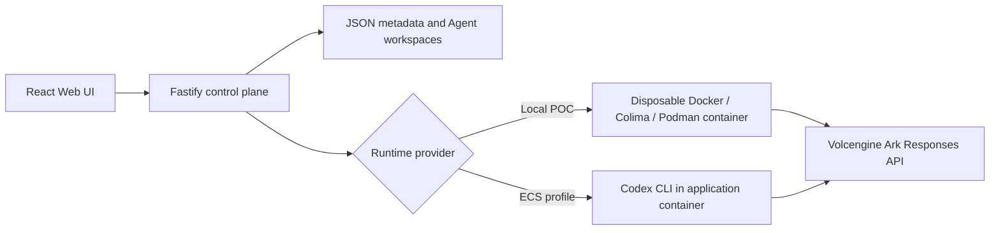

# Volc Agent Launchpad

A minimal Agent platform for three-day middleware hackathons. It provides Agent
CRUD, a browser Playground, persistent workspaces, and Codex CLI backed by the
Volcengine Ark Responses API.

Run it locally with Docker, Colima, or rootless Podman, or deploy it to
Volcengine ECS.

> [!WARNING]
> This is a single-user proof of concept. It is not a hardened multi-tenant
> sandbox. Do not use production data. See [SECURITY.md](SECURITY.md).

## This fork: the Kill Switch track

This fork extends the starter into a Port-inspired Agent control plane that
enters the hackathon under **exactly one track: Kill Switch**. It protects the
long-lived model-provider credential from a compromised Agent Runtime. Provider
keys live only in a trusted model-gateway sidecar process; each Agent turn runs
in a disposable Runtime that holds only an opaque, short-lived, run-scoped lease
and can reach the gateway and nothing else. When an operator invokes Kill, the
control plane revokes the lease first, then terminates and removes the Runtime,
and a later safe Run proves recovery. Queue orchestration, Agent-to-Agent
handoffs, redacted traces, and token usage are supporting evidence for that
boundary, not separate tracks.

Start here:

- [docs/ONBOARDING.md](docs/ONBOARDING.md) - new developer setup, repo map, dev loop.
- [docs/ARCHITECTURE.md](docs/ARCHITECTURE.md) - components, trust zones, data flow.
- [docs/MIDDLEWARE.md](docs/MIDDLEWARE.md) - platform/middleware requirement mapping.
- [docs/DEMO.md](docs/DEMO.md) - the three-minute operator demo.
- [docs/DEVIATIONS.md](docs/DEVIATIONS.md) - frozen baseline record and deviations.

## Features

- React and TypeScript Web UI (operator console; rework in progress)
- Agent create, edit, start, stop, delete, and multi-turn chat
- Fastify control plane with asynchronous Run state
- Persistent Agent workspaces and Codex sessions
- Disposable Docker, Colima, or Podman container for each local turn
- Trusted model-gateway sidecar: the only holder of provider keys, issuing
  opaque run-scoped leases (`npm run gateway`)
- Fixed Planner -> Builder -> Reviewer orchestration over a persisted FIFO queue,
  with correlated Agent-to-Agent handoffs
- Redacting telemetry ledger and read surfaces: `/api/providers`,
  `/api/runs/:id/observability`, `/api/security/posture`
- Revoke-first Kill with observable cleanup, and safe recovery on a later Run
- Inherited Docker and Terraform deployment paths for Volcengine ECS (out of
  scope for the Kill Switch MVP - see [docs/DEPLOYMENT.md](docs/DEPLOYMENT.md))

## Requirements

- Node.js 22+
- npm 10+
- Docker, Colima, or Podman
- A Volcengine Ark API key and endpoint that supports the Responses API

Codex CLI is included in the Runtime image and is not required on the host.

## Local browser SOP

### 1. Check the local tools

Install Node.js 22+ and one supported container engine, then verify them:

```bash
node --version
npm --version
docker --version        # Docker Desktop, Docker Engine, or Colima
podman --version        # Use this instead when running Podman
```

Only one container engine is required. Codex CLI is already included in the
Runtime image.

### 2. Clone the repository

```bash
git clone <repository-url> volc-agent-launchpad
cd volc-agent-launchpad
```

Skip this step when already working from the repository root.

### 3. Start the POC

```bash
ARK_API_KEY=your-ark-api-key \
ARK_MODEL=ep-your-endpoint-id \
npm run poc
```

The first run installs Node.js dependencies and builds the Runtime image. The
script automatically selects Docker, Colima, or Podman.

### 4. Open the browser

Visit <http://localhost:3000>, or open it from the terminal:

```bash
open http://localhost:3000       # macOS
xdg-open http://localhost:3000   # Linux desktop
```

In the Web UI:

1. Select **Create Agent**.
2. Enter a name, description, and workspace instructions.
3. Select **Create Agent** again.
4. Enter a task in the Playground, for example:

   ```text
   Create a TypeScript hello-world CLI, add a test, and run it.
   ```

The Agent can write files, run commands, and continue the same Codex session in
later messages.

### 5. Stop and resume

Press `Ctrl+C` in the startup terminal. The script removes temporary Runtime
containers but keeps Agent workspaces and conversations.

- macOS state: `~/.volc-agent-launchpad/`
- Linux state: `.local/`
- Custom location: set `LOCAL_POC_DATA_ROOT`

Run the same `npm run poc` command to continue later.

### Select a specific container engine

Force Podman when multiple engines are installed:

```bash
CONTAINER_ENGINE=podman \
ARK_API_KEY=your-ark-api-key \
ARK_MODEL=ep-your-endpoint-id \
npm run poc
```

Colima uses `CONTAINER_ENGINE=docker` because it exposes the Docker CLI.

For a clean Linux host, follow the
[rootless Podman setup](docs/LOCAL_POC.md#rootless-podman-on-linux).

## Docker Compose

Create and edit the configuration:

```bash
./scripts/bootstrap-local.sh
```

Required values in `.env`:

```dotenv
ARK_API_KEY=your-ark-api-key
ARK_MODEL=ep-your-endpoint-id
APP_AUTH_TOKEN=replace-with-at-least-24-random-characters
```

Start the application:

```bash
docker compose up --build
```

Open <http://localhost:3000>. Stop it without deleting Agent data:

```bash
docker compose down
```

## Development

```bash
npm install
cp .env.example .env
npm install --global @openai/codex@0.111.0
npm run dev
```

- Web UI: <http://localhost:5173>
- API: <http://localhost:3000>

`npm run dev` runs the control plane with the host-process Codex runner - no
containers, no gateway. Use local paths in `.env` when running outside Docker:

```dotenv
APP_DATA_DIR=.data
AGENT_WORKSPACE_ROOT=workspaces
CODEX_HOME=codex-home
```

### The container / secretless path

The Kill Switch story runs with the model-gateway sidecar and disposable
Runtime containers, in two terminals:

```bash
# terminal 1 - trusted model-gateway sidecar (only holder of provider keys)
set -a; . ./.env; set +a
npm run gateway -w @launchpad/server

# terminal 2 - control plane + disposable Runtime containers
ARK_API_KEY=your-ark-api-key ARK_MODEL=ep-your-endpoint-id npm run poc
```

`npm run gateway` is defined in `apps/server/package.json`, so run it with
`-w @launchpad/server` (or from `apps/server/`). Full walkthrough:
[docs/ONBOARDING.md](docs/ONBOARDING.md) and [docs/LOCAL_POC.md](docs/LOCAL_POC.md).

## Deployment

Local Docker, Colima, or rootless Podman is the supported path for this fork.
See [docs/DEPLOYMENT.md](docs/DEPLOYMENT.md) and
[docs/LOCAL_POC.md](docs/LOCAL_POC.md).

The starter's Volcengine ECS paths - `scripts/deploy-existing-ecs.sh` and the
Terraform in `deploy/volcengine/` - are inherited unchanged and are **out of
scope for the Kill Switch MVP** ([tasks/plan.md](tasks/plan.md) section 3). They
have not been validated against the secretless gateway topology.

## Configuration

### Control plane (`apps/server/src/config.ts`)

| Variable | Default | Purpose |
| --- | --- | --- |
| `ARK_API_KEY` | Required for a live turn | Ark model API key. In the secretless profile it is read only by the gateway process. |
| `ARK_MODEL` | Required for a live turn | Responses-capable endpoint or model ID. |
| `ARK_BASE_URL` | Beijing v3 endpoint | Ark OpenAI-compatible API URL. |
| `APP_AUTH_TOKEN` | Empty on loopback | Shared demo token; use 24+ URL-safe characters remotely. |
| `RUNTIME_PROVIDER` | `local-process` | `container` for disposable local Runtime containers. |
| `CODEX_SANDBOX_MODE` | `workspace-write` | Codex inner sandbox mode. |
| `CODEX_TIMEOUT_MS` | `600000` | Maximum duration of one turn. |
| `PROJECT_WORKSPACE_ROOT` | `project-workspaces` | Root for Project-owned shared workspaces. |
| `ORCHESTRATION_QUEUE_LIMIT` | `50` | Max pending orchestrations before `429`. |
| `LOCAL_POC_DATA_ROOT` | Platform-specific | Local metadata, workspace, and session directory. |

### Secretless profile (control plane -> gateway)

| Variable | Default | Purpose |
| --- | --- | --- |
| `MODEL_GATEWAY_URL` | `http://127.0.0.1:4000` | Base URL the control plane uses to reach the gateway management API. |
| `MODEL_GATEWAY_ADMIN_TOKEN` | Empty | Gateway-admin capability. **Setting it (with `RUNTIME_PROVIDER=container`) activates the secretless profile.** Never injected into a Runtime. |
| `RUNTIME_PROVIDER_ID` | `mock` | Which allowlisted gateway provider id run leases bind to. |
| `MODEL_ID` | Falls back to `ARK_MODEL` | Model id bound to the lease and injected into the Runtime per run. |
| `RUNTIME_GATEWAY_NETWORK` | `bridge` | Name of the internal Docker/Podman network that connects the Runtime to the gateway only. |

### Gateway sidecar process (`apps/server/src/gateway/config.ts`)

Read **only** by `npm run gateway`. The control plane never reads these.

| Variable | Default | Purpose |
| --- | --- | --- |
| `MODEL_GATEWAY_HOST` | `127.0.0.1` | Gateway bind host. |
| `MODEL_GATEWAY_PORT` | `4000` | Gateway bind port. |
| `MODEL_GATEWAY_ADMIN_TOKEN` | Required (>= 24 chars) | Admin capability the `/internal/*` management API requires. |
| `GATEWAY_PROVIDERS` | `mock` only | Comma-separated allowlisted provider ids. |
| `PROVIDER_<ID>_PROTOCOL` | - | `mock` or `responses-http`. |
| `PROVIDER_<ID>_MODELS` | - | Comma-separated allowlisted model ids (>= 1). |
| `PROVIDER_<ID>_BASE_URL` | - | Upstream base URL (`responses-http` only). |
| `PROVIDER_<ID>_KEY_ENV` | - | Name of the env var holding this provider's key (`responses-http` only); the value stays in the gateway process. |

See [.env.example](.env.example) for every variable, grouped and commented.

## How it works



The first turn uses `codex exec`; later turns resume the stored Codex thread.
Deleting an Agent archives its workspace under `workspaces/.deleted/`.

The diagram above is the baseline starter flow. Under the **Kill Switch
profile** the Runtime no longer talks to Ark directly: it reaches the
model-gateway sidecar with a run-scoped lease, and the gateway is the only
process that holds the provider key. See
[docs/ARCHITECTURE.md](docs/ARCHITECTURE.md) for the target design, trust zones,
and data flow.

## Validation

```bash
npm run check                          # typecheck + test + build
bash scripts/secret-sweep.sh           # must print "secret-sweep: clean"
terraform fmt -check -recursive deploy/volcengine
docker compose config
```

When a container engine is available, run the live Kill Switch boundary proof:

```bash
bash scripts/security-checkpoint.sh
```

## Documentation

- [Onboarding](docs/ONBOARDING.md)
- [Architecture](docs/ARCHITECTURE.md)
- [Middleware requirement mapping](docs/MIDDLEWARE.md)
- [Three-minute demo](docs/DEMO.md)
- [Local POC](docs/LOCAL_POC.md)
- [Deployment](docs/DEPLOYMENT.md)
- [Deviations and baseline record](docs/DEVIATIONS.md)
- [Security policy](SECURITY.md)
- [Contributing](CONTRIBUTING.md)
- `docs/HACKATHON_EXTENSION_GUIDE.md` - planned; not yet in the repository.

## License

[MIT](LICENSE)
