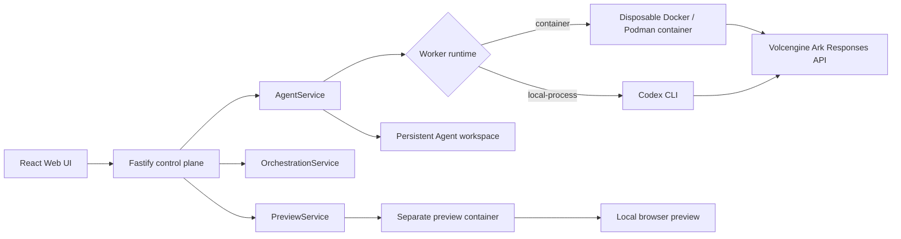

# Volc Agent Launchpad

Volc Agent Launchpad is a small Agent platform for middleware-focused
hackathons. It provides Agent CRUD and lifecycle controls, persistent
workspaces, a React Playground and Team workspace, Codex-backed execution,
per-Agent model selection, and local application previews.

> [!WARNING]
> This is a single-user proof of concept. It intentionally has no identity,
> complete tracing, audit system, or hardened multi-tenant sandbox. Do not use
> production data or credentials. See [SECURITY.md](SECURITY.md).

## Screenshots

### Agent Playground


### Create an Agent


## Features

- React and TypeScript Web UI with Playground, Team, model, and Preview views
- Agent create, edit, start, stop, delete, and multi-turn chat
- Fastify control plane with asynchronous Run state and cancellation
- Persistent per-Agent workspaces, messages, runs, and Codex sessions
- Sequential and supervisor Team orchestration with bounded, redacted handoffs
- Per-Agent provider/model configuration with server-side validation
- Disposable Docker, Colima, or Podman execution for local Agent turns
- Long-lived workspace previews with Vite/Next/Node detection and static HTML fallback
- Docker and Terraform deployment paths for Volcengine ECS

## Developer onboarding

### Prerequisites

- Node.js 22+
- npm 10+
- A Volcengine Ark API key and a Responses-capable model or endpoint ID
- Docker, Colima, or Podman for the container-backed POC

There are two useful local workflows. Use the container-backed POC for the
shortest path to a working Agent runtime. Use development mode when iterating
on the React app or Fastify server and you have the Codex CLI installed on the
host.

### Fastest path: container-backed POC

The POC installs dependencies when needed, builds `Dockerfile.runtime`, builds
the Web/API, and starts the production server. The runtime image already
contains the Codex CLI, so the host does not need Codex installed.

```bash
node --version
npm --version
docker --version        # or podman --version

export ARK_API_KEY=your-ark-api-key
export ARK_MODEL=ep-your-endpoint-id
npm run poc
```

Open <http://localhost:3000>. The script selects a running Docker, Colima, or
Podman engine automatically. To choose one explicitly:

```bash
CONTAINER_ENGINE=podman ARK_API_KEY=your-ark-api-key ARK_MODEL=ep-your-endpoint-id npm run poc
```

Press `Ctrl+C` to stop. Agent workspaces and conversations are retained:

- macOS: `~/.volc-agent-launchpad/`
- Linux: `.local/`
- Custom location: set `LOCAL_POC_DATA_ROOT`

### Development mode: Web + API on the host

```bash
npm install
npm install --global @openai/codex@0.111.0

export HOST=127.0.0.1
export ARK_API_KEY=your-ark-api-key
export ARK_MODEL=ep-your-endpoint-id
export RUNTIME_PROVIDER=local-process
npm run dev
```

The Web UI runs at <http://localhost:5173> and the API at
<http://localhost:3000>. `npm run dev` reads configuration from the process
environment; export the values above or use your normal environment manager.
The default local-process runtime requires a working `codex` command on the
host. The POC path above uses `RUNTIME_PROVIDER=container` instead.

For a predictable local data layout, you can also set:

```bash
export APP_DATA_DIR=.data
export AGENT_WORKSPACE_ROOT=workspaces
export CODEX_HOME=codex-home
export CODEX_SANDBOX_MODE=workspace-write
```

### Docker Compose

Create `.env` manually; the current tree does not contain `.env.example`.
Compose runs in production mode and binds the API to `0.0.0.0`, so a shared
token is required:

```dotenv
ARK_API_KEY=your-ark-api-key
ARK_MODEL=ep-your-endpoint-id
APP_AUTH_TOKEN=replace-with-at-least-24-random-characters
```

Then run:

```bash
docker compose up --build
```

Open <http://localhost:3000>. Stop the stack without deleting persisted Agent
data with:

```bash
docker compose down
```

The legacy `scripts/bootstrap-local.sh` still assumes an `.env.example` file,
so use the manual `.env` setup above until that script is updated.

## Validation and change workflow

Run the focused project check before opening a PR:

```bash
npm run check
```

This runs TypeScript checks, server tests, and production builds. Useful
additional checks for infrastructure changes are:

```bash
terraform fmt -check -recursive deploy/volcengine
docker compose config
git diff --check
```

When changing behavior, keep the write scope clear:

1. Server behavior belongs under `apps/server/src/` and should have focused
   server tests.
2. Web behavior belongs under `apps/web/src/`.
3. Runtime and local-container behavior belongs in `Dockerfile.runtime`,
   `scripts/`, or the server Runtime/Preview modules.
4. Keep workspace data, credentials, build output, and Terraform state out of
   commits.
5. Update this README or the relevant implementation handoff when behavior or
   setup changes.

See [CONTRIBUTING.md](CONTRIBUTING.md) for the contribution checklist.

## Repository map

```text
apps/server/src/
  app.ts                         Fastify HTTP routes and error boundary
  agent-service.ts               Agent lifecycle, runs, messages, workspaces
  orchestration/                 Team execution and supervisor routing
  models/                        Provider/model discovery and resolution
  preview/                       Preview detection, lifecycle, and containers
apps/web/src/                    React UI and orchestration components
scripts/start-local-poc.sh       Container-backed local POC entrypoint
Dockerfile                      Full application image for Compose/ECS
Dockerfile.runtime               Disposable Codex worker image
deploy/volcengine/               Terraform resources and ECS configuration
docs/                            Roadmaps and implementation handoffs
```

## How it works



The backend owns lifecycle, workspace ownership, model validation, preview
operations, and orchestration policy. A disposable Codex worker can modify and
run files in an Agent's persistent workspace; the workspace remains after the
worker exits. A preview is a separate managed runtime so it can continue
serving an application between Agent turns.

## Current progress — 2026-08-30

### Implemented in the current tree

- **Platform baseline:** Agent CRUD and lifecycle controls, asynchronous Runs,
  cancellation, multi-turn chat, persisted JSON state, per-Agent workspaces,
  and persistent Codex sessions.
- **Execution boundary:** local-process execution plus disposable Docker,
  Colima, or Podman containers with resource and sandbox configuration.
- **Team orchestration:** sequential and supervisor modes, bounded steps,
  timeout/cancellation handling, persisted turns/events, shared Team context,
  redacted handoffs, terminal continuation, and Team conversation deletion.
- **Model configuration:** provider/model discovery and filtering, persisted
  per-Agent worker model selection, capability-aware validation, and separate
  supervisor model configuration.
- **Wave 7 preview:** backend-owned start, inspect, restart, stop, and logs;
  supported Vite/Next/narrow Node entrypoint detection; workspace-root
  `index.html` static fallback; bounded preview errors surfaced in the UI; and
  cleanup when an Agent stops or is deleted.

### Next planned work

- **Wave 8:** user-defined roles, skills, platform tools, and backend-enforced
  permissions, including skill discovery and installation boundaries.
- **Wave 9:** observability and evidence such as correlation IDs, policy
  decisions, model metadata, timings, and a clearer execution timeline.
- **Wave 10:** failure/recovery scenarios, stale-runtime reconciliation,
  explicit safe retries, and visible policy-denial evidence.
- **Wave 11:** demo hardening, reproducible judging flows, a short demo script,
  and consolidated documentation.
- **Wave 12 and later:** optional project-level shared workspaces, richer
  collaboration views, public deployment, and other expansion only after the
  core middleware boundaries are stable.

### Current boundaries

- The default local authorization service is intentionally permissive; full
  role- and permission-driven enforcement is planned for Wave 8.
- Preview does not install dependencies automatically. It detects supported
  npm app shapes or serves a safe root `index.html` fallback.
- Preview URLs are local loopback ports opened in a new browser window. There
  is no general remote-port proxy or public preview deployment yet.
- Agent-callable preview tools, durable orchestration resume, parallel Agent
  execution, and full tracing/audit remain deferred.

The detailed roadmap is [the overall implementation plan](docs/AGENT_MIDDLEWARE_OVERALL_IMPLEMENTATION_PLAN_V4.md).
The latest shared-context handoff is [Wave 5](docs/WAVE_5_SHARED_CONVERSATION_CONTEXT_HANDOFF.md).
Preview behavior is documented in [the Wave 7 runtime handoff](docs/WAVE_7_PREVIEW_RUNTIME.md) and [the static-preview/error-UI plan](docs/WAVE_7_STATIC_HTML_PREVIEW_AND_ERROR_UI_IMPLEMENTATION_PLAN.md).

## Configuration

| Variable | Default | Purpose |
| --- | --- | --- |
| `ARK_API_KEY` | Required for Agent runs | Ark API key. |
| `ARK_MODEL` | Required for Agent runs | Responses-capable endpoint or model ID. |
| `ARK_BASE_URL` | Beijing v3 endpoint | OpenAI-compatible Ark API URL. |
| `APP_AUTH_TOKEN` | Empty outside production | Shared bearer token; use at least 24 random characters when exposed. |
| `RUNTIME_PROVIDER` | `local-process` | Set to `container` for disposable local runtime containers. |
| `CODEX_SANDBOX_MODE` | `workspace-write` | Codex inner sandbox mode. |
| `CODEX_TIMEOUT_MS` | `600000` | Maximum duration of one Agent turn. |
| `APP_DATA_DIR` | `.data` | JSON metadata and persisted application data. |
| `AGENT_WORKSPACE_ROOT` | `workspaces` | Persistent Agent workspaces. |
| `CODEX_HOME` | `codex-home` | Codex configuration and session state. |

See `apps/server/src/config.ts` for the complete environment schema, including
container resource limits, model discovery settings, and supervisor settings.

## Deployment

The repository includes an existing-ECS Docker path and a Terraform path for a
complete Volcengine environment. Review the scripts and templates before using
them in a real account:

- [Existing-ECS deployment script](scripts/deploy-existing-ecs.sh)
- [Volcengine Terraform deployment script](scripts/deploy-volcengine.sh)
- [Terraform configuration](deploy/volcengine/main.tf)
- [Application Dockerfile](Dockerfile)

Deployment requires Volcengine credentials, Terraform, and environment-specific
configuration. Do not put credentials, `.tfstate`, or `terraform.tfvars` in a
commit.

## Documentation

- [Overall implementation roadmap](docs/AGENT_MIDDLEWARE_OVERALL_IMPLEMENTATION_PLAN_V4.md)
- [Wave 5 shared conversation context handoff](docs/WAVE_5_SHARED_CONVERSATION_CONTEXT_HANDOFF.md)
- [Wave 7 preview runtime](docs/WAVE_7_PREVIEW_RUNTIME.md)
- [Wave 7 static HTML preview and error UI plan](docs/WAVE_7_STATIC_HTML_PREVIEW_AND_ERROR_UI_IMPLEMENTATION_PLAN.md)
- [Contributing](CONTRIBUTING.md)
- [Security policy](SECURITY.md)

## License

[MIT](LICENSE)
