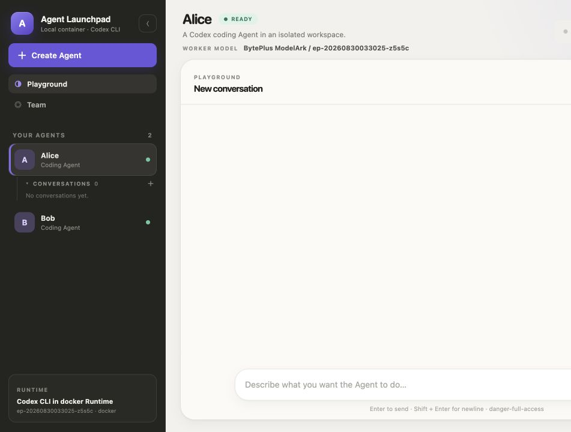
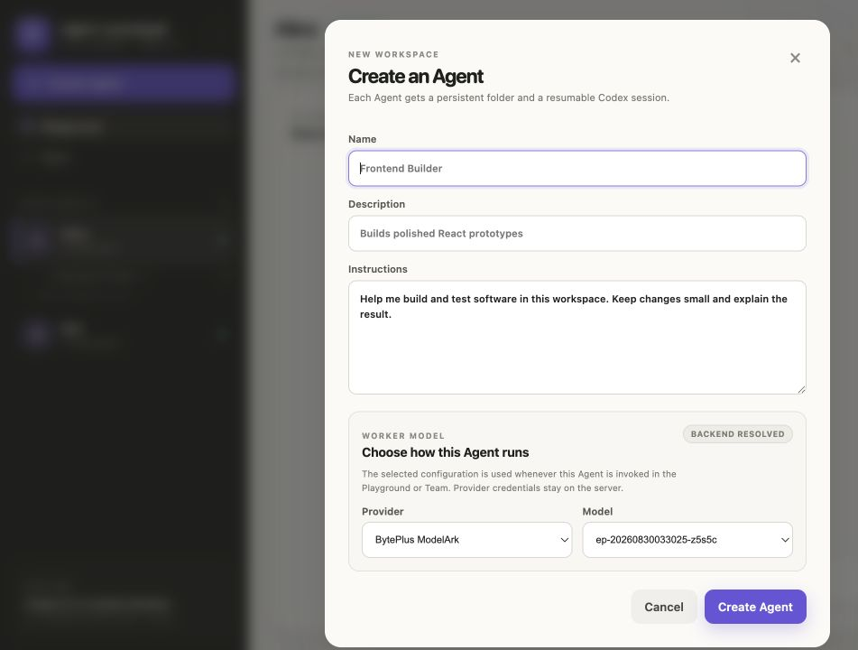

# Volc Agent Launchpad

## Overview

Volc Agent Launchpad is a local-first Agent platform for middleware-focused
hackathons. It provides Agent CRUD, lifecycle controls, chat, persistent
workspaces and Codex sessions, asynchronous runs, Team orchestration,
per-Agent model configuration, and local application previews.

## Screenshots





## Local-first quickstart

Use the local container-backed path first. With Node.js 22+ installed, clone the
repository and run:

```bash
git clone <repository-url>
cd liuqitechjam
npm install
export ARK_BASE_URL=https://ark.cn-beijing.volces.com/api/v3
export ARK_API_KEY=your-ark-api-key
export ARK_MODEL=ep-your-endpoint-id
npm run poc
```

Optional overrides: set `CONTAINER_ENGINE` to `docker` or `podman` to force an
engine, `LOCAL_POC_DATA_ROOT` to change persistent state location, or
`APP_AUTH_TOKEN` to require an app token.

`npm run poc` invokes [scripts/start-local-poc.sh](scripts/start-local-poc.sh),
selects Docker, Colima, or Podman, builds [Dockerfile.runtime](Dockerfile.runtime),
persists local state, builds the app, and serves it at `http://localhost:3000`.
The POC container image includes Codex. The script also binds the control plane
for the runtime network and automatically configures the engine-specific
`MCP_CONTAINER_URL` (`host.docker.internal` for Docker, or
`host.containers.internal` for Podman). Set `MCP_CONTAINER_URL` yourself when
using custom container networking.

The challenge brief makes local Docker/Colima/Podman execution the default
judging path. ECS/cloud deployment is optional and does not affect the score,
so deployment is not required for the local workflow.

## Development and checks

For contributor iteration, after `npm install`, run the Web UI and API on the
host with the same Ark settings:

```bash
export ARK_BASE_URL=https://ark.cn-beijing.volces.com/api/v3
export ARK_API_KEY=your-ark-api-key
export ARK_MODEL=ep-your-endpoint-id
npm run dev
```

The Web UI runs at `http://localhost:5173`; the API runs at
`http://localhost:3000`; and the health endpoint is
`GET http://localhost:3000/api/health`.

Default local-process development requires a `codex` executable on the host.
The POC container image includes Codex, so the container-backed quickstart does
not require a host Codex installation.

Run the project check with:

```bash
npm run check
```

## Current progress — 2026-08-30

Implemented:

- Agent CRUD/lifecycle/chat; persistent workspaces and Codex sessions; async
  runs; local/container execution.
- Orchestration foundation with sequential/supervisor modes, bounded steps,
  shared Team context, continuation and deletion.
- Per-Agent provider/model/reasoning configuration.
- Wave 7 preview runtime including supported npm app detection, static root
  `index.html` fallback, lifecycle/logs/error UI.

Next/planned: Wave 8 roles/skills/tools/permission enforcement, then
observability, failure/recovery, demo hardening, optional expansion.

## Limitations

- Single-user proof of concept.
- Production authorization requires Permit.io configuration; permissive and
  repository-backed policies remain test-only.
- No automatic dependency installation.
- Preview is loopback/open-new-window oriented.

## Links

- [Contributing](CONTRIBUTING.md) · [Security](SECURITY.md)
- [Overall implementation plan](docs/AGENT_MIDDLEWARE_OVERALL_IMPLEMENTATION_PLAN_V4.md)
- [Wave 5 shared conversation context handoff](docs/WAVE_5_SHARED_CONVERSATION_CONTEXT_HANDOFF.md)
- [Wave 7 preview runtime](docs/WAVE_7_PREVIEW_RUNTIME.md)
- [Wave 7 static HTML preview and error UI plan](docs/WAVE_7_STATIC_HTML_PREVIEW_AND_ERROR_UI_IMPLEMENTATION_PLAN.md)
- [Permit policy setup and resource scope](docs/PERMIT_POLICY_SETUP.md)
- [Dockerfile](Dockerfile) · [Dockerfile.runtime](Dockerfile.runtime) · [docker-compose.yml](docker-compose.yml)
- [Local POC script](scripts/start-local-poc.sh)
