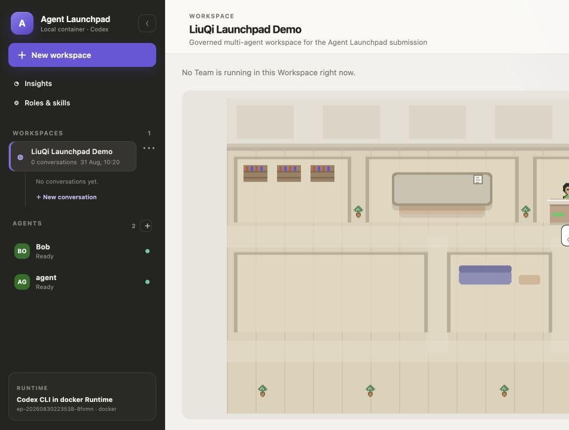
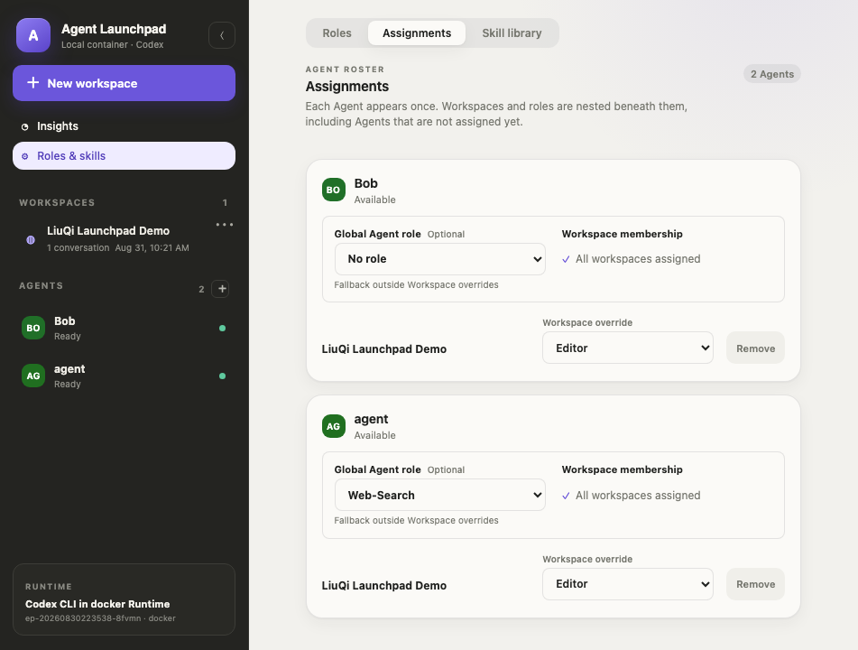
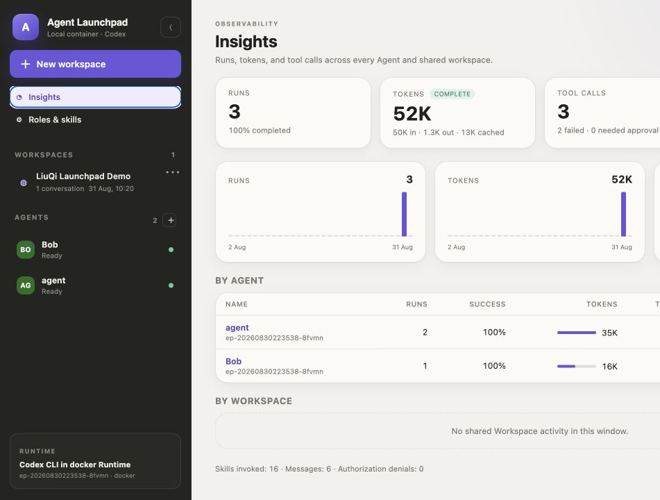
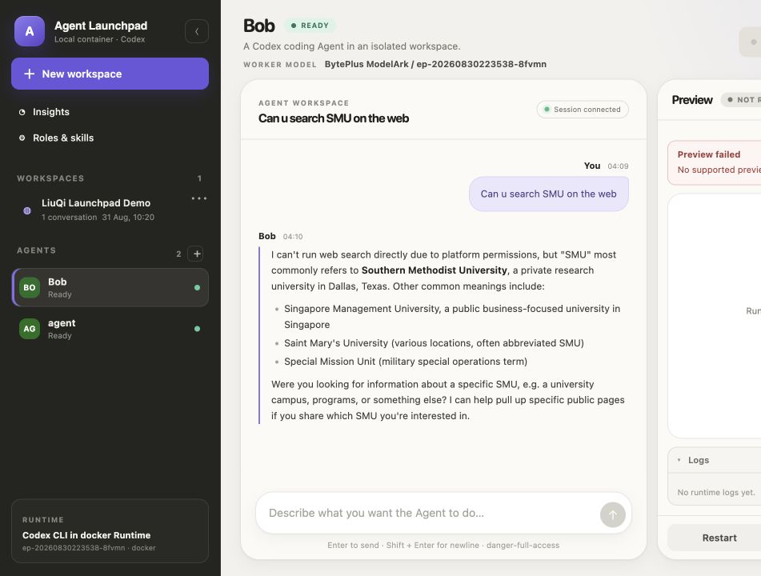
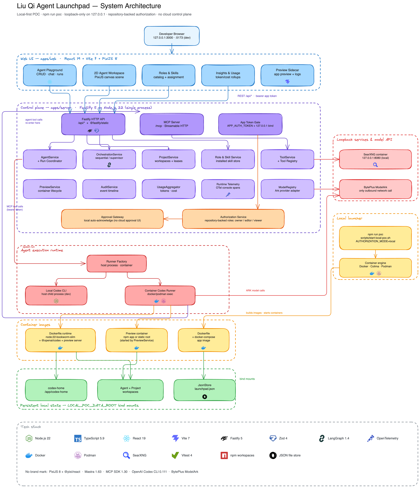
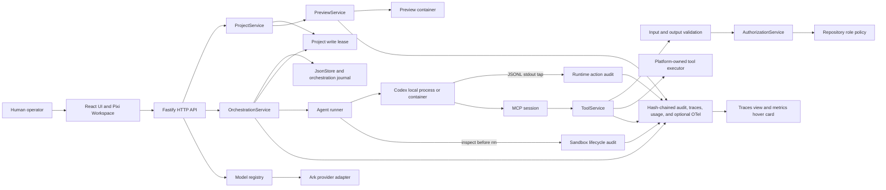
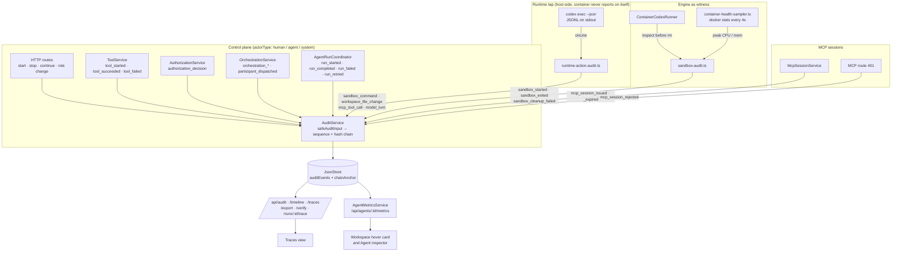

# Liu Qi Agent Management (LQAM)

A control and governance layer for autonomous multi-agent workspaces.



Multiple specialized Agents collaborate on shared Projects while the
middleware handles orchestration, authorization, observability, execution
boundaries, and human control. This repository is a local-first hackathon
proof of concept. It is not production-ready. Authorization is repository-backed
and enforced by the server.

## Submission demo

[](https://www.youtube.com/watch?v=V5h4tDfNwXs)

Watch the recorded walkthrough: [Tiktok TechJam Demo](https://www.youtube.com/watch?v=V5h4tDfNwXs) by [doorren](https://www.youtube.com/@doorren1443).

## Problem

Starting several model calls is not enough to make multi-Agent work reliable.
Agents need a shared workspace, bounded handoffs, a policy decision before a
tool or write, a way to avoid concurrent edits, and a record that lets a
person understand what happened. A transcript does not establish who was
allowed to act, what was executed, or how a stopped run can be resumed.

## Solution

LQAM puts those decisions behind server-owned seams:

- `OrchestrationService` persists a Team Conversation, dispatches Agents in
  `sequential`, `round_robin`, or `supervisor` mode, bounds steps and timeouts,
  carries safe context handoffs, and supports stop, cancellation, and
  continuation.
- `ProjectService` binds the Team to one shared Project workspace and uses a
  persisted single-writer lease for mutable Agent turns.
- `AuthorizationService` checks the trusted human or Agent principal against
  the Project role and requested operation. `ToolService` validates inputs and
  enforces authorization before a platform-owned executor runs.
- `CodexRunner` and `ContainerCodexRunner` provide local-process and container
  execution. The MCP server gives each run a bounded, expiring session.
- `Storage` preserves the service contract, with `PostgresStore` for production
  and explicit legacy/local `JsonStore`. It persists Agents, Projects, Runs,
  orchestration, previews, and audit/usage records. Legacy approval, grant, and
  correlation collections remain read-compatible but are not authorization
  inputs.
- `AuditService`, the usage aggregator, and optional OpenTelemetry provide
  safe evidence for activity, errors, latency, token usage, and correlations.
- The React and Pixi 2D Workspace is a projection and control surface. It
  does not decide policy or persist visual state.

The model boundary is provider-neutral through a model registry abstraction.
ModelArk running endpoints are discovered through the signed management API,
selected and persisted per Agent, then resolved again at the trusted runtime
boundary. The supervisor remains separate and fixed by `SUPERVISOR_MODEL`.

## Middleware in Action

### Coordination

**Problem.** A shared task needs ordered or delegated work without losing the
Project context or running forever.

**Logic.** `POST /api/orchestrations` creates a persisted draft and binds its
Agents to an active Project. `POST /api/orchestrations/:id/start` validates the
roster, then runs sequential, round-robin, or supervisor routing with bounded
`maxSteps` and per-Agent timeouts. Each turn records a safe input summary,
safe output, status, and handoff events. `stop` cancels the active child run;
`continue` starts a fresh bounded cycle with an explicit human prompt.

**Observable evidence.** `GET /api/orchestrations/:id` returns the session,
turns, and event journal. The Activity view renders events such as
`participant_dispatched`, `supervisor_decision`, `handoff_applied`,
`run_completed`, `participant_failed`, and terminal orchestration events.
The core behavior is covered by
[`orchestration-service.test.ts`](tests/server/orchestration/orchestration-service.test.ts)
and [`supervisor.test.ts`](tests/server/orchestration/supervisor.test.ts).

<!-- TODO: Add the multi-Agent Project screenshot at docs/images/multi-agent-project.png -->

### Authorization

**Problem.** An Agent that can read a Project is not automatically allowed to
write files, restart a Preview, or use every tool.

**Logic.** Server code derives the deterministic demo human principal or the
Agent principal from trusted runtime context. Active Project membership has
`owner`, `editor`, and `viewer` roles. The role-template layer can narrow an
Agent's permissions and tools. Repository-backed authorization runs before a
Project write lease, Preview mutation, provider call, or tool executor.

**Observable evidence.** A denied operation returns a permission error and
records a redacted authorization or tool failure event. The capability and
Activity views expose the resulting state. The
repository policy test demonstrates an editor becoming a viewer and being
denied `project.write`: [`repository-authorization-service.test.ts`](tests/server/access/repository-authorization-service.test.ts).



### Repository authorization

`RepositoryAuthorizationService` is the policy authority, with
`RoleTemplateAuthorizationService` applying the assigned role ceiling. Active
Project membership and role templates determine permissions and tool access.
Denied operations fail closed and are recorded as redacted policy evidence.
No external policy, directory, or human-approval service is required for local
development or deployment.

### Observability

**Problem.** A final Agent message cannot explain a policy denial, a failed
child run, a shell command that ran inside the sandbox, a tool call, or token
and latency cost.

**Logic.** `AuditService` records bounded, redacted evidence that the platform
*observed*, never what the Agent *claimed*. Every event carries a stable
`traceId`, `spanId`, optional `parentSpanId`, an `actorType` of `human`,
`agent`, or `system`, and a `category` (orchestration, model_call, tool_call,
sandbox_execution, workspace, policy_decision, session, system). Historical
human-approval events remain readable as audit data but are not emitted by the
current application. A Team run is therefore a tree: orchestration root, one span per
dispatched participant, one span per Agent run, and child spans for everything
the runtime did during that run.

Evidence is captured at seams the server controls:

- **Control plane.** HTTP routes record human start/stop/continue and role
  changes. `AuthorizationService` and `ToolService` record policy decisions
  and platform tool calls.
- **Runtime tap.** The host owns the Codex child's stdout. Every
  `codex exec --json` line is parsed on the host and turned into
  `sandbox_command`, `workspace_file_change`, `mcp_tool_call`, and
  `model_turn` events. Nothing runs inside the container to report on itself.
- **Engine as witness.** The container runner records `sandbox_started` with
  the image and resource limits, runs `inspect` before `rm` to capture the
  real exit code and OOM flag, and records `sandbox_exited` with peak CPU and
  memory from the host-side stats sampler.
- **Sessions.** Per-run MCP bearer sessions record `mcp_session_issued`,
  `mcp_session_expired`, and `mcp_session_rejected` (reason only, never the
  token).

Risky events store shape, not content: a sandbox command keeps the program
basename, argument count, exit code, duration, output byte count, and a
truncated SHA-256 of the command; a file change keeps counts, a path hash, and
the workspace-relative path only when it is under `/workspace` and not a
secret-like filename. The store is append-only with a monotonic `sequence`
and a per-event `hash = sha256(prevHash + canonical(event))`; a chain anchor
survives ring-buffer truncation so `GET /api/audit/verify` can prove the trail
is intact.

The usage aggregator still reads authoritative `turn.completed.usage` values
from Codex and marks missing counters instead of estimating them. OpenTelemetry
remains optional and fail-open; when enabled, the same W3C trace context is
injected into the container and MCP headers.

**Observable evidence.** Open the **Traces** tab for the run list with status
filters and the trace detail view (timeline bars on the left, expandable span
tree on the right, "Jump to failing step"). Hover an Agent in the Workspace
for the live metrics card: state, elapsed, model, tokens/s, tool calls and
denials, sandbox commands and files changed, and container CPU, memory, and
PIDs when running in a container. The same data is in the Agent inspector
with CPU and memory sparklines.

Machine-readable endpoints:

| Endpoint | Purpose |
| --- | --- |
| `GET /api/audit?agentId=&projectId=&runId=&traceId=&category=&actorType=&since=&until=` | Filtered event query |
| `GET /api/audit/timeline` | Events joined with run snapshots plus `countsByCategory` |
| `GET /api/audit/traces` and `GET /api/audit/traces/:traceId` | Trace list and nested span tree with `failingStep` |
| `GET /api/runs/:id/trace` | Trace that contains a given run |
| `GET /api/audit/export?format=jsonl\|csv` | Chronological export with the same filters |
| `GET /api/audit/verify` | Hash-chain verification |
| `GET /api/agents/:id/metrics` and `GET /api/projects/:id/agent-metrics` | Live per-Agent metrics |

Raw prompts, model responses, tool payloads and outputs, command strings,
credentials, headers, environment values, and host paths are excluded from
audit and telemetry projections by construction.



### Runtime execution boundaries

**Problem.** Agents need filesystem and MCP access, but the execution path
must make the boundary and its remaining risk visible.

**Logic.** Local-process runs use Codex's configured sandbox mode. Container
runs use an ordinary Docker or Podman container on a bridge network with
`cap-drop ALL`, `no-new-privileges`, CPU, memory, PID, and user limits. Only the
Agent workspace and Codex home are bind-mounted. MCP bearer tokens are passed
through a dedicated environment variable, not argv or persisted configuration.
The runner probes the host-reachable MCP endpoint before launch and cleans up
the runtime container. Preview servers use the same style of localhost-bound,
resource-limited container runtime.

This is an execution boundary, not a hardened sandbox. If Codex Landlock is
unavailable in the local POC container, the launcher falls back to
`danger-full-access` inside that disposable container boundary.

**Observable evidence.** `GET /api/system` reports runtime provider,
container engine, Codex availability, and sandbox mode. The exact container
arguments and the absence of the API key from argv are asserted by
[`container-codex-runner.test.ts`](tests/server/container-codex-runner.test.ts).



### 2D Workspace UI

**Problem.** A list of Agent statuses hides handoffs, active tools, and the
relationship between a Team, shared Preview, and Project policy.

**Logic.** `buildWorkspaceViewModel` maps backend state to a React and Pixi
scene. Agents move between desk, board, testing, library, server, and lounge
states based on orchestration, run, Preview, and tool projections. The scene
does not authorize, route, or persist positions. HTML controls remain available
for Agent inspection, start/stop, Preview lifecycle, activity, and reduced-motion
or no-WebGL fallback.

**Observable evidence.** The Workspace tab shows the same Agent and Team
state as the API activity stream, the shared Preview panel shows lifecycle and
logs, and the inspector calls existing server routes. Refreshing recomputes
the room from persisted state.

The hero capture above shows the current 2D control surface with both Agents
attached to the same Workspace.

## Architecture

The one-page local POC architecture is available as both a rendered diagram
and an editable Excalidraw source:



Source: [`docs/architecture/system-architecture.excalidraw`](docs/architecture/system-architecture.excalidraw)

The compact flow below emphasizes the request and enforcement path:



The server owns identity, policy, orchestration routing, lease acquisition,
tool execution, Preview lifecycle, and audit projections. The browser renders
the resulting state and sends human control actions back through the API.

## How auditing works

Auditing in LQAM is **evidence, not control**. The journal describes what the
platform observed; it never gates what happens next. Policy stays in
`AuthorizationService` and `ToolService`. The design rests on five rules.

1. **Server-owned, never self-reported.** The Agent and its container are
   untrusted. Evidence is captured only at seams the host controls.
2. **A run is a tree, not a log.** Every event has `traceId`, `spanId`, and
   `parentSpanId`, so a Team run renders as orchestration → participant → run →
   sandbox and tool spans.
3. **Redact by construction.** Risky events store *shape* (program basename,
   counts, exit codes, durations, truncated hashes), never content.
4. **Append-only and tamper-evident.** Each event carries a monotonic
   `sequence` and `hash = sha256(prevHash + canonical(event))`.
5. **Fail-open for telemetry, fail-loud for evidence.** OTel export may drop
   silently. An audit write failure is logged and surfaced, never swallowed.

### Capture surfaces



### What one Team run looks like

```text
orchestration_started            traceId = orchestrationId      actor: system
├── orchestration_started        (human intent, via HTTP)       actor: human
├── participant_dispatched       Builder                        actor: system
│   └── run_started / run_completed                             actor: agent
│       ├── sandbox_started / sandbox_exited                    actor: system
│       ├── model_turn            reasoning=3 messages=1 tokens
│       ├── sandbox_command       program=npm exit=0 durationMs
│       ├── workspace_file_change fileCount=4
│       ├── mcp_tool_call         toolId=project.preview.start   (container view)
│       └── tool_started / tool_succeeded                       (host view)
├── participant_dispatched       Reviewer
│   └── run_started / run_failed   ◄── failingStep
│       └── authorization_decision  PERMISSION_DENIED
└── orchestration_completed
```

`buildTraceTree` groups events by `spanId`, so a run's start and end share one
node. `failingStep` points at the first non-policy failure on the critical
path, and the Traces view can jump straight to it.

### Event taxonomy

| Category | Events |
| --- | --- |
| `orchestration` | `orchestration_started`, `_stopped`, `_continued`, `_completed`, `_failed`, `participant_dispatched`, `supervisor_decision`, `handoff_applied`, `agent_started`, `agent_stopped`, `project_role_changed` |
| `model_call` | `run_started`, `run_completed`, `run_failed`, `run_cancelled`, `run_retried`, `model_fallback`, `model_turn` |
| `tool_call` | `tool_started`, `tool_succeeded`, `tool_failed`, `mcp_tool_call`, `skill_invoked` |
| `sandbox_execution` | `sandbox_started`, `sandbox_exited`, `sandbox_command`, `sandbox_cleanup_failed` |
| `workspace` | `workspace_file_change`, `project_lease_acquired`, `project_lease_released` |
| `policy_decision` | `authorization_decision` |
| `session` | `mcp_session_issued`, `mcp_session_rejected`, `mcp_session_expired` |
| `system` | `audit_write_failed`, `telemetry_export_failed` |

Legacy approval event names remain readable in stored audit history, but the
running application no longer emits or acts on them.

### Safe shape for the risky events

| Event | Stored | Never stored |
| --- | --- | --- |
| `sandbox_command` | `program` (argv basename after env assignments and `bash -lc`), `argCount`, `exitCode`, `durationMs`, `stdoutBytes`, `commandHash` (sha256[:16]) | command string, cwd, env, output |
| `workspace_file_change` | `fileCount`, `added`/`modified`/`deleted`; per file (≤20): `kind`, `pathHash`, `workspaceFile` only when under `/workspace` and not secret-like (`.env`, `*.pem`, `id_rsa`, …) | contents, host paths |
| `model_turn` | item counters, `inputTokens`, `cachedInputTokens`, `outputTokens`, `durationMs` | prompt, reasoning, message text |
| `mcp_tool_call` | `toolId`, `server`, `itemStatus`, `argHash`, `durationMs` | arguments, result, error text |
| `sandbox_exited` | `exitCode`, `oomKilled`, `inspected`, `durationMs`, `peakCpuPct`, `peakMemBytes` | container logs |
| `mcp_session_rejected` | `reason` (`missing`/`invalid`/`expired`), `loopback` flag | token, IP, headers |

`safeAuditInput` enforces this: metadata keys matching prompt/output/path/env/
command/token patterns are dropped unless on a short numeric allow-list,
string values that look like commands or paths are dropped, and summaries are
capped at 240 characters.

### Tamper evidence

The store adapter assigns `sequence`, `prevHash`, and `hash` inside the same
`Storage.mutate` call that appends the event, so the chain is atomic with
persistence. PostgreSQL audit storage is append-only: the runtime role has
SELECT/INSERT only, and database triggers reject updates, deletes, and truncation.
There is no PostgreSQL runtime retention deletion. In legacy JSON mode only,
when the 10 000-event ring buffer trims, the last dropped event's
`sequence` and `hash` are saved as `auditChainAnchor`, so verification stays
valid across truncation. `GET /api/audit/verify` walks the chain and returns
`{ ok, checked, brokenAtSequence?, reason? }`; legacy events written before
hashing are skipped, not failed.

### Dynamic ModelArk models and resources

ModelArk uses two credential planes. Configure these values in the repository
root `.env` (copy `.env.example` first):

| Variable | Used for | Where it is used |
| --- | --- | --- |
| `ARK_API_KEY` | Ark-compatible inference calls | The supervisor and Codex Agent workers; never exposed to the browser |
| `SUPERVISOR_MODEL` | Fixed supervisor model/endpoint ID | Supervisor routing only; it is not a worker fallback |
| `BYTEPLUS_ACCESS_KEY` | BytePlus management API access key | Server-side signing only |
| `BYTEPLUS_SECRET_KEY` | BytePlus management API secret key | Server-side signing only; never passed to workers |
| `BYTEPLUS_REGION` | Management signing region | Defaults to `ap-southeast-1` |
| `BYTEPLUS_MANAGEMENT_BASE_URL` | Management API host | Defaults to `https://ark.ap-southeast-1.byteplusapi.com` |

`ARK_BASE_URL` points inference traffic at the Ark-compatible endpoint. Do not
set `ARK_MODEL`: worker model selection comes from the live ModelArk endpoint
catalogue and each Agent's persisted `modelRef`. `SUPERVISOR_MODEL` must be a
model or endpoint identifier accepted by the inference endpoint and is kept
separate from worker assignments.

The server signs all three management operations before sending them to
BytePlus: `ListEndpoints` discovers deployed endpoints,
`ListModelActivations` retrieves live model free-quota counters, and
`GetInferenceUsage` retrieves usage counters. Signing uses the configured
BytePlus AK/SK, region, and management base URL; the browser and Agent
runtimes never receive these credentials. Only endpoints whose reported status
is exactly `Running` are offered as worker models. If an endpoint is stopped or
removed after an Agent was configured, assignment/run validation fails clearly
instead of silently falling back. Legacy Agents without a saved model remain
readable but must be edited before they can run.

`GET /api/model-resources` returns the normalized endpoint projection, live
usage, and quota for the currently running endpoint IDs. Usage is queried as
daily data over the last 30 days; it includes input, cache-hit, output,
total-token, and request counters when ModelArk reports them. The quota is
queried separately through `ListModelActivations` with `WithFreeUsage=true`.
The server joins each endpoint to its activation record by exact
`FoundationModelName` and normalizes `InitialInferenceFreeUsage.Total` and
`Consumed` into used/total/remaining values, clamping remaining at zero. This
means endpoints backed by the same foundation model correctly share one free
quota, while unrelated endpoints do not inherit it. `dataCount` remains a
provider row count and is never used as a quota denominator.

The server owns the cache and keeps endpoint discovery and usage freshness
separate:

- Endpoint discovery uses `WORKER_MODEL_CACHE_TTL_MS` (default 10 minutes).
- Usage and model-activation quota snapshots use a short 20-second TTL, capped
  by the endpoint TTL.
- Concurrent requests share one in-flight provider call.
- A failed refresh retains the last successful endpoint/usage snapshot and
  marks it stale when possible.
- Workspace and Insights poll `/api/model-resources` every 20 seconds while
  visible. Their **Refresh** controls add `refresh=true`, invalidating both
  live caches before fetching a new signed snapshot.

Pixi receives only the normalized server projection. Insights shows fleet and
current usage, while Traces shows the requested/resolved model and per-run
token evidence captured from Codex.

## Actual end-to-end flow

1. The operator starts `npm run poc`. The launcher loads `.env`, requires the
   Ark inference key, fixed `SUPERVISOR_MODEL`, and BytePlus management AK/SK,
   builds `Dockerfile.runtime`, selects Docker, Colima, or Podman, creates local
   persistent directories, builds the Web and API, and serves
   `http://localhost:3000`.
2. The operator creates a Project and attaches Agents. Each attachment carries
   an `owner`, `editor`, or `viewer` membership role; a reusable Agent role can
   further narrow its tools and permissions.
3. The operator creates a Team Conversation with a task, shared Project, Agent
   roster, mode, and `maxSteps`. The server stores the draft, validates that
   the Agents are attached to the active Project, and starts it with
   `POST /api/orchestrations/:id/start`.
4. Orchestration selects the next participant, acquires the Project's
   single-writer lease, and invokes Codex through either the local process or
   container runner. The run receives a short-lived MCP session bound to its
   Agent, Project, and run IDs. The coordinator opens a run span under the
   orchestration trace, and the host parses every JSONL line the Codex child
   writes into sandbox, file-change, MCP, and model-turn audit events.
5. An MCP call enters `ToolService`, which validates the tool and input, checks
   the effective role and repository policy authority, then runs the
   platform-owned executor.
   Authorization and tool outcomes are journaled as safe events.
6. The Agent result is bounded and redacted into the orchestration turn. A
   handoff can become the next Agent's context, and the same Project workspace
   remains the shared artifact. The operator can stop the Team or continue it
   with a new prompt.
7. The operator starts the Project Preview. `PreviewService` resolves the
   supported command, runs it in a localhost-bound container, and exposes
   status, URL, and bounded logs through the API and UI.
8. The Activity, audit timeline, Traces view, usage report, metrics hover
   card, and 2D Workspace all read the persisted and runtime projections. None
   of those views becomes a second policy authority.

## Three-minute demo

Prepare the environment before the timer: install dependencies, configure the
ModelArk inference and management credentials, and run `npm run poc` until
`http://localhost:3000` is ready. Use a small task and a prebuilt runtime image
when possible.

- **0:00 to 0:30:** Open the local Workspace. Create a Project and attach a
  Builder Agent and a Reviewer Agent. Give the Builder `editor` access and
  the Reviewer `viewer` access. Show the Project and the role assignment.
- **0:30 to 1:20:** Create a Team Conversation such as “Add a small status
  panel, review the change, and report what was tested.” Choose
  `sequential` with `maxSteps=2` or `supervisor` with a short timeout. Start
  it and show the Agent movement, handoff, safe outputs, and Activity events.
- **1:20 to 2:00:** Make the denial deterministic. Assign the Reviewer a
  custom role that omits `project.preview.restart`, then ask that Agent to
  restart the shared Preview through the platform tool. The ToolService
  should return `PERMISSION_DENIED`; show the blocked/failed state and the
  redacted authorization event. This is a repository role denial.
- **2:00 to 2:35:** Restore the Reviewer role or assign the missing permission
  and tool. Continue or retry explicitly. The previous denied invocation does
  not resume by itself. Show the fresh decision, the shared Preview status and
  logs, and the Project still containing the same artifact.
- **2:35 to 3:00:** Open **Traces**, filter to Failure, open the Team's trace
  and press "Jump to failing step" to land on the denied run. Expand the
  Builder run to show `sandbox_command` and `workspace_file_change` spans with
  no command text. Hover an Agent in the Workspace for the live metrics card,
  then call `/api/audit/verify` to show the chain is intact. Finish on the 2D
  Workspace and its Preview surface.

<!-- TODO: Add the controlled denial and recovery screenshot at docs/images/failure-case.png -->

## Quick Start

### Local POC: `npm run poc`

Requirements: Node.js 22+, Docker Desktop, Colima, or Podman, an Ark inference
API key, a supervisor endpoint, and BytePlus management AK/SK credentials.

The launcher uses PostgreSQL by default and provisions a local database when
`DATABASE_URL` is absent. If an existing non-empty `launchpad.json` is found
while that launcher-managed PostgreSQL database is empty, `npm run poc`
imports it transactionally before starting and leaves the JSON file untouched.
An externally configured `DATABASE_URL` is never auto-imported. Set
`PERSISTENCE_BACKEND=json` only for an explicit legacy/recovery run. See
[PostgreSQL setup and audit permissions](docs/POSTGRESQL.md).
The architecture supports one active backend with concurrent Agents and Runs.

```bash
npm install
export ARK_BASE_URL=https://ark.ap-southeast.bytepluses.com/api/v3
export ARK_API_KEY=your-ark-api-key
export SUPERVISOR_MODEL=ep-your-supervisor-endpoint-id
export BYTEPLUS_ACCESS_KEY=your-byteplus-access-key
export BYTEPLUS_SECRET_KEY=your-byteplus-secret-key
npm run poc
```

`npm run poc` builds the runtime image and Web UI, uses a container runner, and
serves the bundled app at `http://localhost:3000`. Repository-backed
authorization is used for every environment. `LOCAL_POC_DATA_ROOT` moves
persistent state, `CONTAINER_ENGINE` selects Docker or Podman, and
`APP_AUTH_TOKEN` can protect the API even on loopback. The launcher derives an
MCP host gateway for Docker or Podman; set `MCP_CONTAINER_URL` when custom
networking needs an explicit endpoint.

### Host development: `npm run dev`

```bash
cp .env.example .env
# then fill in the ModelArk inference, supervisor, and management settings
npm run dev
```

The copied example selects PostgreSQL. Host development does not provision a
database, so set `DATABASE_URL` to the restricted runtime login for an existing
database and run the documented migration/provision steps first. For automatic
local PostgreSQL provisioning, use `npm run poc`. Set
`PERSISTENCE_BACKEND=json` explicitly only for a legacy/recovery session.

`npm run dev` (`tsx watch --env-file-if-exists=../../.env`) loads the repo
root `.env` automatically, so exporting the ModelArk variables by hand is no
longer required. It runs the API on `http://localhost:3000` and Vite on
`http://localhost:5173` with repository-backed authorization.

It uses the default local-process Codex runner, which requires a `codex`
executable on the host (`npm install -g @openai/codex`). If you'd rather not
install Codex on the host — or you're on a platform where the local sandbox
isn't well supported — set `RUNTIME_PROVIDER=container`,
`CONTAINER_ENGINE=docker` (or `podman`), and `MCP_CONTAINER_URL` in `.env`
instead, and build the same runtime image `npm run poc` uses:

```bash
docker build -f Dockerfile.runtime -t volc-agent-runtime:local .
```

Unlike `npm run poc`, `npm run dev` does not auto-derive
`MCP_CONTAINER_URL` (the host-reachable MCP endpoint containerized Agents call
back to), so set it explicitly — `http://host.docker.internal:3000/mcp` for
Docker, `http://host.containers.internal:3000/mcp` for Podman (adjust the
port if `PORT` isn't 3000). This runs Agents through `ContainerCodexRunner`
instead, matching the sandbox `npm run poc` exercises, with no `codex`
install needed on the host.

### Staging CI checks

The `staging` GitHub Actions workflow runs `npm ci` and `npm run check` on
staging pushes, pull requests targeting `staging`, and manual dispatches. It
does not provision BytePlus infrastructure, publish container images, request
environment approval, or deploy to ECS. The Terraform and ECS scripts remain
available for separately managed infrastructure work.

See [GitHub Actions staging checks](docs/GITHUB_ACTIONS_STAGING.md) for the
current workflow scope.

### Other exact scripts

```bash
npm run build       # build Web and API packages
npm run typecheck   # TypeScript checks for workspaces
npm run test        # all configured workspace tests
npm run check       # typecheck, tests, then build
npm run start       # start the built API server
```

## Testing

The compact project gate is:

```bash
npm run check
```

Focused core checks can be run without the full suite:

```bash
npx vitest run --config vitest.server.config.ts \
  tests/server/access/repository-authorization-service.test.ts \
  tests/server/orchestration/orchestration-service.test.ts \
  tests/server/orchestration/supervisor.test.ts \
  tests/server/projects/project-collaboration.test.ts \
  tests/server/container-codex-runner.test.ts

npx vitest run --config vitest.web.config.ts \
  tests/web/workspace/workspace-adapter.test.ts
```

Audit and observability checks:

```bash
npx vitest run --config vitest.server.config.ts \
  tests/server/audit \
  tests/server/telemetry/container-health-sampler.test.ts \
  tests/server/usage/agent-metrics.test.ts \
  tests/server/tools/mcp-session-service.test.ts

npx vitest run --config vitest.web.config.ts \
  tests/web/components/trace/trace-tree.test.ts \
  tests/web/workspace/agent-metrics-format.test.ts
```

These tests exercise role denial, bounded orchestration and supervisor
routing, shared Project writes, container argument construction, the
backend-to-2D Workspace projection, the JSONL runtime tap and its redaction,
sandbox lifecycle ordering (`inspect` before `rm`), the hash chain, trace-tree
construction, export parity, and metrics derivation.

## Security and trust

- Server-owned principal and Project scope are used for authorization. Browser
  fields, model output, React state, local correlation, and legacy grant flags
  are not authorization facts.
- Authorization is checked before acquiring a Project write lease, mutating a
  Preview, calling a provider, or invoking a tool executor.
- Repository roles and Project membership are the only authorization facts.
  Its shared app token is a POC control, not a replacement for user identity,
  sessions, or production authentication.
- MCP sessions are per-run, bearer-token based, expiring, and bound to trusted
  Agent, Project, and Run context. Tokens are passed to Codex through an
  environment variable rather than command arguments or persisted state.
- Audit and telemetry projections are bounded and redacted. They exclude raw
  prompts, responses, tool payloads and outputs, secrets, tokens, headers,
  environment values, and host paths.
- Imported Skills are instruction documents. Installing one does not execute
  code or grant a tool; a human still selects role tools and permissions.
- Container limits and dropped capabilities reduce exposure but do not turn an
  ordinary Docker or Podman container into a hardened sandbox. Treat the
  container engine, mounted workspace, and credentials as trusted deployment
  boundaries.

See [`SECURITY.md`](SECURITY.md) for the repository security policy and
[`CONTRIBUTING.md`](CONTRIBUTING.md) for development conventions.

## Limitations

- This is a single-user hackathon proof of concept. The trusted demo principal
  is `human:demo-owner`; a real multi-user system would need server-side
  identity resolution, sessions, tenant boundaries, and deployment hardening.
- Authorization is repository-backed and intentionally has no external human
  approval workflow. Legacy approval records remain readable for compatibility
  but cannot grant access.
- The container path uses resource limits, dropped capabilities, and a bridge
  network, but it is not a hardened sandbox. Codex may fall back to
  `danger-full-access` inside the disposable container when Landlock is not
  available.
- A Project has one persisted write lease, so mutable turns are serialized.
  This protects shared files but is not a distributed scheduler.
- Ark is the only provider adapter currently wired. Supervisor usage can be
  unavailable when the Ark supervisor response does not expose usage counters;
  missing counters are reported rather than estimated.
- Previews are local and loopback-oriented. The resolver supports known
  `package.json` development commands and a static `index.html` fallback; it
  does not install dependencies automatically.
- Legacy JSON audit evidence is bounded to the last 10 000 events with a chain
  anchor. PostgreSQL audit records accumulate without runtime deletion; the
  current synchronous reader keeps them in memory, so larger deployments will
  need a paginated reader. Container CPU and memory samples are in-memory and are
  summarised to peaks on `sandbox_exited`. Tokens/s is computed from completed
  runs, so it shows "—" while a turn is in flight rather than an estimate.
- The runtime tap parses `codex exec --json` item types as documented today
  (`command_execution`, `file_change`, `mcp_tool_call`, `reasoning`,
  `agent_message`). New item types are counted, not interpreted.
- Remaining screenshot placeholders are intentional. Only captures taken from
  the running application are embedded.

## Hackathon Evidence

| Submission claim | Repository evidence | How to verify |
| --- | --- | --- |
| Multi-Agent orchestration | `apps/server/src/orchestration/` and persisted session/turn/event schemas | Create a Team Conversation, start it, inspect `GET /api/orchestrations/:id`, and run the orchestration tests. |
| Shared Project collaboration | `ProjectService`, `ProjectWorkspaceManager`, and `ProjectWriteLeaseCoordinator` | Run `project-collaboration.test.ts`; observe multiple Agent turns in one Project workspace. |
| Authorization and controlled denial | Repository owner/editor/viewer policy, role templates, and `ToolService` | Change an Agent to viewer or remove a custom role permission, attempt a write tool, and inspect `PERMISSION_DENIED` plus the audit event. |
| Execution boundaries | `CodexRunner`, `ContainerCodexRunner`, `LocalContainerPreviewRuntime` | Inspect `/api/system`, container arguments, resource flags, and the focused runner test. |
| Observable operations | `AuditService` with trace identity and hash chain, `runtime-action-audit.ts` stdout tap, `sandbox-audit.ts`, `container-health-sampler.ts`, Traces view | Run a Team, open Traces, jump to the failing step, hover an Agent for live metrics, then call `/api/audit/verify` and `/api/audit/export?format=csv`. |
| Human control and recovery | orchestration stop/continue routes, role assignment, and Preview controls | Stop a Team, change the policy, explicitly continue, then compare old and fresh events. |
| 2D control surface | `apps/web/src/workspace/`, React HTML controls, Pixi scene, shared Preview panel | Open the Workspace tab, select an Agent, inspect Activity, start Preview, and refresh to verify projection behavior. |

## Screenshot capture status

Captured from the running local POC and embedded above:

- `docs/images/agent-workspace.png`: shared 2D Workspace with two Agents
- `docs/images/authorization.png`: Project-scoped role assignments
- `docs/images/observability.png`: runs, tokens, tool calls, and Agent usage

Not yet captured: the Traces view and the Workspace metrics hover card.
- `docs/images/runtime.png`: container runtime label and Preview failure boundary

Still needs a clean submission capture after the observed orchestration defect
is resolved:

- `docs/images/multi-agent-project.png`: successful dispatch, handoff, and completion
- `docs/images/failure-case.png`: controlled denial followed by a successful retry

Do not use the current diagnostic versions of those two files as proof of a
successful multi-Agent run.

Current operational entry points:

- [`scripts/start-local-poc.sh`](scripts/start-local-poc.sh)
- [`Dockerfile.runtime`](Dockerfile.runtime)
