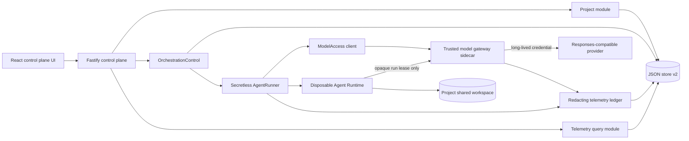

# Architecture

Target design for the **Secretless Multi-Agent Control Plane** MVP. The single
challenge track is **Kill Switch** (see [tasks/plan.md](../tasks/plan.md)
section 2): protect the long-lived model-provider credential from a compromised
Agent Runtime, and prove that a Run can be killed, contained, and recovered.

> **Implementation status.** The **backend Tasks 0-16 are implemented and
> committed**: the store v1 -> v2 migration, the redacting telemetry ledger, the
> gateway sidecar with opaque leases, the `ModelAccess` adapter, the secretless
> container Runtime, the revoke-first Kill path, Projects and shared workspaces,
> the persisted FIFO orchestration queue, the Planner -> Builder -> Reviewer
> pipeline with retries and restart reconciliation, and the redacted read
> surfaces (`/api/providers`, `/api/runs/:id/observability`,
> `/api/security/posture`). The **operator UI** (Tasks 13-16, `apps/web/`) is
> **in progress** - a rework is underway. File paths and status are labelled per
> row below.

## Component overview

| Component | Where | Status | Responsibility |
| --- | --- | --- | --- |
| React control-plane UI | `apps/web/` | **in progress** (Tasks 13-16, rework underway) | Resource catalog, Run Inspector, Security Envelope. Renders only safe descriptors and redacted telemetry. |
| Fastify control plane | `apps/server/src/app.ts`, `index.ts` | **implemented** | Transport validation only; delegates to domain modules. `AppModules` wires in projects / orchestration / telemetry routes. All existing routes stay compatible. |
| `AgentService` | `apps/server/src/agent-service.ts` | baseline (preserved) | Agent CRUD, lifecycle, Playground `sendMessage`, Run persistence. Kill routes through `runner.cancel`. |
| JSON store | `apps/server/src/store.ts` | **implemented (Task 1)** | `JsonStore` with one atomic `mutate()` path. `Database.version = 2`; v1 files upgrade losslessly. |
| Domain types | `apps/server/src/types.ts` | **implemented (Task 1)** | Additive v2 record types + correlation fields. |
| `OrchestrationControl` + `FixedPipeline` | `apps/server/src/modules/orchestration/` | **implemented (Tasks 10-12)** | FIFO queue, atomic claim, fixed 3-stage state machine, retry matrix (`retry-policy.ts`), restart reconciliation, handoff messages, trace correlation. |
| `ModelAccess` | `apps/server/src/modules/model-access/` | **implemented (Task 5)** | `withSession(scope, use)` owns lease issue/use/revoke and `finally` cleanup; `HttpGatewayManagementClient` maps failures fail-closed. Callback never sees a provider key. |
| `TelemetryLedger` + redactor | `apps/server/src/modules/telemetry/` | **implemented (Tasks 2, 16)** | Structured append/query, pre-persistence redaction, 2 KiB preview + 500-record caps, trace ordering, usage aggregation. Routes: `/api/providers`, `/api/runs/:id/observability`, `/api/security/posture`. |
| Project module | `apps/server/src/modules/projects/` | **implemented (Task 9)** | Project CRUD, three role assignments, Project-owned shared workspace (`project-workspace.ts`), path containment, archive. |
| Provider directory | `apps/server/src/modules/providers/provider-directory.ts` | **implemented (Task 13)** | Config-derived safe provider descriptors for `GET /api/providers`. No base URL, key-env name, or credential. |
| `SecretlessRunner` | `apps/server/src/runtime/secretless-runner.ts` | **implemented (Tasks 6, 8)** | Wraps the container runner + `ModelAccess`; run-scoped gateway Codex home; revoke-first Kill with `onKill` outcome; fails closed. |
| Runner factory | `apps/server/src/runner-factory.ts` | **implemented (Task 8)** | Selects host-process / plain container / `SecretlessRunner` per `isSecretlessProfile`. |
| Container runner | `apps/server/src/container-codex-runner.ts` | **implemented (Task 6)** | Disposable per-turn container. Secretless branch omits `ARK_API_KEY`, sets the `MODEL_GATEWAY_*` env allowlist, and uses `RUNTIME_GATEWAY_NETWORK`. Baseline branch still injects `ARK_API_KEY` when the profile is off. |
| Model gateway sidecar | `apps/server/src/gateway/` | **implemented (Tasks 3-4, 7)** | **Separate process** (`npm run gateway`). Only holder of provider keys. Issues opaque hashed leases, validates them, injects the real credential, forwards to the provider, returns a sanitized response. |
| Provider catalog | `apps/server/src/gateway/provider-catalog.ts`, `gateway/providers/` | **implemented (Tasks 3, 7)** | Allowlisted `responses-http` adapter + deterministic mock adapter. |
| Responses-compatible provider | external (BytePlus / Volcengine Ark) | live via the gateway | One live provider; additional providers are config-only (`GATEWAY_PROVIDERS` + `PROVIDER_<ID>_*`). |

## Data flow (target)

Reused verbatim from [tasks/plan.md](../tasks/plan.md) section 4.



### Primary request flow (implemented)

1. Browser submits a direct Playground Run or a fixed Project orchestration.
2. Fastify validates and calls a domain module; routes never touch queue rows.
3. The control plane atomically persists the Run / message / job, then returns `202 Accepted`.
4. `ModelAccess.withSession(...)` requests a run-scoped lease from the gateway management API.
5. `SecretlessRunner` starts the Runtime on an internal network and passes only the gateway URL, selected model, and ephemeral lease.
6. Codex sends Responses-compatible calls to the gateway; the gateway validates the lease, injects the provider credential, forwards, and returns a sanitized response.
7. Runtime, gateway, queue, and model activity append correlated redacted records under one `traceId`.
8. Completion, failure, cancellation, or timeout revokes the lease in `finally`; cancellation revokes *before* terminating the Runtime.

### Malicious and recovery flow (implemented)

1. A controlled malicious Run tries to read a provider key and reach the provider directly.
2. The key is absent from the environment and workspace; direct egress is unavailable.
3. The operator invokes **Kill**. The control plane revokes the lease first, terminates the container, and verifies cleanup.
4. A request that reuses the revoked lease gets a sanitized denial with **zero** upstream provider calls.
5. A later safe Run receives a new lease and succeeds, proving recovery.

## Trust zones

From [tasks/plan.md](../tasks/plan.md) section 4.

| Zone | Trust | Contains | Must not contain |
| --- | --- | --- | --- |
| Browser | Untrusted | Safe descriptors, redacted telemetry, control-plane token when configured | Provider keys, gateway leases, gateway admin token |
| Control plane | Trusted coordinator | Domain state, queue, project paths, gateway management client | Provider keys in the protected profile |
| Gateway sidecar | Trusted credential broker | Provider allowlist, provider keys, in-memory lease hashes | Project files, raw Agent history |
| Agent Runtime | Compromisable | Prompt, project mount, sanitized Codex home, run lease | Provider key, control-plane token, gateway admin token, unrelated host environment |
| Data layer | Trusted local state | Domain records and redacted telemetry | Raw leases, provider keys, raw authorization headers |

Network layout ([tasks/plan.md](../tasks/plan.md) section 8; expressed in
`docker-compose.yml` and via `RUNTIME_GATEWAY_NETWORK`):

```text
Runtime -- internal network -- Gateway -- egress network -- Provider
   X-------------- direct public internet / provider --------------X
```

## Deep modules

Summarized from [tasks/plan.md](../tasks/plan.md) section 5. Each module exposes a
small use-case interface; HTTP routes and React code never edit queue state.
All of the following are implemented; paths are under `apps/server/src/`.

- **`OrchestrationControl` / `FixedPipeline`** (`modules/orchestration/`) -
  `enqueue` / `list` / `inspect` / `cancel` plus the pipeline worker. Hides
  queue sequencing, atomic claims, the fixed Planner -> Builder -> Reviewer
  state machine, Run creation, the retry matrix (`retry-policy.ts`), restart
  reconciliation, handoff messages, and trace correlation.
- **`ModelAccess`** (`modules/model-access/`) - `withSession<T>(scope, use)` and
  `revoke(runId)`. Owns issue/use/revoke ordering and guaranteed `finally`
  cleanup. `GatewayModelAccess` talks to the gateway management API via
  `HttpGatewayManagementClient`; tests use an in-memory adapter. The callback
  receives an ephemeral Runtime session, never a provider key.
- **`ProviderCatalog` / `ResponsesProvider`** (`gateway/provider-catalog.ts`,
  `gateway/providers/`) - owned by the gateway. `responses-http` adapter for
  allowlisted providers plus a deterministic mock. Provider ids, base URLs,
  model ids, and key env-var names come from `gateway/config.ts`, never browser
  input. The control plane's redacted projection is
  `modules/providers/provider-directory.ts`.
- **`TelemetryLedger`** (`modules/telemetry/`) - `append(draft)` /
  `inspectRun(runId)`. Owns redaction (`redactor.ts`), preview limits (2 KiB),
  record caps (500 per Run), ordering, trace correlation, usage aggregation, and
  persistence. Callers submit structured fields, not preformatted log strings.
- **`AgentRunner` seam** - `SecretlessRunner` (`runtime/secretless-runner.ts`)
  adapts the container runner additively with run context + `ModelAccess`;
  `runner-factory.ts` selects it. Host-process execution (`codex-runner.ts`)
  stays an explicitly ungoverned developer fallback, excluded from security
  claims.

SOLID application: orchestration owns progression; gateway owns credentials;
runner owns process lifecycle; telemetry owns evidence + redaction; routes own
transport validation. A new Responses-compatible provider is added by config
without touching orchestration or Runtime code. Real and mock providers satisfy
one normalized contract; production and in-memory gateway clients satisfy one
`ModelAccess` interface. Composition roots pick adapters; modules never read
`process.env` directly.

## Folder structure

From [tasks/plan.md](../tasks/plan.md) section 6. New code is feature-first;
baseline files move only when a focused task takes over their responsibility.
Everything below exists on disk today.

```text
apps/server/src/
├── app.ts                         # Fastify composition and compatibility routes
├── index.ts                       # process composition root
├── agent-service.ts               # baseline Agent CRUD/Playground facade
├── config.ts                      # control-plane env + isSecretlessProfile + Codex config writers
├── runner-factory.ts              # host-process / plain container / SecretlessRunner selection
├── types.ts                       # additive baseline/domain types            [implemented]
├── store.ts                       # JSON store v2                             [implemented]
├── modules/
│   ├── projects/                  # project-service / project-workspace / project-routes   [implemented]
│   ├── orchestration/             # orchestration-control / fixed-pipeline / retry-policy / routes [implemented]
│   ├── model-access/              # model-access / gateway-client             [implemented]
│   ├── providers/                 # provider-directory (safe GET /api/providers projection) [implemented]
│   └── telemetry/                 # redactor / telemetry-ledger / telemetry-routes         [implemented]
├── runtime/
│   └── secretless-runner.ts       # [implemented]
└── gateway/                       # separate sidecar process                  [implemented]
    ├── main.ts                    # entry point (npm run gateway)
    ├── app.ts
    ├── config.ts                  # ONLY process allowed to read provider keys
    ├── lease-registry.ts
    ├── provider-catalog.ts
    └── providers/
        ├── responses-http-provider.ts
        └── deterministic-mock-provider.ts

apps/web/src/
├── main.tsx
├── app/                           # App / AppShell / routes / navigation
├── api/                           # client / contracts (transport DTOs only)
├── features/                      # projects / agents / providers / orchestrations / runs / security
└── shared/                        # ui / hooks / styles / utils (used by >= 2 features)
```

Folder rules: a feature owns its views, hooks, types, and tests; `shared/` holds
only code used by at least two features; server modules import Fastify only in
their route adapters; the gateway never imports Project, orchestration,
telemetry, or browser modules; the web app never imports server persistence
types; composition roots construct concrete adapters. The `apps/web/src/`
layout above is the target the in-progress rework is moving toward.

## Data model and invariants

The JSON database is migrated explicitly from version 1 to version 2 with no loss
of Agents, messages, Runs, thread ids, or workspaces
(`apps/server/src/store.ts`, **implemented**). Every collection below is now
populated by its owning module.

```ts
interface DatabaseV2 {
  version: 2;
  agents: Agent[];
  messages: Message[];
  runs: AgentRun[];
  projects: Project[];                       // ProjectService (Task 9)
  orchestrations: OrchestrationRecord[];     // OrchestrationControl (Task 10)
  queueJobs: QueueJob[];                     // OrchestrationControl (Task 10)
  handoffMessages: HandoffMessage[];         // FixedPipeline (Task 11)
  telemetry: TelemetryRecord[];              // TelemetryLedger (Tasks 2, 16)
  nextQueueSequence: number;
}
```

Additive correlation fields on existing records (in `types.ts`, populated by the
orchestration and telemetry modules): `projectId?`, `orchestrationId?`,
`traceId?`, `stage?` (`"planner" | "builder" | "reviewer"`), `attempt?`.

### Core invariants (from plan section 7)

All fifteen are enforced by the implemented modules and covered by tests.

1. Existing baseline records load unchanged through the v1 -> v2 migrator.
2. Project workspaces are owned and archived by Projects, never by an assigned Agent.
3. Planner, Builder, and Reviewer Agent ids must exist and be distinct.
4. Only one queue job is `running` globally.
5. Queue sequence numbers are assigned inside one `JsonStore.mutate()` call and are monotonic.
6. Planner completes before Builder is enqueued; Builder completes before Reviewer is enqueued.
7. Planner and Reviewer use a read-only sandbox; Builder alone uses workspace-write.
8. Every stage produces an ordinary Agent Run and a correlated handoff message.
9. Later stages never execute after failure, block, or cancellation.
10. A terminal orchestration cannot return to an active state.
11. A raw lease is never persisted; the gateway stores only a hash + metadata in memory.
12. Provider credentials never enter control-plane state in the protected profile.
13. Every persisted preview/error passes through the redactor first.
14. Cancellation revokes model access before Runtime termination.
15. Gateway denial invokes no provider adapter and has no direct-key fallback.

Restart reconciliation (`OrchestrationControl.reconcileAfterRestart`, called from
`index.ts`): queued jobs stay queued; a `running` job becomes `failed` with
`interrupted_by_restart`; its Agent returns to a safe non-busy state; all
in-memory leases are already invalid.

### Retry matrix (from plan section 7)

Encoded in `apps/server/src/modules/orchestration/retry-policy.ts`.

| Failure | Automatic retry | Reason |
| --- | ---: | --- |
| Queue claim interrupted before Runtime launch | Once | No Agent side effect occurred. |
| Gateway unavailable before lease issuance | Once (short backoff) | Runtime was not launched. |
| Provider 429 / 502 / 503 / 504 during Planner or Reviewer | Once | These stages are read-only. |
| Builder Runtime launch fails before process start | Once | Project files are unchanged. |
| Builder fails after process start | No | Mutations may be partial; require a new explicit Run. |
| Policy/security denial, invalid or revoked lease | No | Retrying would bypass an intentional control. |
| Invalid input or unknown provider | No | Deterministic caller error. |

## Related documents

- [docs/ONBOARDING.md](ONBOARDING.md) - developer setup, repo map, dev loop.
- [docs/DEVIATIONS.md](DEVIATIONS.md) - frozen baseline record (Task 0).
- [docs/MIDDLEWARE.md](MIDDLEWARE.md) - platform/middleware requirement mapping.
- [docs/DEMO.md](DEMO.md) - three-minute operator demo.
- [docs/LOCAL_POC.md](LOCAL_POC.md) - local run instructions.
- [docs/DEPLOYMENT.md](DEPLOYMENT.md) - supported deployment path.
- [.env.example](../.env.example) - every environment variable, grouped.
- Diagram source artifacts referenced by the plan
  (`docs/agent-control-plane-architecture.excalidraw` / `.svg` / `.png`) are
  **not yet in the repository**; the mermaid diagram above is authoritative
  until they are added.
