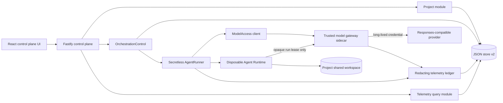

# Architecture

Target design for the **Secretless Multi-Agent Control Plane** MVP. The single
challenge track is **Kill Switch** (see [tasks/plan.md](../tasks/plan.md)
section 2): protect the long-lived model-provider credential from a compromised
Agent Runtime, and prove that a Run can be killed, contained, and recovered.

> **Implementation status.** Only **Task 0** (baseline freeze,
> [docs/DEVIATIONS.md](DEVIATIONS.md)) and **Task 1** (lossless JSON store
> v1 -> v2 migration, `apps/server/src/store.ts` + `apps/server/src/types.ts`)
> are done. Everything else on this page is **planned / in progress** and is
> labelled below. This document describes the *target*, not current behavior.

## Component overview

| Component | Where | Status | Responsibility |
| --- | --- | --- | --- |
| React control-plane UI | `apps/web/` | baseline (shell rework planned, Tasks 13-16) | Resource catalog, Run Inspector, Security Envelope. Renders only safe descriptors and redacted telemetry. |
| Fastify control plane | `apps/server/src/app.ts`, `index.ts` | baseline (new routes planned, Tasks 9-16) | Transport validation only; delegates to domain modules. Keeps all existing routes compatible. |
| `AgentService` | `apps/server/src/agent-service.ts` | baseline | Agent CRUD, lifecycle, Playground `sendMessage`, Run persistence. Preserved. |
| JSON store | `apps/server/src/store.ts` | **Task 1 done** | `JsonStore` with one atomic `mutate()` path. `Database.version = 2`; v1 files upgrade losslessly. |
| Domain types | `apps/server/src/types.ts` | **Task 1 done** | Additive v2 record types + `Correlation` fields. |
| `OrchestrationControl` | `modules/orchestration/` | planned (Tasks 10-12) | Hides FIFO queue, atomic claim, fixed 3-stage state machine, retry matrix, restart reconciliation, handoff messages, trace correlation. |
| `ModelAccess` | `modules/model-access/` | planned (Task 5) | `withSession(scope, use)` owns lease issue/use/revoke and `finally` cleanup. Callback never sees a provider key. |
| `TelemetryLedger` + redactor | `modules/telemetry/` | planned (Task 2) | Structured append/query, pre-persistence redaction, preview + record caps, trace ordering, usage aggregation. |
| Project module | `modules/projects/` | planned (Task 9) | Project CRUD, three role assignments, Project-owned shared workspace, path containment. |
| `SecretlessRunner` | `runtime/secretless-runner.ts` | planned (Task 6) | Wraps the existing container runner + `ModelAccess`; env allowlist; gateway-only network. |
| Container runner | `apps/server/src/container-codex-runner.ts` | baseline (secretless rework planned, Task 6) | Disposable per-turn container. Today injects `ARK_API_KEY` and uses `--network bridge` - the gap this MVP closes. |
| Model gateway sidecar | `apps/server/src/gateway/` | planned (Tasks 3-4, 7) | **Separate process.** Only holder of provider keys. Issues opaque hashed leases, validates them, injects the real credential, forwards to the provider, returns a sanitized response. |
| Provider catalog | `gateway/provider-catalog.ts`, `gateway/providers/` | planned (Tasks 3, 7) | Allowlisted Responses-compatible HTTP adapter + deterministic mock adapter. |
| Responses-compatible provider | external (BytePlus / Volcengine Ark) | baseline via Codex | One live provider; additional providers are config-only. |

## Data flow (target)

Reused verbatim from [tasks/plan.md](../tasks/plan.md) section 4.



### Primary request flow (planned)

1. Browser submits a direct Playground Run or a fixed Project orchestration.
2. Fastify validates and calls a domain module; routes never touch queue rows.
3. The control plane atomically persists the Run / message / job, then returns `202 Accepted`.
4. `ModelAccess.withSession(...)` requests a run-scoped lease from the gateway management API.
5. `SecretlessRunner` starts the Runtime on an internal network and passes only the gateway URL, selected model, and ephemeral lease.
6. Codex sends Responses-compatible calls to the gateway; the gateway validates the lease, injects the provider credential, forwards, and returns a sanitized response.
7. Runtime, gateway, queue, and model activity append correlated redacted records under one `traceId`.
8. Completion, failure, cancellation, or timeout revokes the lease in `finally`; cancellation revokes *before* terminating the Runtime.

### Malicious and recovery flow (planned)

1. A controlled malicious Run tries to read a provider key and reach the provider directly.
2. The key is absent from the environment and workspace; direct egress is unavailable.
3. The operator invokes **Kill**. The control plane revokes the lease first, terminates the container, and verifies cleanup.
4. A request that reuses the revoked lease gets a sanitized denial with **zero** upstream provider calls.
5. A later safe Run receives a new lease and succeeds, proving recovery.

## Trust zones

From [tasks/plan.md](../tasks/plan.md) section 4.

| Zone | Trust | Contains | Must not contain |
| --- | --- | --- | --- |
| Browser | Untrusted | Safe descriptors, redacted telemetry, control-plane token when configured | Provider keys, gateway leases, gateway admin token |
| Control plane | Trusted coordinator | Domain state, queue, project paths, gateway management client | Provider keys in the protected profile |
| Gateway sidecar | Trusted credential broker | Provider allowlist, provider keys, in-memory lease hashes | Project files, raw Agent history |
| Agent Runtime | Compromisable | Prompt, project mount, sanitized Codex home, run lease | Provider key, control-plane token, gateway admin token, unrelated host environment |
| Data layer | Trusted local state | Domain records and redacted telemetry | Raw leases, provider keys, raw authorization headers |

Network layout (planned, [tasks/plan.md](../tasks/plan.md) section 8):

```text
Runtime -- internal network -- Gateway -- egress network -- Provider
   X-------------- direct public internet / provider --------------X
```

## Deep modules

Summarized from [tasks/plan.md](../tasks/plan.md) section 5. Each module exposes a
small use-case interface; HTTP routes and React code never edit queue state.

- **`OrchestrationControl`** (planned) - `enqueue` / `list` / `inspect` /
  `cancel`. Hides queue sequencing, atomic claims, the fixed
  Planner -> Builder -> Reviewer state machine, Run creation, the retry matrix,
  restart reconciliation, handoff messages, and trace correlation.
- **`ModelAccess`** (planned) - `withSession<T>(scope, use)` and `revoke(runId)`.
  Owns issue/use/revoke ordering and guaranteed `finally` cleanup. Production
  adapter talks to the gateway management API; tests use an in-memory adapter.
  The callback receives an ephemeral Runtime config, never a provider key.
- **`ProviderCatalog` / `ResponsesProvider`** (planned) - owned by the gateway.
  Parameterized HTTP adapter for allowlisted Responses-compatible providers plus
  a deterministic mock. Provider ids, base URLs, model ids, and key env-var
  names come from trusted config, never browser input.
- **`TelemetryLedger`** (planned) - `append(draft)` / `inspectRun(runId)`. Owns
  redaction, preview limits (2 KiB), record caps (500 per Run), ordering, trace
  correlation, usage aggregation, and persistence. Callers submit structured
  fields, not preformatted log strings.
- **Existing `AgentRunner`** (baseline seam) - kept as-is. `SecretlessRunner`
  adapts it additively with run context + `ModelAccess`. Host-process execution
  stays an explicitly ungoverned developer fallback, excluded from security
  claims.

SOLID application: orchestration owns progression; gateway owns credentials;
runner owns process lifecycle; telemetry owns evidence + redaction; routes own
transport validation. A new Responses-compatible provider is added by config
without touching orchestration or Runtime code. Real and mock providers satisfy
one normalized contract; production and in-memory gateway clients satisfy one
`ModelAccess` interface. Composition roots pick adapters; modules never read
`process.env` directly.

## Folder structure (target)

From [tasks/plan.md](../tasks/plan.md) section 6. New code is feature-first;
baseline files move only when a focused task takes over their responsibility.

```text
apps/server/src/
├── app.ts                         # Fastify composition and compatibility routes
├── index.ts                       # process composition root
├── agent-service.ts               # baseline Agent CRUD/Playground facade
├── types.ts                       # additive baseline/domain types            [Task 1 done]
├── store.ts                       # JSON store v2                             [Task 1 done]
├── modules/
│   ├── projects/                  # project-service / project-workspace / project-routes   [planned]
│   ├── orchestration/             # orchestration-control / fixed-pipeline / retry-policy / routes [planned]
│   ├── model-access/              # model-access / gateway-client             [planned]
│   └── telemetry/                 # redactor / telemetry-ledger / telemetry-routes         [planned]
├── runtime/
│   └── secretless-runner.ts       # [planned]
└── gateway/                       # separate sidecar process                  [planned]
    ├── main.ts                    # entry point
    ├── app.ts
    ├── config.ts                  # ONLY process allowed to read provider keys
    ├── lease-registry.ts
    ├── provider-catalog.ts
    └── providers/
        ├── responses-http-provider.ts
        └── deterministic-mock-provider.ts

apps/web/src/
├── main.tsx
├── app/                           # App / AppShell / routes / navigation
├── api/                           # client / contracts (transport DTOs only)
├── features/                      # projects / agents / providers / orchestrations / runs / security
└── shared/                        # ui / hooks / styles / utils (used by >= 2 features)
```

Folder rules: a feature owns its views, hooks, types, and tests; `shared/` holds
only code used by at least two features; server modules import Fastify only in
their route adapters; the gateway never imports Project, orchestration, or
browser modules; the web app never imports server persistence types; composition
roots construct concrete adapters.

## Data model and invariants

The JSON database is migrated explicitly from version 1 to version 2 with no loss
of Agents, messages, Runs, thread ids, or workspaces
(`apps/server/src/store.ts`, **Task 1 done**).

```ts
interface DatabaseV2 {
  version: 2;
  agents: Agent[];
  messages: Message[];
  runs: AgentRun[];
  projects: Project[];                       // planned population (Task 9)
  orchestrations: OrchestrationRecord[];     // planned population (Task 10)
  queueJobs: QueueJob[];                     // planned population (Task 10)
  handoffMessages: HandoffMessage[];         // planned population (Task 11)
  telemetry: TelemetryRecord[];              // planned population (Task 2)
  nextQueueSequence: number;
}
```

Additive correlation fields on existing records (present in `types.ts` today,
populated by later tasks): `projectId?`, `orchestrationId?`, `traceId?`,
`stage?` (`"planner" | "builder" | "reviewer"`), `attempt?`.

### Core invariants (from plan section 7)

1. Existing baseline records load unchanged through the v1 -> v2 migrator. **(enforced today)**
2. Project workspaces are owned and archived by Projects, never by an assigned Agent.
3. Planner, Builder, and Reviewer Agent ids must exist and be distinct.
4. Only one queue job is `running` globally.
5. Queue sequence numbers are assigned inside one `JsonStore.mutate()` call and are monotonic.
6. Planner completes before Builder is enqueued; Builder completes before Reviewer is enqueued.
7. Planner and Reviewer use a read-only sandbox; Builder alone uses workspace-write.
8. Every stage produces an ordinary Agent Run and a correlated handoff message.
9. Later stages never execute after failure, block, or cancellation.
10. A terminal orchestration cannot return to an active state.
11. A raw lease is never persisted; the gateway stores only a hash + metadata in memory.
12. Provider credentials never enter control-plane state in the protected profile.
13. Every persisted preview/error passes through the redactor first.
14. Cancellation revokes model access before Runtime termination.
15. Gateway denial invokes no provider adapter and has no direct-key fallback.

Restart reconciliation (planned): queued jobs stay queued; a `running` job
becomes `failed` with `interrupted_by_restart`; its Agent returns to a safe
non-busy state; all in-memory leases are already invalid.

### Retry matrix (from plan section 7)

| Failure | Automatic retry | Reason |
| --- | ---: | --- |
| Queue claim interrupted before Runtime launch | Once | No Agent side effect occurred. |
| Gateway unavailable before lease issuance | Once (short backoff) | Runtime was not launched. |
| Provider 429 / 502 / 503 / 504 during Planner or Reviewer | Once | These stages are read-only. |
| Builder Runtime launch fails before process start | Once | Project files are unchanged. |
| Builder fails after process start | No | Mutations may be partial; require a new explicit Run. |
| Policy/security denial, invalid or revoked lease | No | Retrying would bypass an intentional control. |
| Invalid input or unknown provider | No | Deterministic caller error. |

## Related documents

- [docs/DEVIATIONS.md](DEVIATIONS.md) - frozen baseline record (Task 0).
- [docs/MIDDLEWARE.md](MIDDLEWARE.md) - platform/middleware requirement mapping.
- [docs/DEMO.md](DEMO.md) - three-minute operator demo (draft).
- [docs/LOCAL_POC.md](LOCAL_POC.md) - local run instructions.
- [.env.example](../.env.example) - every environment variable, grouped.
- Diagram source artifacts referenced by the plan
  (`docs/agent-control-plane-architecture.excalidraw` / `.svg` / `.png`) are
  **not yet in the repository**; the mermaid diagram above is authoritative
  until they are added.
