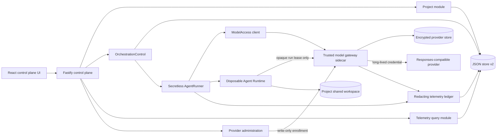

# Implementation Plan: Secretless Multi-Agent Control Plane MVP

> **Status:** design revised and locked; implementation not authorized yet.
>
> **Approval rule:** creating or approving this document does not authorize product-code changes. Before Task 0 starts, the project owner must explicitly say to begin implementation.
>
> **Canonical plan:** this document supersedes the earlier Bouncer-oriented proposal in `implementation.md`.

## 1. Outcome

Extend the Volc Agent Launchpad starter into a Port-inspired Agent control plane while entering the challenge under exactly one primary track: **Kill Switch**.

The MVP protects the long-lived model-provider credential from a compromised Agent Runtime. Provider credentials live only in a trusted gateway sidecar. A disposable Runtime receives a short-lived, run-scoped gateway lease, can reach only that gateway, and is terminated and cleaned up when a Run is killed. Queue orchestration, Agent-to-Agent communication, structured logs, traces, and token usage support and demonstrate that security boundary; they are not separate challenge tracks.

The finished MVP must preserve Agent CRUD, lifecycle operations, Playground chat, persistence, model execution, and session continuation. An authenticated operator can onboard a Responses-compatible provider without editing environment files, let the gateway discover or validate its models, and bind a default provider/model to each Agent. The workflow remains usable by developers and non-developers through one guided setup path.

## 2. Locked product decisions

| Area | Locked decision | Reason |
| --- | --- | --- |
| Challenge track | Kill Switch only | The official extension guide requires one primary track. |
| Explicit threat | A compromised Runtime reads or exfiltrates the long-lived provider API key | Concrete protected asset and demonstrable abuse case. |
| Protected asset | Long-lived provider credential | It may exist transiently in the write-only setup form and authenticated relay request, but must never be returned, retained in browser storage, persisted by the control plane, mounted into a Runtime, logged, traced, or shown in screenshots. |
| Primary enforcement | Dedicated model-gateway sidecar plus gateway-only Runtime network | Enforcement sits below Agent prompts and outside the untrusted Runtime. |
| Runtime credential | Opaque, short-lived lease bound to Run, Agent, provider, model, scope, and expiry | Compromise exposes a revocable capability, not the provider credential. |
| Failure policy | Fail closed; never fall back to a direct provider key | Gateway denial or outage cannot weaken the security boundary. |
| Providers | Operator-managed Responses-compatible providers, one live provider, and a deterministic mock | Presets make onboarding approachable; a guarded custom HTTPS option proves extensibility without native adapters for every vendor. |
| Provider administration | One authenticated operator capability; no per-user RBAC claim | The MVP remains single-operator while provider mutations fail when control-plane authentication is disabled. |
| Credential persistence | Authenticated encryption in a gateway-owned store; gateway-only master key | Providers survive restarts without putting plaintext or encryption keys in control-plane state. |
| Model discovery | Capability-based gateway discovery with explicit manual/unverified fallback | `/models` is not universal across Responses-compatible providers; unsupported discovery must remain usable without pretending verification occurred. |
| Model assignment | Optional Agent default plus an atomic orchestration-wide override | Each Run snapshots the effective provider/model; no stage silently changes models or falls back. |
| Project model | A Project groups three role-assigned Agents and owns one shared working directory | Agents can collaborate on the same files without cross-project access. |
| Write permissions | Planner and Reviewer are read-only; Builder is workspace-write | Only one role mutates project files. |
| Orchestration | Fixed persisted FIFO: Planner → Builder → Reviewer | Coherent and demonstrable; no general DAG engine. |
| Agent communication | Persisted, correlated handoff messages plus the Project workspace | Communication is inspectable and bounded; no peer sockets or arbitrary message bus. |
| Concurrency | One stage globally in flight for the MVP | Deterministic ordering and no shared-workspace write races. |
| Retry policy | At most one automatic retry for explicitly transient, side-effect-safe failures | Avoid replaying partially completed Builder mutations. |
| Queue infrastructure | Existing JSON store plus an in-process worker | Small local infrastructure; BullMQ and Temporal are documented future options. |
| Telemetry | OpenTelemetry-shaped structured spans/log records persisted locally | Clear future export seam without adding Kafka or a Collector now. |
| UI | Original dark operational console inspired by Port's information architecture | Resource catalog, operational state, and evidence remain easy to scan. |
| Authentication | Preserve the starter's optional shared control-plane bearer token | SSO and human RBAC are not required to prove credential containment. |
| Agent internet access | No role receives arbitrary egress in the governed profile | Role-based internet exceptions would undermine the chosen threat boundary. |
| Deployment | Local Docker/Colima/Podman is the supported protected path | Matches the judging path and three-day scope. |
| Agent framework | No full framework in the MVP; keep `AgentRunner`/`AgentExecutor` as an adapter seam | A framework does not solve credential containment, discovery, leases, networking, or Kill and would obscure the fixed workflow. |

## 3. Explicit non-goals

- No second challenge track, production SSO, OAuth, or delegated cloud identity.
- No arbitrary workflow editor, DAG engine, dynamic fan-out, or distributed scheduler.
- No BullMQ, Redis, Temporal, Kafka, RabbitMQ, Postgres, or Kubernetes in the MVP.
- No native Anthropic, Bedrock, Gemini, or provider-specific protocol implementations; additional providers must be Responses-compatible.
- No anonymous provider mutation, direct browser-to-provider traffic, credential read-back/export, arbitrary authentication headers, or unrestricted provider endpoints.
- No real multi-user identity, per-user RBAC, or audit attribution; “developer/non-developer” describes setup usability, not separate permissions.
- No automatic billable inference during provider discovery; model testing is an explicit operator action.
- No full agent framework, dynamic agent graph, framework-managed memory, or framework-controlled retry loop.
- No arbitrary Agent internet access or role-based egress exceptions.
- No raw chain-of-thought, authorization headers, provider bodies, environment dumps, or unredacted secrets in telemetry.
- No claim that ordinary containers provide hardened hostile multi-tenant isolation.
- No ECS work unless the complete local flow is already verified and frozen.

## 4. Architecture

Diagram artifacts: [editable Excalidraw](../docs/agent-control-plane-architecture.excalidraw), [SVG export](../docs/agent-control-plane-architecture.svg), and [PNG preview](../docs/agent-control-plane-architecture.png).



### Trust zones

| Zone | Trust | Contains | Must not contain |
| --- | --- | --- | --- |
| Browser | Untrusted ingress | Safe descriptors, redacted telemetry, control-plane token, transient write-only credential input | Retained/prefilled provider keys, ciphertext export, gateway leases, gateway admin token |
| Control plane | Trusted coordinator and transient relay | Domain state, queue, project paths, gateway management client, transient enrollment body | Persisted provider keys/ciphertext, provider keys in logs/telemetry, gateway master key |
| Gateway sidecar | Trusted credential broker | Provider registry, decrypted credentials in bounded process memory, encrypted credential store, master key, in-memory lease hashes | Project files, raw Agent history |
| Agent Runtime | Compromisable | Prompt, project mount, sanitized Codex home, run lease | Provider key, control-plane token, gateway admin token, unrelated host environment |
| Control-plane data layer | Trusted local state | Safe provider/model summaries, Agent bindings, domain records, redacted telemetry | Raw leases, provider keys/ciphertext, master key, raw authorization headers |

### Primary request flow

1. An authenticated operator first uses the setup wizard to select a provider preset or guarded custom HTTPS endpoint and submit a write-only credential. Fastify validates and relays it without persistence; the gateway encrypts it and discovers models or records an explicit manual/unverified model.
2. The operator binds an optional default provider/model pair to each Agent. A later orchestration may supply one complete override pair for all stages.
3. The browser submits a direct Playground Run or fixed Project orchestration.
4. Fastify validates the request and calls a domain module; routes do not manipulate queue rows directly.
5. The control plane resolves and snapshots the effective provider/model, then atomically persists the Run/message/job before returning `202 Accepted`.
6. `ModelAccess.withSession(...)` requests a run-scoped lease from the gateway management interface.
7. `SecretlessRunner` starts the Runtime on an internal network and passes only the gateway URL, selected model, and ephemeral lease.
8. Codex sends Responses-compatible calls to the gateway. The gateway validates the lease, forces the leased provider/model, injects the selected provider credential, forwards the request, and returns a sanitized response.
9. Runtime, gateway, queue, and model activity append correlated redacted records with one `traceId`.
10. Completion, failure, cancellation, timeout, provider disable, or credential rotation revokes affected leases; cancellation revokes before terminating the Runtime.

### Malicious and recovery flow

1. A controlled malicious Run attempts to read a provider key and contact the provider directly.
2. The key is absent from the environment and workspace; direct egress is unavailable.
3. The operator invokes Kill. The control plane revokes the lease first, terminates the container, and verifies cleanup.
4. A request using the revoked lease receives a sanitized denial without invoking the upstream provider.
5. A later safe Run receives a new lease and succeeds, proving recovery.

## 5. Deep modules and ownership

### `OrchestrationControl`

```ts
interface OrchestrationControl {
  enqueue(input: EnqueueOrchestration): Promise<OrchestrationView>;
  list(query: OrchestrationQuery): Promise<OrchestrationPage>;
  inspect(id: string): Promise<OrchestrationView>;
  cancel(id: string): Promise<OrchestrationView>;
}
```

The implementation hides queue sequencing, atomic claims, the fixed three-stage state machine, Run creation, retry rules, restart reconciliation, handoff messages, and trace correlation. HTTP routes and React code never edit queue state.

### `ModelAccess`

```ts
interface ModelAccess {
  withSession<T>(
    scope: GatewayScope,
    use: (session: RuntimeGatewaySession) => Promise<T>,
  ): Promise<T>;
  revoke(runId: string): Promise<void>;
}
```

`withSession` owns issue/use/revoke sequencing and `finally` cleanup. Its production adapter uses the gateway management interface; tests use an in-memory adapter. The callback receives an ephemeral Runtime configuration, never a provider key.

### `ProviderRegistry`

```ts
interface ProviderRegistry {
  list(): Promise<readonly ProviderSummary[]>;
  register(input: ProviderEnrollment): Promise<ProviderSummary>;
  rotate(id: string, credential: WriteOnlyCredential): Promise<ProviderSummary>;
  disable(id: string): Promise<ProviderSummary>;
  refreshModels(id: string): Promise<ModelCatalogSnapshot>;
  resolve(id: string, modelId: string): Promise<ResponsesProvider>;
}

interface ResponsesProvider {
  listModels?(signal: AbortSignal): Promise<readonly DiscoveredModel[]>;
  respond(request: ResponsesRequest, signal: AbortSignal): Promise<ResponsesReply>;
}
```

The gateway owns this interface and the encrypted provider store. A parameterized HTTP adapter supports preset and guarded custom Responses-compatible providers; a deterministic mock adapter provides reproducible tests and demos. The control plane and browser receive safe summaries only. Provider URLs and credentials are accepted only through authenticated enrollment, are validated gateway-side, and never come from Runtime requests.

Discovery is capability-based. The gateway attempts a bounded supported model-list operation, records independent connection and discovery states, and permits an operator-entered model ID only when it is explicitly marked `manual` and `unverified`. Discovery does not make a billable inference request. A separate explicit “Test model” action may do so after warning the operator.

### `AgentExecutor` seam

The existing `AgentRunner` remains the MVP implementation of a small `AgentExecutor` seam. Codex CLI continues to own workspace execution and resumable sessions. A future agent framework may be added as another adapter, but it must use `ModelAccess`, accept the fixed orchestration contract, and may not receive provider credentials or introduce hidden retries/concurrency.

### `TelemetryLedger`

```ts
interface TelemetryLedger {
  append(record: TelemetryDraft): Promise<void>;
  inspectRun(runId: string): Promise<RunObservabilityView>;
}
```

The ledger owns redaction, preview limits, ordering, trace correlation, usage aggregation, and persistence. Callers submit structured fields, not preformatted log strings.

### Existing `AgentRunner`

Retain the existing interface as the Runtime seam. Add optional run context additively; a `SecretlessRunner` adapter wraps the existing container implementation and `ModelAccess`. The protected local profile uses only this adapter. Host-process execution remains an explicitly ungoverned developer fallback and is excluded from security claims.

### SOLID application

- **Single responsibility:** orchestration owns progression; gateway owns credentials; Runner owns process lifecycle; telemetry owns evidence and redaction; routes own transport validation.
- **Open/closed:** a configured Responses-compatible provider is added without modifying orchestration or Runtime lifecycle code.
- **Liskov substitution:** real and mock providers satisfy the same normalized response contract; production and in-memory gateway clients satisfy the same `ModelAccess` interface.
- **Interface segregation:** callers learn small use-case interfaces rather than a repository or event-bus façade.
- **Dependency inversion:** domain modules accept the existing Runner and small persistence/model-access interfaces; the composition root selects adapters.

## 6. Proposed folder structure

New code is feature-first. Existing baseline files stay in place until a focused task moves responsibility; there is no big-bang rearrangement.

```text
apps/server/src/
├── app.ts                         # Fastify composition and compatibility routes
├── index.ts                       # process composition root
├── agent-service.ts               # baseline Agent CRUD/Playground façade
├── types.ts                       # additive baseline/domain types
├── modules/
│   ├── projects/
│   │   ├── project-service.ts
│   │   ├── project-workspace.ts
│   │   └── project-routes.ts
│   ├── orchestration/
│   │   ├── orchestration-control.ts
│   │   ├── fixed-pipeline.ts
│   │   ├── retry-policy.ts
│   │   └── orchestration-routes.ts
│   ├── model-access/
│   │   ├── model-access.ts
│   │   └── gateway-client.ts
│   ├── providers/
│   │   ├── provider-admin-service.ts
│   │   └── provider-routes.ts
│   └── telemetry/
│       ├── redactor.ts
│       ├── telemetry-ledger.ts
│       └── telemetry-routes.ts
├── runtime/
│   └── secretless-runner.ts
└── gateway/
    ├── main.ts                    # separate sidecar process entry point
    ├── app.ts
    ├── config.ts                  # only process allowed to read provider keys
    ├── lease-registry.ts
    ├── provider-registry.ts
    ├── encrypted-provider-store.ts
    ├── model-discovery.ts
    └── providers/
        ├── responses-http-provider.ts
        └── deterministic-mock-provider.ts

apps/web/src/
├── main.tsx
├── app/
│   ├── App.tsx
│   ├── AppShell.tsx
│   ├── routes.tsx
│   └── navigation.ts
├── api/
│   ├── client.ts
│   └── contracts.ts
├── features/
│   ├── projects/
│   ├── agents/
│   ├── providers/
│   ├── orchestrations/
│   ├── runs/
│   └── security/
└── shared/
    ├── ui/
    ├── hooks/
    ├── styles/
    └── utils/
```

Folder rules:

- A feature owns its views, hooks, types, and focused tests.
- `shared/` contains only code used by at least two features.
- Server modules do not import Fastify except their route adapters.
- The gateway never imports Project, orchestration, or browser modules.
- The web app owns transport DTOs; it does not import server persistence types.
- The composition roots construct concrete adapters; modules do not read global environment variables directly.

## 7. Data model and invariants

Migrate the JSON database explicitly from version 1 to version 2 without losing Agents, messages, Runs, thread IDs, or workspaces.

```ts
interface DatabaseV2 {
  version: 2;
  agents: Agent[];
  messages: Message[];
  runs: AgentRun[];
  providerSummaries: ProviderSummary[];
  providerModels: ProviderModel[];
  projects: Project[];
  orchestrations: OrchestrationRecord[];
  queueJobs: QueueJob[];
  handoffMessages: HandoffMessage[];
  telemetry: TelemetryRecord[];
  nextQueueSequence: number;
}
```

Additive correlation fields on existing records:

```ts
projectId?: string;
orchestrationId?: string;
traceId?: string;
stage?: "planner" | "builder" | "reviewer";
attempt?: number;
providerId?: string;
modelId?: string;
providerRevision?: number;
```

Agent defaults and safe provider catalog records are stored without credentials:

```ts
interface AgentModelBinding {
  providerId: string;
  modelId: string;
}

interface ProviderSummary {
  id: string;
  displayName: string;
  protocol: "responses";
  endpointHost: string;
  credentialState: "configured" | "invalid" | "rotating";
  connectionStatus:
    | "unknown"
    | "healthy"
    | "auth_failed"
    | "unreachable"
    | "rate_limited"
    | "upstream_error"
    | "disabled";
  discoveryStatus: "never" | "fresh" | "stale" | "unsupported" | "failed";
  revision: number;
  lastCheckedAt: string | null;
}

interface ProviderModel {
  providerId: string;
  modelId: string;
  source: "discovered" | "manual";
  status: "available" | "stale" | "removed" | "unverified";
}
```

`Agent.modelSelection` is `AgentModelBinding | null`. Every admitted Run stores the effective provider/model and provider revision. A Codex thread also records its model binding; changing the binding starts a new session instead of silently resuming against another provider/model.

Core invariants:

1. Existing baseline records load unchanged through the v1 → v2 migrator.
2. Project workspaces are owned and archived by Projects, never by an assigned Agent.
3. Planner, Builder, and Reviewer Agent IDs must exist and be distinct.
4. Only one queue job is `running` globally.
5. Queue sequence numbers are assigned inside one `JsonStore.mutate()` call and are monotonic.
6. Planner must complete before Builder is enqueued; Builder must complete before Reviewer is enqueued.
7. Planner and Reviewer use a read-only sandbox; Builder alone uses workspace-write.
8. Every stage produces an ordinary Agent Run and correlated handoff message.
9. Later stages never execute after failure, block, or cancellation.
10. A terminal orchestration cannot return to an active state.
11. A raw lease is never persisted; the gateway stores only a hash and metadata in memory.
12. Provider credentials may pass transiently through an authenticated, `no-store` control-plane request but never enter control-plane persistence, logs, telemetry, responses, Runtime configuration, or screenshots.
13. Every persisted preview/error passes through the redactor first.
14. Cancellation revokes model access before Runtime termination.
15. Gateway denial invokes no provider adapter and has no direct-key fallback.
16. The gateway encrypts provider credentials with authenticated encryption, a unique nonce, key version, and provider-bound associated data; its master key is gateway-only and missing/wrong/corrupt keys fail closed.
17. Provider and model must be selected as one valid pair. Partial overrides, disabled providers, removed models, and provider/model mismatches fail closed without fallback.
18. Each orchestration snapshots one override for all stages when supplied; otherwise every stage snapshots its assigned Agent's default at admission.
19. Disabling or rotating a provider immediately blocks new leases and revokes active leases. Removal is a soft archive/tombstone so historical Runs remain explainable.
20. A model absent from a newer discovery snapshot is marked removed, not deleted; manual IDs remain visibly unverified.
21. Provider mutation is unavailable when shared control-plane authentication is disabled. The MVP describes the token holder as the operator and makes no per-user RBAC claim.

### Retry matrix

| Failure | Automatic retry | Reason |
| --- | ---: | --- |
| Queue claim interrupted before Runtime launch | Once | No Agent side effect occurred. |
| Gateway unavailable before lease issuance | Once with short backoff | Runtime was not launched. |
| Provider `429`, `502`, `503`, or `504` during Planner/Reviewer | Once | These stages are read-only. |
| Builder Runtime launch fails before process start | Once | Project files are unchanged. |
| Builder fails after process start | No | File mutations may be partial; require a new explicit Run. |
| Policy/security denial, invalid lease, or revoked lease | No | Retrying would bypass an intentional control. |
| Invalid input or unknown provider | No | Deterministic caller error. |

On process restart, queued jobs remain queued. Any running job becomes failed with `interrupted_by_restart`; the associated Agent returns to a safe non-busy state, and all old gateway leases are invalid because the registry is in memory and leases expire.

## 8. Gateway and Runtime security contract

### Gateway interfaces

Private management interface, reachable only by the control plane:

```text
POST /internal/providers
PATCH /internal/providers/:id
POST /internal/providers/:id/credential-rotations
POST /internal/providers/:id/disables
POST /internal/providers/:id/models/refresh
POST /internal/providers/:id/models
POST /internal/providers/:id/tests
POST /internal/leases
POST /internal/leases/:id/revocations
GET  /internal/health
```

Runtime data plane, reachable only on the internal Runtime network:

```text
POST /p/:providerId/v1/responses
Authorization: Bearer <opaque run lease>
```

The management interface requires a distinct gateway-admin capability. That capability is never supplied to the Runtime or browser. Enrollment credentials are relayed once over the private interface, encrypted immediately in a gateway-owned store, cleared from request objects as soon as practical, and never returned. The gateway master key is supplied through a deployment secret or restricted file mounted only into the gateway; it is absent from the control-plane environment, JSON database, Runtime, workspace, and infrastructure state committed to the repository.

For the MVP, credentials are bearer tokens only. Custom endpoints require HTTPS, no URL userinfo/query/fragment, no redirects, bounded DNS/connect/read timeouts and response sizes, and gateway-side rejection of loopback, private, link-local, metadata, and DNS-rebinding destinations. Presets are the default non-developer path. Local/private endpoints require an explicit ungoverned development flag and are excluded from security claims.

Provider connection and discovery are separate states. Model refresh is serialized per provider, rate-limited, bounded, generation-checked to ignore out-of-order results, and stores only normalized IDs plus timestamps. `404`/`405` from model listing means `unsupported`, not necessarily an unusable provider. Cached IDs can be displayed as stale, but authentication failure blocks new assignments and leases. Explicit manual IDs are allowed with an `unverified` warning; no automatic paid inference validates them.

Lease metadata:

```ts
interface LeaseScope {
  leaseId: string;
  runId: string;
  agentId: string;
  projectId?: string;
  orchestrationId?: string;
  providerId: string;
  model: string;
  scope: "responses:create";
  expiresAt: string;
}
```

Runtime environment allowlist:

```text
MODEL_GATEWAY_URL
MODEL_GATEWAY_TOKEN
MODEL_ID
CODEX_HOME
HOME
PATH
LANG
NO_COLOR
```

The protected path must explicitly omit provider keys, `APP_AUTH_TOKEN`, gateway-admin credentials, cloud credentials, inherited proxy credentials, and unrelated host variables.

Network layout:

```text
Runtime ── internal network ── Gateway ── egress network ── Provider
   X────────────── direct public internet / provider ─────────────X
```

Compose uses separate control, Runtime-internal, and gateway-egress networks. The Runtime receives only its Project workspace and sanitized per-Agent Codex state. The gateway receives neither workspace mount. The control plane and Runtime receive neither provider credentials nor the gateway master key. The ungoverned `local-process` runner cannot execute provider-managed Runs and is excluded from provider-management security claims.

## 9. Orchestration and Agent communication

Each Project stores three role assignments:

```ts
interface ProjectRoles {
  plannerAgentId: string;
  builderAgentId: string;
  reviewerAgentId: string;
}
```

The fixed pipeline is:

```text
User task
  → Planner: produce bounded implementation plan
  → Builder: receive original task + Planner handoff; modify Project workspace
  → Reviewer: receive original task + plan + Builder summary; inspect workspace read-only
  → final orchestration result
```

Handoff messages are persisted records with sender, recipient, stage, correlation IDs, content type, bounded redacted content, and timestamp. They are not raw chain-of-thought. Large binary files are shared through the Project workspace, not embedded in messages.

Queue behavior:

- Global FIFO by persisted sequence.
- One orchestration completes its fixed stages before the next begins.
- Idempotent submission accepts an optional `Idempotency-Key`; a duplicate returns the original orchestration.
- Stage completion is accepted once; duplicate completion is a no-op.
- Cancellation marks pending stages cancelled and revokes the active stage before stopping it.
- Queue limits return `429` before creating partial records.
- Standalone Playground Runs use the Agent default binding. An orchestration override must contain both `providerId` and `modelId` and applies to Planner, Builder, and Reviewer.
- Effective bindings are resolved and persisted at admission; later provider/model or Agent changes never retarget queued or historical Runs.
- A disabled provider, removed model, or authentication failure blocks launch with a stable error. There is no implicit provider/model fallback.
- Resuming a Codex thread with a different provider/model starts a new thread and records why; it never silently crosses a model binding.

## 10. Observability contract

The MVP records complete structured lifecycle evidence within a deliberately safe capture boundary. “Full logs” does not mean raw prompts, raw provider payloads, environment dumps, or chain-of-thought.

Span kinds:

```text
orchestration
queue.wait
stage.planner | stage.builder | stage.reviewer
runtime.launch | runtime.execute | runtime.cleanup
gateway.lease | gateway.request | gateway.revoke
gateway.provider.enroll | gateway.provider.rotate | gateway.models.refresh
provider.responses
security.deny | security.kill
```

Every record includes stable IDs, timestamp, status, duration when complete, project/orchestration/run/Agent correlation when applicable, retry attempt, safe error code, and a redacted preview. Provider spans include available input, cached-input, and output token usage.

Capture limits:

- Maximum 2 KiB redacted preview per record.
- Maximum 500 telemetry records per Run.
- Existing final Agent output remains governed by the baseline model; telemetry stores only a preview.
- Sensitive key names and configured secret values are redacted before persistence and before logger output.
- Provider mutation, discovery, and secret-ingress responses use `Cache-Control: no-store`.
- The API never returns the raw lease, its hash, plaintext/ciphertext provider credentials, private endpoint details, or gateway-admin material.

Future export must occur behind the ledger implementation, preferably through OTLP/OpenTelemetry Collector. Application modules will not write directly to Kafka.

## 11. Public HTTP interface

All existing routes remain compatible. New endpoints use Zod validation and preserve the current `{ "error": string }` shape while adding optional `code`, `details`, and `requestId` fields.

```text
GET    /api/projects
POST   /api/projects
GET    /api/projects/:id
PATCH  /api/projects/:id

GET    /api/providers
POST   /api/providers
GET    /api/providers/:id
PATCH  /api/providers/:id
POST   /api/providers/:id/credential-rotations
POST   /api/providers/:id/disables
POST   /api/providers/:id/models/refresh
POST   /api/providers/:id/models
POST   /api/providers/:id/tests

PUT    /api/agents/:id/model-binding
DELETE /api/agents/:id/model-binding

GET    /api/orchestrations?projectId=&status=&cursor=&limit=
POST   /api/orchestrations
GET    /api/orchestrations/:id
POST   /api/orchestrations/:id/cancellations
GET    /api/orchestrations/:id/messages

GET    /api/runs?projectId=&orchestrationId=&agentId=&status=&cursor=&limit=
GET    /api/runs/:id
GET    /api/runs/:id/observability
POST   /api/runs/:id/cancellations

GET    /api/security/posture
```

Example orchestration request:

```json
{
  "projectId": "project-uuid",
  "prompt": "Implement and review the requested change.",
  "modelOverride": {
    "providerId": "provider-uuid",
    "modelId": "exact-upstream-model-id"
  }
}
```

`202 Accepted` is returned only after the orchestration, first queue job, correlation IDs, and initial message are durably persisted.

Provider mutation routes require configured control-plane authentication; when `APP_AUTH_TOKEN` is empty they return a stable permission error. The key field is write-only, responses set `Cache-Control: no-store`, and neither validation errors nor upstream failures echo the submitted credential or raw response body. Provider creation is compensated: if gateway persistence succeeds but safe control-plane metadata persistence fails, the gateway record is archived; startup reconciliation detects any remaining divergence.

Stable new error codes include:

```text
INVALID_INPUT
PROJECT_NOT_FOUND
ROLE_ASSIGNMENT_INVALID
QUEUE_FULL
PROVIDER_NOT_FOUND
PROVIDER_AUTH_FAILED
PROVIDER_UNREACHABLE
PROVIDER_DISABLED
PROVIDER_DISCOVERY_UNSUPPORTED
PROVIDER_DISCOVERY_FAILED
MODEL_NOT_FOUND
MODEL_UNVERIFIED
MODEL_SWITCH_REQUIRES_NEW_SESSION
GATEWAY_UNAVAILABLE
LEASE_INVALID
LEASE_REVOKED
PROVIDER_RATE_LIMITED
PROVIDER_UNAVAILABLE
RUNTIME_TIMEOUT
RUN_TERMINAL
```

## 12. Frontend design

### Information architecture

The application uses a compact global rail and domain navigation with these destinations:

1. Projects
2. Agents
3. Providers
4. Orchestrations
5. Runs
6. Security

The existing Agent Playground remains reachable from Agent detail; it is not rebuilt.

### Visual direction

- Graphite/cool-gray surfaces with restrained cyan for active state and amber/red for security attention.
- Dense catalog tables for scanability; cards only for workflow templates, health summaries, and security posture.
- A persistent right-side Run Inspector replaces a generic assistant panel.
- The signature element is a vertical **Security Envelope** rail showing Workspace → Runtime → Lease → Gateway → Provider state.
- Motion is limited to status transitions, queue progress, and inspector entry; reduced-motion preferences are honored.

### Required views

- **Projects:** catalog, shared-workspace status, three role assignments, latest orchestration.
- **Agents:** existing lifecycle and Playground plus Project/role metadata, default provider/model picker, binding warnings, and a clear new-session notice when the binding changes.
- **Providers:** catalog plus operator setup wizard: choose a preset or guarded custom Responses endpoint, enter a write-only key, discover/refresh models, add a manual unverified model when necessary, explicitly test a model, rotate credentials, and disable/archive providers. Credentials are never prefilled or displayed again.
- **Orchestrations:** FIFO position, fixed stage strip, retry count, inter-Agent messages, cancel/Kill action.
- **Runs:** filterable table and Inspector tabs for Overview, Trace, Logs, Usage, and Security.
- **Security:** protected asset statement, active controls, gateway status, recent denies/kills, and a controlled-demo guide.

### UI engineering rules

- Server state uses one query/polling abstraction; no duplicated fetch loops per page.
- URL search parameters own table filters, selection, and pagination.
- Local React state owns transient UI only.
- Every page implements loading, empty, error, permission-denied, and degraded states.
- WCAG AA contrast, visible focus, semantic tables, keyboard-operable controls, one `h1` per route, and reduced motion are required.
- Responsive checkpoints: 320, 768, 1024, and 1440 px.
- Avoid generic component abstractions until at least two features need them.
- The provider wizard uses plain-language progressive disclosure: preset first, advanced endpoint controls second, separate connection/discovery states, explicit paid-test confirmation, and actionable remediation without raw upstream errors.

## 13. Platform and middleware requirement mapping

| Requirement | Planned evidence |
| --- | --- |
| Preserve baseline | Baseline tests remain green; existing routes and Playground remain functional. |
| Real backend behavior | Fastify delegates to Project, orchestration, provider-administration, model-access, and telemetry modules. |
| Real Runtime behavior | Container receives a lease instead of a provider key and is terminated by the Kill path. |
| Real data behavior | Queue, messages, correlation, spans, usage, and recovery state persist in JSON v2. |
| Real infrastructure behavior | Runtime and gateway use separate networks and process environments. |
| Defined ownership | Module interfaces, trust zones, data crossings, and failure modes are explicit above. |
| Success evidence | A real safe Run reaches the configured provider and records a complete correlated trace. |
| Abuse evidence | Direct egress/key theft attempt fails; lease is revoked; Runtime is removed. |
| Recovery evidence | A later safe Run obtains a new lease and succeeds. |
| Automated verification | Interface, integration, negative, cleanup, migration, and secret-sweep tests are required. |
| Keep secrets out | Write-only enrollment, encrypted gateway-only provider storage, Runtime allowlist, pre-persistence redaction, and secret sweeps. |
| Small infrastructure | Node processes, local containers, and existing JSON persistence only. |

## 14. Implementation tasks

Each task is intended for one focused implementation session and should leave the repository buildable. The checklist mirror is in `tasks/todo.md`.

### Task 0: Baseline proof and contract freeze

**Description:** Record the untouched baseline behavior, confirm the protected container path, and turn this plan's contracts into the implementation gate.

**Acceptance criteria:**

- Baseline CRUD, lifecycle, Playground, follow-up session, and workspace persistence are exercised.
- `npm run check` passes before product changes.
- No implementation proceeds until the owner explicitly approves this plan.

**Verification:** `npm run check`; manual baseline acceptance journey.

**Dependencies:** None.

**Files likely touched:** `docs/DEVIATIONS.md`, `tasks/todo.md`.

**Estimated scope:** Small.

### Task 1: Add lossless database v2 migration and model-binding metadata

**Description:** Add Project, orchestration, queue, handoff, telemetry, safe provider/model summary, Agent model-binding, Run binding-snapshot, and thread-binding fields while preserving all version-1 records. Credentials and encrypted credential blobs are not part of this database.

**Acceptance criteria:**

- Version-1 fixtures migrate deterministically to version 2.
- Existing Agents, Runs, messages, thread IDs, and paths are unchanged.
- Legacy Agents receive a null model binding; existing Runs retain history without being silently assigned a new provider/model.
- Provider summaries contain safe metadata only and cannot represent a credential, ciphertext, master key, or private management capability.
- Unsupported/corrupt formats fail with a useful error and do not overwrite the file.

**Verification:** focused store migration tests; `npm run typecheck`.

**Dependencies:** Task 0.

**Files likely touched:** `apps/server/src/types.ts`, `apps/server/src/store.ts`, `apps/server/src/store.test.ts`.

**Estimated scope:** Medium.

### Task 2: Add the redacting telemetry ledger

**Description:** Implement structured append/query behavior with redaction and capture limits before any gateway logging exists.

**Acceptance criteria:**

- Key-named fields, authorization material, configured secret values, and lease-shaped values are redacted.
- Preview and record-count limits are enforced centrally.
- Records retain stable chronological and trace ordering.

**Verification:** focused redactor/ledger tests including nested payloads and substring secrets.

**Dependencies:** Task 1.

**Files likely touched:** `modules/telemetry/redactor.ts`, `modules/telemetry/telemetry-ledger.ts`, `modules/telemetry/redactor.test.ts`, `modules/telemetry/telemetry-ledger.test.ts`.

**Estimated scope:** Medium.

### Task 3: Build the gateway, encrypted provider store, and deterministic mock

**Description:** Start the sidecar as a separate process with health, a gateway-owned authenticated-encryption store, a dynamic provider registry, bounded requests, and a deterministic Responses-compatible mock.

**Acceptance criteria:**

- The mock returns deterministic output and token usage.
- Unknown providers and arbitrary URLs fail closed.
- Credential ciphertext is bound to provider identity and key version with a unique nonce; missing, wrong, or corrupt master keys fail closed.
- The provider store is atomic and readable only by the gateway process; neither plaintext nor ciphertext is exposed through management responses.
- Gateway logs contain only redacted structured fields.

**Verification:** encrypted-store round-trip/wrong-key/tag/atomic-write tests; gateway HTTP tests; production TypeScript build.

**Dependencies:** Task 2.

**Files likely touched:** `gateway/main.ts`, `gateway/app.ts`, `gateway/provider-registry.ts`, `gateway/encrypted-provider-store.ts`, `gateway/providers/deterministic-mock-provider.ts`, `gateway/app.test.ts`.

**Estimated scope:** Medium.

### Task 4: Add authenticated provider onboarding and model discovery

**Description:** Add operator-only control-plane routes and private gateway operations for preset/custom provider enrollment, credential rotation, disable/archive, bounded discovery, manual model IDs, and explicit model testing.

**Acceptance criteria:**

- Provider mutations are unavailable when `APP_AUTH_TOKEN` is empty; the MVP claims one authorized operator, not per-user RBAC.
- Credential fields are write-only, `no-store`, transiently relayed, encrypted gateway-side, and absent from every response, log, telemetry record, and control-plane record.
- Custom endpoints enforce HTTPS and complete SSRF/DNS/redirect/private-network protections; Runtime requests cannot supply endpoints or arbitrary headers.
- Connection and discovery states are separate. Unsupported discovery permits a clearly labelled manual/unverified model ID; automatic discovery never performs paid inference.
- Refresh is bounded, serialized, rate-limited, generation-safe, and marks missing models removed instead of deleting history.
- Rotation/disable revokes active leases and prevents new ones; partial gateway/control-plane writes are compensated or reconciled.

**Verification:** provider administration route tests; secret-ingress/no-store tests; SSRF/DNS/redirect tests; discovery unsupported/stale/timeout/size/rate-limit tests; gateway/control-plane reconciliation tests.

**Dependencies:** Task 3.

**Files likely touched:** `modules/providers/provider-admin-service.ts`, `modules/providers/provider-routes.ts`, `gateway/app.ts`, `gateway/model-discovery.ts`, `gateway/provider-registry.ts`, `app.ts`.

**Estimated scope:** Large.

### Task 5: Implement opaque lease issue, validation, and revocation

**Description:** Add an in-memory hashed lease registry and authenticated management endpoints.

**Acceptance criteria:**

- Leases are bound to Run, Agent, provider, model, scope, and expiry.
- Wrong, expired, mismatched, or revoked leases are denied before provider invocation.
- Raw leases are neither persisted nor logged.

**Verification:** lease contract tests prove denied calls result in zero provider calls.

**Dependencies:** Task 4.

**Files likely touched:** `gateway/lease-registry.ts`, `gateway/app.ts`, `gateway/config.ts`, `gateway/lease-registry.test.ts`, `gateway/app.test.ts`.

**Estimated scope:** Medium.

### Task 6: Add the control-plane `ModelAccess` adapter

**Description:** Hide management HTTP, session issuance, normalized failures, and guaranteed revocation behind the deep model-access interface.

**Acceptance criteria:**

- `withSession` revokes in success, failure, timeout, and thrown-callback paths.
- `revoke(runId)` is idempotent.
- Gateway unavailability returns a stable fail-closed error and never produces direct provider configuration.

**Verification:** interface tests with an in-memory gateway plus management HTTP contract test.

**Dependencies:** Task 5.

**Files likely touched:** `modules/model-access/model-access.ts`, `modules/model-access/gateway-client.ts`, `modules/model-access/model-access.test.ts`, `modules/model-access/gateway-client.test.ts`.

**Estimated scope:** Medium.

### Task 7: Make the local Runtime secretless and gateway-only

**Description:** Wrap the container Runner, generate Codex gateway configuration, allowlist environment variables, and place Runtime/Gateway on the protected network topology.

**Acceptance criteria:**

- Container argv, environment, mounts, workspace, and Codex config contain no provider key.
- The Runtime can reach the mock gateway but cannot reach a direct external test endpoint.
- Baseline container limits and cleanup behavior remain intact.

**Verification:** container-argument unit tests and a local protected-network integration test.

**Dependencies:** Task 6.

**Files likely touched:** `runtime/secretless-runner.ts`, `container-codex-runner.ts`, `container-codex-runner.test.ts`, `config.ts`, `docker-compose.yml`.

**Estimated scope:** Medium.

### Task 8: Add live provider execution and model-binding resolution

**Description:** Forward operator-managed Responses-compatible providers through the gateway, resolve Agent defaults and orchestration-wide overrides, snapshot effective bindings on Runs, and protect Codex session continuity across model changes.

**Acceptance criteria:**

- Only the gateway process reads provider credentials.
- Streaming/non-streaming behavior required by Codex is normalized and bounded.
- Provider errors expose stable safe codes and available token usage, never raw sensitive bodies.
- Standalone Runs use the Agent default; complete orchestration overrides apply to all stages and are resolved at admission.
- Invalid, disabled, removed, or mismatched bindings fail closed without fallback.
- A binding change starts a new Codex thread rather than silently resuming the previous provider/model session.

**Verification:** mocked-fetch contract tests; binding/override/snapshot/session-switch tests; one manual live smoke test through Codex → gateway → provider.

**Dependencies:** Task 7.

**Files likely touched:** `gateway/providers/responses-http-provider.ts`, `gateway/provider-registry.ts`, `gateway/config.ts`, `agent-service.ts`, `types.ts`, `gateway/providers/responses-http-provider.test.ts`.

**Estimated scope:** Medium.

### Security checkpoint: Tasks 0–8

- `npm run check` passes.
- A real safe container Run succeeds through the gateway.
- After enrollment, no provider credential remains in browser storage/state or appears in Runtime, workspace, API responses, control-plane state, logs, or telemetry.
- Provider credentials and the gateway master key are absent from control-plane/Runtime environment, JSON state, argv, mounts, and compose inspection; setup inputs are never retained or returned.
- Preset onboarding, guarded custom onboarding, discovery, manual fallback, Agent binding, and binding-change session reset behave as documented.
- Gateway down/denied means no Runtime fallback and no provider call.
- The owner reviews the checkpoint before orchestration work begins.

### Task 9: Implement Kill, revocation, cleanup, and safe recovery

**Description:** Integrate revoke-first cancellation with Runtime termination and security telemetry.

**Acceptance criteria:**

- Kill revokes the active lease before stopping/removing the Runtime.
- A revoked lease cannot invoke a provider; cleanup outcome is observable.
- A new safe Run after containment succeeds with a new lease.

**Verification:** negative integration test plus the controlled malicious/recovery demo.

**Dependencies:** Security checkpoint.

**Files likely touched:** `agent-service.ts`, `runtime/secretless-runner.ts`, `modules/model-access/model-access.ts`, `agent-service.test.ts`, `runtime/secretless-runner.test.ts`.

**Estimated scope:** Medium.

### Task 10: Add Projects and shared workspace ownership

**Description:** Add Project CRUD, role assignments, and a Project-owned shared directory without changing standalone Agent workspaces.

**Acceptance criteria:**

- Role assignments reference three distinct existing Agents.
- Project paths cannot escape the configured root; Project archive owns shared-workspace cleanup.
- Workflow execution can select the Project workspace while direct Playground uses the Agent workspace.

**Verification:** Project module and path-containment tests; one API integration test.

**Dependencies:** Task 1, Task 9.

**Files likely touched:** `modules/projects/project-service.ts`, `modules/projects/project-workspace.ts`, `modules/projects/project-routes.ts`, `modules/projects/project-service.test.ts`, `app.ts`.

**Estimated scope:** Medium.

### Task 11: Admit persisted FIFO orchestrations

**Description:** Implement idempotent submission, monotonic sequence allocation, queue limits, and one global atomic claim.

**Acceptance criteria:**

- `202` occurs only after orchestration, first job, message, and trace IDs persist.
- Duplicate idempotency keys return the original record.
- Concurrent submissions claim exactly one lowest-sequence job.

**Verification:** concurrency, idempotency, and restart tests through `OrchestrationControl`.

**Dependencies:** Task 10.

**Files likely touched:** `modules/orchestration/orchestration-control.ts`, `modules/orchestration/orchestration-routes.ts`, `modules/orchestration/orchestration-control.test.ts`, `types.ts`, `app.ts`.

**Estimated scope:** Medium.

### Task 12: Execute Planner → Builder → Reviewer

**Description:** Add the fixed stage state machine, role-specific sandbox permissions, shared workspace selection, and bounded handoff messages.

**Acceptance criteria:**

- Stage order is immutable and each stage creates a correlated ordinary Agent Run.
- Planner/Reviewer are read-only; Builder is the sole workspace writer.
- A complete orchestration override applies to all three stages; without one, each stage uses the assigned Agent default snapshot resolved at admission.
- Failure, block, or cancellation prevents every later stage.

**Verification:** fake-Runner state-machine tests and one mock-provider end-to-end orchestration.

**Dependencies:** Task 11.

**Files likely touched:** `modules/orchestration/fixed-pipeline.ts`, `modules/orchestration/orchestration-control.ts`, `modules/orchestration/fixed-pipeline.test.ts`, `agent-service.ts`, `types.ts`.

**Estimated scope:** Medium.

### Task 13: Add safe retries and restart reconciliation

**Description:** Encode the locked retry matrix, backoff, attempt IDs, stale-job recovery, and duplicate-completion protection.

**Acceptance criteria:**

- Only enumerated transient, side-effect-safe failures retry once.
- Builder never automatically replays after process start.
- Restart preserves queued work and terminally reconciles in-flight work without duplicates.

**Verification:** table-driven retry tests and process-restart fixture tests.

**Dependencies:** Task 12.

**Files likely touched:** `modules/orchestration/retry-policy.ts`, `modules/orchestration/orchestration-control.ts`, `modules/orchestration/retry-policy.test.ts`, `modules/orchestration/orchestration-control.test.ts`.

**Estimated scope:** Medium.

### Orchestration checkpoint: Tasks 9–13

- Two workflows execute in strict FIFO order.
- Planner, Builder, and Reviewer use the assigned Agents and one Project workspace.
- Handoff messages, Runs, attempts, and trace IDs correlate correctly.
- Cancellation, safe retry, and restart behaviors match the documented matrix.
- `npm run check` passes.

### Task 14: Add provider onboarding, model assignment, and Project catalog UI

**Description:** Add the guided provider setup/rotation/disable wizard, separate connection/discovery status, model refresh/manual fallback, Agent default binding, orchestration override selection, and Project catalog data through initial frontend feature modules.

**Acceptance criteria:**

- Browser responses include health/model/credential mode but no keys, URLs that permit proxy abuse, or leases.
- Credential input is never prefilled, persisted in browser storage, echoed, or rendered after submission.
- Presets are the primary path; custom endpoint controls and manual model IDs are advanced, guarded, and clearly labelled.
- Model assignment shows stale/removed/unverified/disabled states and warns that a binding change starts a new session.
- Projects show role assignments and workspace status.
- Loading, empty, error, and degraded states render correctly.

**Verification:** route response tests and web typecheck/build.

**Dependencies:** Task 4, Task 8, Task 10, Task 13.

**Files likely touched:** `app/AppShell.tsx`, `features/projects/ProjectsPage.tsx`, `features/providers/ProvidersPage.tsx`, `api/contracts.ts`, `api/client.ts`.

**Estimated scope:** Medium.

### Task 15: Add the Port-inspired application shell

**Description:** Split the monolithic frontend incrementally into routing, navigation, tokens, and reusable shell primitives while preserving the Playground.

**Acceptance criteria:**

- All six destinations are keyboard reachable and deep-linkable.
- Existing Agent CRUD, lifecycle, and Playground behavior remains available.
- Layout passes the four responsive checkpoints and reduced-motion behavior.

**Verification:** web typecheck/build and manual keyboard/responsive audit.

**Dependencies:** Task 14.

**Files likely touched:** `app/App.tsx`, `app/AppShell.tsx`, `app/routes.tsx`, `app/navigation.ts`, `shared/styles/tokens.css`.

**Estimated scope:** Medium.

### Task 16: Add Orchestrations and Agent communication UI

**Description:** Add submission, FIFO queue, stage strip, correlated messages, retry state, and Kill controls.

**Acceptance criteria:**

- Queue position and Planner → Builder → Reviewer progress reflect backend state only.
- Handoff messages identify sender, recipient, stage, and correlation.
- Kill is clearly destructive, idempotent, and reports revoke/cleanup outcome.

**Verification:** API integration test; web build; manual mock-provider flow.

**Dependencies:** Task 13, Task 15.

**Files likely touched:** `features/orchestrations/OrchestrationsPage.tsx`, `features/orchestrations/OrchestrationDetail.tsx`, `features/orchestrations/StageStrip.tsx`, `features/orchestrations/HandoffTimeline.tsx`, `features/orchestrations/hooks.ts`.

**Estimated scope:** Medium.

### Task 17: Add Run Inspector and Security views

**Description:** Expose redacted traces, logs, token usage, security-envelope state, and denial/cleanup evidence.

**Acceptance criteria:**

- Inspector tabs show correlated status, duration, error code, retry attempt, and available usage.
- Security Envelope shows Workspace → Runtime → Lease → Gateway → Provider state.
- No response or rendered view contains configured secrets or raw leases.

**Verification:** telemetry route tests, secret sweep, web build, manual successful and denied Runs.

**Dependencies:** Task 2, Task 9, Task 15.

**Files likely touched:** `modules/telemetry/telemetry-routes.ts`, `features/runs/RunInspector.tsx`, `features/runs/TraceView.tsx`, `features/runs/UsageView.tsx`, `features/security/SecurityPage.tsx`.

**Estimated scope:** Medium.

### Task 18: Harden, document, and rehearse

**Description:** Finish failure handling, architecture docs, one-command startup, evidence tests, and the three-minute demonstration.

**Acceptance criteria:**

- README names Kill Switch as the sole track and explains setup, threat, controls, evidence, limitations, and provider configuration.
- Architecture diagram shows trust boundaries, data flow, enforcement, instrumentation, failure, and recovery.
- Two consecutive demo rehearsals complete under three minutes with no secret exposure.

**Verification:** `npm run check`; secret scan of source/config/generated telemetry; complete documented local setup from a clean data root.

**Dependencies:** Tasks 16–17.

**Files likely touched:** `README.md`, `docs/MIDDLEWARE.md`, `docs/DEMO.md`, `scripts/start-local-poc.sh`, `SECURITY.md`.

**Estimated scope:** Medium.

### Final checkpoint

- Baseline acceptance journey passes.
- Protected safe Run passes through the real provider.
- Controlled malicious Run is blocked/terminated, credential remains protected, and cleanup is visible.
- Safe recovery Run succeeds.
- Fixed multi-Agent orchestration, messages, queue, retries, traces, logs, and usage are functional—not static.
- An operator can onboard a provider, discover or manually register a model, bind Agents, and observe the effective binding without editing environment files.
- `npm run check` passes.
- Repository, control-plane state, logs, traces, post-submit browser state, screenshots, and demo output contain no plaintext secret; the gateway store contains ciphertext only.
- Reviewer can reproduce the POC from the README.

## 15. Verification strategy

### Interface tests

- `OrchestrationControl`: FIFO, state order, idempotency, cancellation, retries, restart.
- `ModelAccess`: issue/use/revoke, fail closed, `finally`, normalized errors.
- `ProviderRegistry`: encrypted-store behavior, safe summaries, provider lifecycle, and real/mock contract equivalence.
- Model discovery: capability probing, bounds, independent connection/discovery states, refresh generations, stale/removed/manual states, and no automatic inference.
- Model binding: Agent default, complete orchestration override, admission snapshot, disabled/missing model failure, and new-session-on-change behavior.
- `TelemetryLedger`: redaction, bounds, ordering, usage aggregation.
- Project module: role assignments, shared-path containment, archive ownership.

### Integration tests

- Control plane → gateway management interface.
- Browser → authenticated control-plane write-only enrollment → encrypted gateway store, with safe response and compensation on partial failure.
- Runtime → mock gateway on the internal network.
- Runtime cannot use a direct external endpoint.
- Revoke-first cancellation denies the old lease and removes the Runtime.
- Complete mock orchestration produces correlated Runs/messages/spans.
- One live Codex → gateway → configured provider smoke test outside the default automated suite.

### Regression tests

- Existing AgentService, app, store, Codex runner, and container runner suites.
- Existing `npm run check` remains the phase gate.
- Manual baseline follow-up confirms saved Codex thread continuation.
- Manual binding change confirms a new Codex thread starts and the prior thread is not resumed against another provider/model.

### Secret verification

- Assert generated container args/environment do not contain configured provider credentials.
- Assert persisted database and telemetry do not contain provider credentials, leases, gateway-admin material, or authorization headers.
- Assert public API snapshots and frontend fixtures are clean.
- Assert provider mutation responses are `no-store`, submitted credentials are not retained in browser storage, and encrypted provider blobs/master keys never enter control-plane fixtures.
- Assert custom provider enrollment rejects URL credentials, redirects, loopback/private/link-local/metadata targets, and DNS rebinding.
- Scan source and committed documentation for credential-shaped values before demo freeze.

## 16. Three-minute demo

1. Open Providers, use a preset to show the write-only onboarding path and model discovery result, then show that the credential cannot be read back. Use a preconfigured demo provider so no live secret appears on screen.
2. Bind the three Agents to a discovered model, open the Project catalog, and show Planner/Builder/Reviewer assignments plus safe provider/model summaries.
3. Submit a safe orchestration. Show FIFO admission, the snapshotted effective binding, and fixed stage progression against the shared Project workspace.
4. Open Run Inspector and show correlated Runtime/gateway/provider spans, redacted logs, duration, and token usage.
5. Launch the controlled malicious case: attempt to find the provider credential and contact the provider directly.
6. Invoke Kill. Show lease revocation, provider denial, Runtime termination, cleanup, and the protected credential remaining absent; then start a new safe Run to prove recovery.

## 17. Risks and mitigations

| Risk | Impact | Mitigation / gate |
| --- | --- | --- |
| Codex cannot use the gateway's Responses behavior transparently | High | Task 7–8 real smoke test is the first security checkpoint; stop and quarantine orchestration scope if it fails. |
| Provider enrollment becomes an SSRF or credential-exfiltration surface | High | Presets first; HTTPS-only guarded custom endpoints; DNS/IP/redirect revalidation; bounded requests; write-only no-store secret handling. |
| Gateway master key loss or mismatch makes credentials unrecoverable | High | Gateway-only deployment secret, key versioning, fail-closed startup, documented backup/rotation/re-enrollment procedure, and wrong-key tests. |
| Model discovery is unavailable or misleading | Medium | Separate connection/discovery states, bounded capability probing, explicit manual/unverified fallback, stale/removed markers, and no automatic paid test. |
| Model change corrupts session continuity | Medium | Persist thread binding and start a new Codex session on any provider/model mismatch. |
| A full agent framework expands scope or bypasses controls | Medium | Keep the fixed workflow and `AgentExecutor` adapter seam; any future framework must use `ModelAccess` and cannot own secrets/retries. |
| Container networking differs across Docker, Colima, and Podman | High | Support and document one proven protected path first; make network names configurable; test the selected judge machine. |
| Sidecar separation exists in code but key still reaches control plane | High | Separate gateway process environment and config loader; automated environment/argv/API secret assertions. |
| Retried Builder duplicates file changes | High | No retry after Builder process start; retry only pre-launch failures. |
| Project workspace creates write races | Medium | One global stage in flight; Planner/Reviewer read-only; Builder sole writer. |
| Queue/store state diverges on restart | Medium | One authoritative JSON mutation path and explicit reconciliation tests. |
| “Full logs” leaks sensitive payloads | High | Structured fields, pre-persistence redaction, strict limits, no raw CoT/provider bodies. |
| Additional UI obscures the baseline Playground | Medium | Preserve Agent detail/Playground route and verify baseline at every checkpoint. |
| Multiple-provider claim exceeds implemented behavior | Medium | Claim Responses-compatible provider catalog: one live, one deterministic mock, additional config-ready; document native protocols as out of scope. |
| Three-day scope slips | High | Security checkpoint first; stop UI polish before cutting Kill Switch evidence or tests. |

## 18. Parallel execution after approval

Contract changes and database migration are sequential. After Task 1, the following lanes can proceed with coordination at the named interfaces:

- **Security lane:** Tasks 2–8.
- **Project/orchestration lane:** Tasks 10–13 after the security checkpoint; Task 9 Kill remains in the security lane.
- **Frontend lane:** shell/token exploration may begin after contracts freeze, but live feature integration waits for the relevant route contracts.
- **Verification/docs lane:** test fixtures, diagram maintenance, secret-sweep procedure, and demo script can run alongside completed slices.

Only one owner changes `types.ts`, `app.ts`, `agent-service.ts`, or `App.tsx` at a time. Interface changes require an updated plan and owner approval before dependent work continues.

## 19. Approval gate

There are no intentionally open design branches in this MVP. Any requested change to the primary threat, trust boundary, Project workspace semantics, provider protocol, queue infrastructure, or fixed stage topology reopens planning.

Implementation begins only after the project owner reviews this document and explicitly authorizes it.
