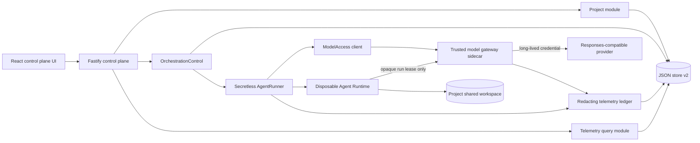

# Implementation Plan: Secretless Multi-Agent Control Plane MVP

> **Status:** design locked; implementation not authorized yet.
>
> **Approval rule:** creating or approving this document does not authorize product-code changes. Before Task 0 starts, the project owner must explicitly say to begin implementation.
>
> **Canonical plan:** this document supersedes the earlier Bouncer-oriented proposal in `implementation.md`.

## 1. Outcome

Extend the Volc Agent Launchpad starter into a Port-inspired Agent control plane while entering the challenge under exactly one primary track: **Kill Switch**.

The MVP protects the long-lived model-provider credential from a compromised Agent Runtime. Provider credentials live only in a trusted gateway sidecar. A disposable Runtime receives a short-lived, run-scoped gateway lease, can reach only that gateway, and is terminated and cleaned up when a Run is killed. Queue orchestration, Agent-to-Agent communication, structured logs, traces, and token usage support and demonstrate that security boundary; they are not separate challenge tracks.

The finished MVP must preserve Agent CRUD, lifecycle operations, Playground chat, persistence, model execution, and session continuation.

## 2. Locked product decisions

| Area | Locked decision | Reason |
| --- | --- | --- |
| Challenge track | Kill Switch only | The official extension guide requires one primary track. |
| Explicit threat | A compromised Runtime reads or exfiltrates the long-lived provider API key | Concrete protected asset and demonstrable abuse case. |
| Protected asset | Long-lived provider credential | It must never enter a workspace, Runtime environment, browser response, log, trace, or screenshot. |
| Primary enforcement | Dedicated model-gateway sidecar plus gateway-only Runtime network | Enforcement sits below Agent prompts and outside the untrusted Runtime. |
| Runtime credential | Opaque, short-lived lease bound to Run, Agent, provider, model, scope, and expiry | Compromise exposes a revocable capability, not the provider credential. |
| Failure policy | Fail closed; never fall back to a direct provider key | Gateway denial or outage cannot weaken the security boundary. |
| Providers | One live Responses-compatible provider, deterministic mock, and configuration-ready additional Responses-compatible providers | Proves multiple-provider architecture without native adapters for every vendor. |
| Project model | A Project groups three role-assigned Agents and owns one shared working directory | Agents can collaborate on the same files without cross-project access. |
| Write permissions | Planner and Reviewer are read-only; Builder is workspace-write | Only one role mutates project files. |
| Orchestration | Fixed persisted FIFO: Planner → Builder → Reviewer | Coherent and demonstrable; no general DAG engine. |
| Agent communication | Persisted, correlated handoff messages plus the Project workspace | Communication is inspectable and bounded; no peer sockets or arbitrary message bus. |
| Concurrency | One stage globally in flight for the MVP | Deterministic ordering and no shared-workspace write races. |
| Retry policy | At most one automatic retry for explicitly transient, side-effect-safe failures | Avoid replaying partially completed Builder mutations. |
| Queue infrastructure | Existing JSON store plus an in-process worker | Small local infrastructure; BullMQ and Temporal are documented future options. |
| Telemetry | OpenTelemetry-shaped structured spans/log records persisted locally | Clear future export seam without adding Kafka or a Collector now. |
| UI | Original dark operational console inspired by Port's information architecture | Resource catalog, operational state, and evidence remain easy to scan. |
| Authentication | Preserve the starter's optional shared control-plane bearer token | SSO and human RBAC are not required to prove credential containment. |
| Agent internet access | No role receives arbitrary egress in the governed profile | Role-based internet exceptions would undermine the chosen threat boundary. |
| Deployment | Local Docker/Colima/Podman is the supported protected path | Matches the judging path and three-day scope. |

## 3. Explicit non-goals

- No second challenge track, production SSO, OAuth, or delegated cloud identity.
- No arbitrary workflow editor, DAG engine, dynamic fan-out, or distributed scheduler.
- No BullMQ, Redis, Temporal, Kafka, RabbitMQ, Postgres, or Kubernetes in the MVP.
- No native Anthropic, Bedrock, Gemini, or provider-specific protocol implementations; additional providers must be Responses-compatible.
- No direct browser configuration of provider URLs or credentials.
- No arbitrary Agent internet access or role-based egress exceptions.
- No raw chain-of-thought, authorization headers, provider bodies, environment dumps, or unredacted secrets in telemetry.
- No claim that ordinary containers provide hardened hostile multi-tenant isolation.
- No ECS work unless the complete local flow is already verified and frozen.

## 4. Architecture

Diagram artifacts: [editable Excalidraw](../docs/agent-control-plane-architecture.excalidraw), [SVG export](../docs/agent-control-plane-architecture.svg), and [PNG preview](../docs/agent-control-plane-architecture.png).



### Trust zones

| Zone | Trust | Contains | Must not contain |
| --- | --- | --- | --- |
| Browser | Untrusted | Safe descriptors, redacted telemetry, control-plane token when configured | Provider keys, gateway leases, gateway admin token |
| Control plane | Trusted coordinator | Domain state, queue, project paths, gateway management client | Provider keys in the protected profile |
| Gateway sidecar | Trusted credential broker | Provider allowlist, provider keys, in-memory lease hashes | Project files, raw Agent history |
| Agent Runtime | Compromisable | Prompt, project mount, sanitized Codex home, run lease | Provider key, control-plane token, gateway admin token, unrelated host environment |
| Data layer | Trusted local state | Domain records and redacted telemetry | Raw leases, provider keys, raw authorization headers |

### Primary request flow

1. The browser submits a direct Playground Run or fixed Project orchestration.
2. Fastify validates the request and calls a domain module; routes do not manipulate queue rows directly.
3. The control plane atomically persists the Run/message/job before returning `202 Accepted`.
4. `ModelAccess.withSession(...)` requests a run-scoped lease from the gateway management interface.
5. `SecretlessRunner` starts the Runtime on an internal network and passes only the gateway URL, selected model, and ephemeral lease.
6. Codex sends Responses-compatible calls to the gateway. The gateway validates the lease, injects the selected provider credential, forwards the request, and returns a sanitized response.
7. Runtime, gateway, queue, and model activity append correlated redacted records with one `traceId`.
8. Completion, failure, cancellation, or timeout revokes the lease in `finally`; cancellation revokes before terminating the Runtime.

### Malicious and recovery flow

1. A controlled malicious Run attempts to read a provider key and contact the provider directly.
2. The key is absent from the environment and workspace; direct egress is unavailable.
3. The operator invokes Kill. The control plane revokes the lease first, terminates the container, and verifies cleanup.
4. A request using the revoked lease receives a sanitized denial without invoking the upstream provider.
5. A later safe Run receives a new lease and succeeds, proving recovery.

## 5. Deep modules and ownership

### `OrchestrationControl`

```ts
interface OrchestrationControl {
  enqueue(input: EnqueueOrchestration): Promise<OrchestrationView>;
  list(query: OrchestrationQuery): Promise<OrchestrationPage>;
  inspect(id: string): Promise<OrchestrationView>;
  cancel(id: string): Promise<OrchestrationView>;
}
```

The implementation hides queue sequencing, atomic claims, the fixed three-stage state machine, Run creation, retry rules, restart reconciliation, handoff messages, and trace correlation. HTTP routes and React code never edit queue state.

### `ModelAccess`

```ts
interface ModelAccess {
  withSession<T>(
    scope: GatewayScope,
    use: (session: RuntimeGatewaySession) => Promise<T>,
  ): Promise<T>;
  revoke(runId: string): Promise<void>;
}
```

`withSession` owns issue/use/revoke sequencing and `finally` cleanup. Its production adapter uses the gateway management interface; tests use an in-memory adapter. The callback receives an ephemeral Runtime configuration, never a provider key.

### `ProviderCatalog`

```ts
interface ProviderCatalog {
  list(): readonly ProviderSummary[];
  resolve(id: string): ResponsesProvider;
}

interface ResponsesProvider {
  respond(request: ResponsesRequest, signal: AbortSignal): Promise<ResponsesReply>;
}
```

The gateway owns this interface. A parameterized HTTP adapter supports allowlisted Responses-compatible providers; a deterministic mock adapter provides reproducible tests and demos. Provider IDs, base URLs, model IDs, and credential environment-variable names come from trusted configuration, never browser input.

### `TelemetryLedger`

```ts
interface TelemetryLedger {
  append(record: TelemetryDraft): Promise<void>;
  inspectRun(runId: string): Promise<RunObservabilityView>;
}
```

The ledger owns redaction, preview limits, ordering, trace correlation, usage aggregation, and persistence. Callers submit structured fields, not preformatted log strings.

### Existing `AgentRunner`

Retain the existing interface as the Runtime seam. Add optional run context additively; a `SecretlessRunner` adapter wraps the existing container implementation and `ModelAccess`. The protected local profile uses only this adapter. Host-process execution remains an explicitly ungoverned developer fallback and is excluded from security claims.

### SOLID application

- **Single responsibility:** orchestration owns progression; gateway owns credentials; Runner owns process lifecycle; telemetry owns evidence and redaction; routes own transport validation.
- **Open/closed:** a configured Responses-compatible provider is added without modifying orchestration or Runtime lifecycle code.
- **Liskov substitution:** real and mock providers satisfy the same normalized response contract; production and in-memory gateway clients satisfy the same `ModelAccess` interface.
- **Interface segregation:** callers learn small use-case interfaces rather than a repository or event-bus façade.
- **Dependency inversion:** domain modules accept the existing Runner and small persistence/model-access interfaces; the composition root selects adapters.

## 6. Proposed folder structure

New code is feature-first. Existing baseline files stay in place until a focused task moves responsibility; there is no big-bang rearrangement.

```text
apps/server/src/
├── app.ts                         # Fastify composition and compatibility routes
├── index.ts                       # process composition root
├── agent-service.ts               # baseline Agent CRUD/Playground façade
├── types.ts                       # additive baseline/domain types
├── modules/
│   ├── projects/
│   │   ├── project-service.ts
│   │   ├── project-workspace.ts
│   │   └── project-routes.ts
│   ├── orchestration/
│   │   ├── orchestration-control.ts
│   │   ├── fixed-pipeline.ts
│   │   ├── retry-policy.ts
│   │   └── orchestration-routes.ts
│   ├── model-access/
│   │   ├── model-access.ts
│   │   └── gateway-client.ts
│   └── telemetry/
│       ├── redactor.ts
│       ├── telemetry-ledger.ts
│       └── telemetry-routes.ts
├── runtime/
│   └── secretless-runner.ts
└── gateway/
    ├── main.ts                    # separate sidecar process entry point
    ├── app.ts
    ├── config.ts                  # only process allowed to read provider keys
    ├── lease-registry.ts
    ├── provider-catalog.ts
    └── providers/
        ├── responses-http-provider.ts
        └── deterministic-mock-provider.ts

apps/web/src/
├── main.tsx
├── app/
│   ├── App.tsx
│   ├── AppShell.tsx
│   ├── routes.tsx
│   └── navigation.ts
├── api/
│   ├── client.ts
│   └── contracts.ts
├── features/
│   ├── projects/
│   ├── agents/
│   ├── providers/
│   ├── orchestrations/
│   ├── runs/
│   └── security/
└── shared/
    ├── ui/
    ├── hooks/
    ├── styles/
    └── utils/
```

Folder rules:

- A feature owns its views, hooks, types, and focused tests.
- `shared/` contains only code used by at least two features.
- Server modules do not import Fastify except their route adapters.
- The gateway never imports Project, orchestration, or browser modules.
- The web app owns transport DTOs; it does not import server persistence types.
- The composition roots construct concrete adapters; modules do not read global environment variables directly.

## 7. Data model and invariants

Migrate the JSON database explicitly from version 1 to version 2 without losing Agents, messages, Runs, thread IDs, or workspaces.

```ts
interface DatabaseV2 {
  version: 2;
  agents: Agent[];
  messages: Message[];
  runs: AgentRun[];
  projects: Project[];
  orchestrations: OrchestrationRecord[];
  queueJobs: QueueJob[];
  handoffMessages: HandoffMessage[];
  telemetry: TelemetryRecord[];
  nextQueueSequence: number;
}
```

Additive correlation fields on existing records:

```ts
projectId?: string;
orchestrationId?: string;
traceId?: string;
stage?: "planner" | "builder" | "reviewer";
attempt?: number;
```

Core invariants:

1. Existing baseline records load unchanged through the v1 → v2 migrator.
2. Project workspaces are owned and archived by Projects, never by an assigned Agent.
3. Planner, Builder, and Reviewer Agent IDs must exist and be distinct.
4. Only one queue job is `running` globally.
5. Queue sequence numbers are assigned inside one `JsonStore.mutate()` call and are monotonic.
6. Planner must complete before Builder is enqueued; Builder must complete before Reviewer is enqueued.
7. Planner and Reviewer use a read-only sandbox; Builder alone uses workspace-write.
8. Every stage produces an ordinary Agent Run and correlated handoff message.
9. Later stages never execute after failure, block, or cancellation.
10. A terminal orchestration cannot return to an active state.
11. A raw lease is never persisted; the gateway stores only a hash and metadata in memory.
12. Provider credentials never enter control-plane state in the protected profile.
13. Every persisted preview/error passes through the redactor first.
14. Cancellation revokes model access before Runtime termination.
15. Gateway denial invokes no provider adapter and has no direct-key fallback.

### Retry matrix

| Failure | Automatic retry | Reason |
| --- | ---: | --- |
| Queue claim interrupted before Runtime launch | Once | No Agent side effect occurred. |
| Gateway unavailable before lease issuance | Once with short backoff | Runtime was not launched. |
| Provider `429`, `502`, `503`, or `504` during Planner/Reviewer | Once | These stages are read-only. |
| Builder Runtime launch fails before process start | Once | Project files are unchanged. |
| Builder fails after process start | No | File mutations may be partial; require a new explicit Run. |
| Policy/security denial, invalid lease, or revoked lease | No | Retrying would bypass an intentional control. |
| Invalid input or unknown provider | No | Deterministic caller error. |

On process restart, queued jobs remain queued. Any running job becomes failed with `interrupted_by_restart`; the associated Agent returns to a safe non-busy state, and all old gateway leases are invalid because the registry is in memory and leases expire.

## 8. Gateway and Runtime security contract

### Gateway interfaces

Private management interface, reachable only by the control plane:

```text
POST /internal/leases
POST /internal/leases/:id/revocations
GET  /internal/health
```

Runtime data plane, reachable only on the internal Runtime network:

```text
POST /p/:providerId/v1/responses
Authorization: Bearer <opaque run lease>
```

The management interface requires a distinct gateway-admin capability. That capability is never supplied to the Runtime. The provider key exists only in the gateway process environment.

Lease metadata:

```ts
interface LeaseScope {
  leaseId: string;
  runId: string;
  agentId: string;
  projectId?: string;
  orchestrationId?: string;
  providerId: string;
  model: string;
  scope: "responses:create";
  expiresAt: string;
}
```

Runtime environment allowlist:

```text
MODEL_GATEWAY_URL
MODEL_GATEWAY_TOKEN
MODEL_ID
CODEX_HOME
HOME
PATH
LANG
NO_COLOR
```

The protected path must explicitly omit provider keys, `APP_AUTH_TOKEN`, gateway-admin credentials, cloud credentials, inherited proxy credentials, and unrelated host variables.

Network layout:

```text
Runtime ── internal network ── Gateway ── egress network ── Provider
   X────────────── direct public internet / provider ─────────────X
```

The Runtime receives only its Project workspace and sanitized per-Agent Codex state. The gateway receives neither workspace mount.

## 9. Orchestration and Agent communication

Each Project stores three role assignments:

```ts
interface ProjectRoles {
  plannerAgentId: string;
  builderAgentId: string;
  reviewerAgentId: string;
}
```

The fixed pipeline is:

```text
User task
  → Planner: produce bounded implementation plan
  → Builder: receive original task + Planner handoff; modify Project workspace
  → Reviewer: receive original task + plan + Builder summary; inspect workspace read-only
  → final orchestration result
```

Handoff messages are persisted records with sender, recipient, stage, correlation IDs, content type, bounded redacted content, and timestamp. They are not raw chain-of-thought. Large binary files are shared through the Project workspace, not embedded in messages.

Queue behavior:

- Global FIFO by persisted sequence.
- One orchestration completes its fixed stages before the next begins.
- Idempotent submission accepts an optional `Idempotency-Key`; a duplicate returns the original orchestration.
- Stage completion is accepted once; duplicate completion is a no-op.
- Cancellation marks pending stages cancelled and revokes the active stage before stopping it.
- Queue limits return `429` before creating partial records.

## 10. Observability contract

The MVP records complete structured lifecycle evidence within a deliberately safe capture boundary. “Full logs” does not mean raw prompts, raw provider payloads, environment dumps, or chain-of-thought.

Span kinds:

```text
orchestration
queue.wait
stage.planner | stage.builder | stage.reviewer
runtime.launch | runtime.execute | runtime.cleanup
gateway.lease | gateway.request | gateway.revoke
provider.responses
security.deny | security.kill
```

Every record includes stable IDs, timestamp, status, duration when complete, project/orchestration/run/Agent correlation when applicable, retry attempt, safe error code, and a redacted preview. Provider spans include available input, cached-input, and output token usage.

Capture limits:

- Maximum 2 KiB redacted preview per record.
- Maximum 500 telemetry records per Run.
- Existing final Agent output remains governed by the baseline model; telemetry stores only a preview.
- Sensitive key names and configured secret values are redacted before persistence and before logger output.
- The API never returns the raw lease, its hash, a provider key, or gateway-admin material.

Future export must occur behind the ledger implementation, preferably through OTLP/OpenTelemetry Collector. Application modules will not write directly to Kafka.

## 11. Public HTTP interface

All existing routes remain compatible. New endpoints use Zod validation and preserve the current `{ "error": string }` shape while adding optional `code`, `details`, and `requestId` fields.

```text
GET    /api/projects
POST   /api/projects
GET    /api/projects/:id
PATCH  /api/projects/:id

GET    /api/providers

GET    /api/orchestrations?projectId=&status=&cursor=&limit=
POST   /api/orchestrations
GET    /api/orchestrations/:id
POST   /api/orchestrations/:id/cancellations
GET    /api/orchestrations/:id/messages

GET    /api/runs?projectId=&orchestrationId=&agentId=&status=&cursor=&limit=
GET    /api/runs/:id
GET    /api/runs/:id/observability
POST   /api/runs/:id/cancellations

GET    /api/security/posture
```

Example orchestration request:

```json
{
  "projectId": "project-uuid",
  "prompt": "Implement and review the requested change.",
  "providerId": "ark"
}
```

`202 Accepted` is returned only after the orchestration, first queue job, correlation IDs, and initial message are durably persisted.

Stable new error codes include:

```text
INVALID_INPUT
PROJECT_NOT_FOUND
ROLE_ASSIGNMENT_INVALID
QUEUE_FULL
PROVIDER_NOT_FOUND
GATEWAY_UNAVAILABLE
LEASE_INVALID
LEASE_REVOKED
PROVIDER_RATE_LIMITED
PROVIDER_UNAVAILABLE
RUNTIME_TIMEOUT
RUN_TERMINAL
```

## 12. Frontend design

### Information architecture

The application uses a compact global rail and domain navigation with these destinations:

1. Projects
2. Agents
3. Providers
4. Orchestrations
5. Runs
6. Security

The existing Agent Playground remains reachable from Agent detail; it is not rebuilt.

### Visual direction

- Graphite/cool-gray surfaces with restrained cyan for active state and amber/red for security attention.
- Dense catalog tables for scanability; cards only for workflow templates, health summaries, and security posture.
- A persistent right-side Run Inspector replaces a generic assistant panel.
- The signature element is a vertical **Security Envelope** rail showing Workspace → Runtime → Lease → Gateway → Provider state.
- Motion is limited to status transitions, queue progress, and inspector entry; reduced-motion preferences are honored.

### Required views

- **Projects:** catalog, shared-workspace status, three role assignments, latest orchestration.
- **Agents:** existing lifecycle and Playground plus Project/role metadata.
- **Providers:** safe descriptor, health, model, protocol, and `gateway-managed` credential mode—never credential values.
- **Orchestrations:** FIFO position, fixed stage strip, retry count, inter-Agent messages, cancel/Kill action.
- **Runs:** filterable table and Inspector tabs for Overview, Trace, Logs, Usage, and Security.
- **Security:** protected asset statement, active controls, gateway status, recent denies/kills, and a controlled-demo guide.

### UI engineering rules

- Server state uses one query/polling abstraction; no duplicated fetch loops per page.
- URL search parameters own table filters, selection, and pagination.
- Local React state owns transient UI only.
- Every page implements loading, empty, error, permission-denied, and degraded states.
- WCAG AA contrast, visible focus, semantic tables, keyboard-operable controls, one `h1` per route, and reduced motion are required.
- Responsive checkpoints: 320, 768, 1024, and 1440 px.
- Avoid generic component abstractions until at least two features need them.

## 13. Platform and middleware requirement mapping

| Requirement | Planned evidence |
| --- | --- |
| Preserve baseline | Baseline tests remain green; existing routes and Playground remain functional. |
| Real backend behavior | Fastify delegates to Project, orchestration, model-access, and telemetry modules. |
| Real Runtime behavior | Container receives a lease instead of a provider key and is terminated by the Kill path. |
| Real data behavior | Queue, messages, correlation, spans, usage, and recovery state persist in JSON v2. |
| Real infrastructure behavior | Runtime and gateway use separate networks and process environments. |
| Defined ownership | Module interfaces, trust zones, data crossings, and failure modes are explicit above. |
| Success evidence | A real safe Run reaches the configured provider and records a complete correlated trace. |
| Abuse evidence | Direct egress/key theft attempt fails; lease is revoked; Runtime is removed. |
| Recovery evidence | A later safe Run obtains a new lease and succeeds. |
| Automated verification | Interface, integration, negative, cleanup, migration, and secret-sweep tests are required. |
| Keep secrets out | Runtime allowlist, gateway-only provider config, pre-persistence redaction, and secret sweeps. |
| Small infrastructure | Node processes, local containers, and existing JSON persistence only. |

## 14. Implementation tasks

Each task is intended for one focused implementation session and should leave the repository buildable. The checklist mirror is in `tasks/todo.md`.

### Task 0: Baseline proof and contract freeze

**Description:** Record the untouched baseline behavior, confirm the protected container path, and turn this plan's contracts into the implementation gate.

**Acceptance criteria:**

- Baseline CRUD, lifecycle, Playground, follow-up session, and workspace persistence are exercised.
- `npm run check` passes before product changes.
- No implementation proceeds until the owner explicitly approves this plan.

**Verification:** `npm run check`; manual baseline acceptance journey.

**Dependencies:** None.

**Files likely touched:** `docs/DEVIATIONS.md`, `tasks/todo.md`.

**Estimated scope:** Small.

### Task 1: Add lossless database v2 migration

**Description:** Add Project, orchestration, queue, handoff, and telemetry collections while preserving all version-1 records.

**Acceptance criteria:**

- Version-1 fixtures migrate deterministically to version 2.
- Existing Agents, Runs, messages, thread IDs, and paths are unchanged.
- Unsupported/corrupt formats fail with a useful error and do not overwrite the file.

**Verification:** focused store migration tests; `npm run typecheck`.

**Dependencies:** Task 0.

**Files likely touched:** `apps/server/src/types.ts`, `apps/server/src/store.ts`, `apps/server/src/store.test.ts`.

**Estimated scope:** Medium.

### Task 2: Add the redacting telemetry ledger

**Description:** Implement structured append/query behavior with redaction and capture limits before any gateway logging exists.

**Acceptance criteria:**

- Key-named fields, authorization material, configured secret values, and lease-shaped values are redacted.
- Preview and record-count limits are enforced centrally.
- Records retain stable chronological and trace ordering.

**Verification:** focused redactor/ledger tests including nested payloads and substring secrets.

**Dependencies:** Task 1.

**Files likely touched:** `modules/telemetry/redactor.ts`, `modules/telemetry/telemetry-ledger.ts`, `modules/telemetry/redactor.test.ts`, `modules/telemetry/telemetry-ledger.test.ts`.

**Estimated scope:** Medium.

### Task 3: Build the gateway with deterministic mock provider

**Description:** Start the sidecar as a separate process with health, allowlisted provider resolution, bounded requests, and a deterministic Responses-compatible mock.

**Acceptance criteria:**

- The mock returns deterministic output and token usage.
- Unknown providers and arbitrary URLs fail closed.
- Gateway logs contain only redacted structured fields.

**Verification:** gateway HTTP tests; production TypeScript build.

**Dependencies:** Task 2.

**Files likely touched:** `gateway/main.ts`, `gateway/app.ts`, `gateway/provider-catalog.ts`, `gateway/providers/deterministic-mock-provider.ts`, `gateway/app.test.ts`.

**Estimated scope:** Medium.

### Task 4: Implement opaque lease issue, validation, and revocation

**Description:** Add an in-memory hashed lease registry and authenticated management endpoints.

**Acceptance criteria:**

- Leases are bound to Run, Agent, provider, model, scope, and expiry.
- Wrong, expired, mismatched, or revoked leases are denied before provider invocation.
- Raw leases are neither persisted nor logged.

**Verification:** lease contract tests prove denied calls result in zero provider calls.

**Dependencies:** Task 3.

**Files likely touched:** `gateway/lease-registry.ts`, `gateway/app.ts`, `gateway/config.ts`, `gateway/lease-registry.test.ts`, `gateway/app.test.ts`.

**Estimated scope:** Medium.

### Task 5: Add the control-plane `ModelAccess` adapter

**Description:** Hide management HTTP, session issuance, normalized failures, and guaranteed revocation behind the deep model-access interface.

**Acceptance criteria:**

- `withSession` revokes in success, failure, timeout, and thrown-callback paths.
- `revoke(runId)` is idempotent.
- Gateway unavailability returns a stable fail-closed error and never produces direct provider configuration.

**Verification:** interface tests with an in-memory gateway plus management HTTP contract test.

**Dependencies:** Task 4.

**Files likely touched:** `modules/model-access/model-access.ts`, `modules/model-access/gateway-client.ts`, `modules/model-access/model-access.test.ts`, `modules/model-access/gateway-client.test.ts`.

**Estimated scope:** Medium.

### Task 6: Make the local Runtime secretless and gateway-only

**Description:** Wrap the container Runner, generate Codex gateway configuration, allowlist environment variables, and place Runtime/Gateway on the protected network topology.

**Acceptance criteria:**

- Container argv, environment, mounts, workspace, and Codex config contain no provider key.
- The Runtime can reach the mock gateway but cannot reach a direct external test endpoint.
- Baseline container limits and cleanup behavior remain intact.

**Verification:** container-argument unit tests and a local protected-network integration test.

**Dependencies:** Task 5.

**Files likely touched:** `runtime/secretless-runner.ts`, `container-codex-runner.ts`, `container-codex-runner.test.ts`, `config.ts`, `docker-compose.yml`.

**Estimated scope:** Medium.

### Task 7: Add a live Responses-compatible provider adapter

**Description:** Forward one configured provider through the gateway and make additional Responses-compatible provider descriptors configuration-ready.

**Acceptance criteria:**

- Only the gateway process reads provider credentials.
- Streaming/non-streaming behavior required by Codex is normalized and bounded.
- Provider errors expose stable safe codes and available token usage, never raw sensitive bodies.

**Verification:** mocked-fetch contract tests; one manual live smoke test through Codex → gateway → provider.

**Dependencies:** Task 6.

**Files likely touched:** `gateway/providers/responses-http-provider.ts`, `gateway/provider-catalog.ts`, `gateway/config.ts`, `gateway/providers/responses-http-provider.test.ts`.

**Estimated scope:** Medium.

### Security checkpoint: Tasks 0–7

- `npm run check` passes.
- A real safe container Run succeeds through the gateway.
- No provider credential is present in the Runtime, workspace, API, telemetry, or browser.
- Gateway down/denied means no Runtime fallback and no provider call.
- The owner reviews the checkpoint before orchestration work begins.

### Task 8: Implement Kill, revocation, cleanup, and safe recovery

**Description:** Integrate revoke-first cancellation with Runtime termination and security telemetry.

**Acceptance criteria:**

- Kill revokes the active lease before stopping/removing the Runtime.
- A revoked lease cannot invoke a provider; cleanup outcome is observable.
- A new safe Run after containment succeeds with a new lease.

**Verification:** negative integration test plus the controlled malicious/recovery demo.

**Dependencies:** Security checkpoint.

**Files likely touched:** `agent-service.ts`, `runtime/secretless-runner.ts`, `modules/model-access/model-access.ts`, `agent-service.test.ts`, `runtime/secretless-runner.test.ts`.

**Estimated scope:** Medium.

### Task 9: Add Projects and shared workspace ownership

**Description:** Add Project CRUD, role assignments, and a Project-owned shared directory without changing standalone Agent workspaces.

**Acceptance criteria:**

- Role assignments reference three distinct existing Agents.
- Project paths cannot escape the configured root; Project archive owns shared-workspace cleanup.
- Workflow execution can select the Project workspace while direct Playground uses the Agent workspace.

**Verification:** Project module and path-containment tests; one API integration test.

**Dependencies:** Task 1, Task 8.

**Files likely touched:** `modules/projects/project-service.ts`, `modules/projects/project-workspace.ts`, `modules/projects/project-routes.ts`, `modules/projects/project-service.test.ts`, `app.ts`.

**Estimated scope:** Medium.

### Task 10: Admit persisted FIFO orchestrations

**Description:** Implement idempotent submission, monotonic sequence allocation, queue limits, and one global atomic claim.

**Acceptance criteria:**

- `202` occurs only after orchestration, first job, message, and trace IDs persist.
- Duplicate idempotency keys return the original record.
- Concurrent submissions claim exactly one lowest-sequence job.

**Verification:** concurrency, idempotency, and restart tests through `OrchestrationControl`.

**Dependencies:** Task 9.

**Files likely touched:** `modules/orchestration/orchestration-control.ts`, `modules/orchestration/orchestration-routes.ts`, `modules/orchestration/orchestration-control.test.ts`, `types.ts`, `app.ts`.

**Estimated scope:** Medium.

### Task 11: Execute Planner → Builder → Reviewer

**Description:** Add the fixed stage state machine, role-specific sandbox permissions, shared workspace selection, and bounded handoff messages.

**Acceptance criteria:**

- Stage order is immutable and each stage creates a correlated ordinary Agent Run.
- Planner/Reviewer are read-only; Builder is the sole workspace writer.
- Failure, block, or cancellation prevents every later stage.

**Verification:** fake-Runner state-machine tests and one mock-provider end-to-end orchestration.

**Dependencies:** Task 10.

**Files likely touched:** `modules/orchestration/fixed-pipeline.ts`, `modules/orchestration/orchestration-control.ts`, `modules/orchestration/fixed-pipeline.test.ts`, `agent-service.ts`, `types.ts`.

**Estimated scope:** Medium.

### Task 12: Add safe retries and restart reconciliation

**Description:** Encode the locked retry matrix, backoff, attempt IDs, stale-job recovery, and duplicate-completion protection.

**Acceptance criteria:**

- Only enumerated transient, side-effect-safe failures retry once.
- Builder never automatically replays after process start.
- Restart preserves queued work and terminally reconciles in-flight work without duplicates.

**Verification:** table-driven retry tests and process-restart fixture tests.

**Dependencies:** Task 11.

**Files likely touched:** `modules/orchestration/retry-policy.ts`, `modules/orchestration/orchestration-control.ts`, `modules/orchestration/retry-policy.test.ts`, `modules/orchestration/orchestration-control.test.ts`.

**Estimated scope:** Medium.

### Orchestration checkpoint: Tasks 8–12

- Two workflows execute in strict FIFO order.
- Planner, Builder, and Reviewer use the assigned Agents and one Project workspace.
- Handoff messages, Runs, attempts, and trace IDs correlate correctly.
- Cancellation, safe retry, and restart behaviors match the documented matrix.
- `npm run check` passes.

### Task 13: Expose provider and Project catalog views end to end

**Description:** Add safe provider descriptors and Project catalog data through the API and initial frontend feature modules.

**Acceptance criteria:**

- Browser responses include health/model/credential mode but no keys, URLs that permit proxy abuse, or leases.
- Projects show role assignments and workspace status.
- Loading, empty, error, and degraded states render correctly.

**Verification:** route response tests and web typecheck/build.

**Dependencies:** Task 9, Task 12.

**Files likely touched:** `app/AppShell.tsx`, `features/projects/ProjectsPage.tsx`, `features/providers/ProvidersPage.tsx`, `api/contracts.ts`, `api/client.ts`.

**Estimated scope:** Medium.

### Task 14: Add the Port-inspired application shell

**Description:** Split the monolithic frontend incrementally into routing, navigation, tokens, and reusable shell primitives while preserving the Playground.

**Acceptance criteria:**

- All six destinations are keyboard reachable and deep-linkable.
- Existing Agent CRUD, lifecycle, and Playground behavior remains available.
- Layout passes the four responsive checkpoints and reduced-motion behavior.

**Verification:** web typecheck/build and manual keyboard/responsive audit.

**Dependencies:** Task 13.

**Files likely touched:** `app/App.tsx`, `app/AppShell.tsx`, `app/routes.tsx`, `app/navigation.ts`, `shared/styles/tokens.css`.

**Estimated scope:** Medium.

### Task 15: Add Orchestrations and Agent communication UI

**Description:** Add submission, FIFO queue, stage strip, correlated messages, retry state, and Kill controls.

**Acceptance criteria:**

- Queue position and Planner → Builder → Reviewer progress reflect backend state only.
- Handoff messages identify sender, recipient, stage, and correlation.
- Kill is clearly destructive, idempotent, and reports revoke/cleanup outcome.

**Verification:** API integration test; web build; manual mock-provider flow.

**Dependencies:** Task 12, Task 14.

**Files likely touched:** `features/orchestrations/OrchestrationsPage.tsx`, `features/orchestrations/OrchestrationDetail.tsx`, `features/orchestrations/StageStrip.tsx`, `features/orchestrations/HandoffTimeline.tsx`, `features/orchestrations/hooks.ts`.

**Estimated scope:** Medium.

### Task 16: Add Run Inspector and Security views

**Description:** Expose redacted traces, logs, token usage, security-envelope state, and denial/cleanup evidence.

**Acceptance criteria:**

- Inspector tabs show correlated status, duration, error code, retry attempt, and available usage.
- Security Envelope shows Workspace → Runtime → Lease → Gateway → Provider state.
- No response or rendered view contains configured secrets or raw leases.

**Verification:** telemetry route tests, secret sweep, web build, manual successful and denied Runs.

**Dependencies:** Task 2, Task 8, Task 14.

**Files likely touched:** `modules/telemetry/telemetry-routes.ts`, `features/runs/RunInspector.tsx`, `features/runs/TraceView.tsx`, `features/runs/UsageView.tsx`, `features/security/SecurityPage.tsx`.

**Estimated scope:** Medium.

### Task 17: Harden, document, and rehearse

**Description:** Finish failure handling, architecture docs, one-command startup, evidence tests, and the three-minute demonstration.

**Acceptance criteria:**

- README names Kill Switch as the sole track and explains setup, threat, controls, evidence, limitations, and provider configuration.
- Architecture diagram shows trust boundaries, data flow, enforcement, instrumentation, failure, and recovery.
- Two consecutive demo rehearsals complete under three minutes with no secret exposure.

**Verification:** `npm run check`; secret scan of source/config/generated telemetry; complete documented local setup from a clean data root.

**Dependencies:** Tasks 15–16.

**Files likely touched:** `README.md`, `docs/MIDDLEWARE.md`, `docs/DEMO.md`, `scripts/start-local-poc.sh`, `SECURITY.md`.

**Estimated scope:** Medium.

### Final checkpoint

- Baseline acceptance journey passes.
- Protected safe Run passes through the real provider.
- Controlled malicious Run is blocked/terminated, credential remains protected, and cleanup is visible.
- Safe recovery Run succeeds.
- Fixed multi-Agent orchestration, messages, queue, retries, traces, logs, and usage are functional—not static.
- `npm run check` passes.
- Repository, logs, traces, browser state, screenshots, and demo output contain no secret.
- Reviewer can reproduce the POC from the README.

## 15. Verification strategy

### Interface tests

- `OrchestrationControl`: FIFO, state order, idempotency, cancellation, retries, restart.
- `ModelAccess`: issue/use/revoke, fail closed, `finally`, normalized errors.
- `ProviderCatalog`: allowlist only; real and mock contract equivalence.
- `TelemetryLedger`: redaction, bounds, ordering, usage aggregation.
- Project module: role assignments, shared-path containment, archive ownership.

### Integration tests

- Control plane → gateway management interface.
- Runtime → mock gateway on the internal network.
- Runtime cannot use a direct external endpoint.
- Revoke-first cancellation denies the old lease and removes the Runtime.
- Complete mock orchestration produces correlated Runs/messages/spans.
- One live Codex → gateway → configured provider smoke test outside the default automated suite.

### Regression tests

- Existing AgentService, app, store, Codex runner, and container runner suites.
- Existing `npm run check` remains the phase gate.
- Manual baseline follow-up confirms saved Codex thread continuation.

### Secret verification

- Assert generated container args/environment do not contain configured provider credentials.
- Assert persisted database and telemetry do not contain provider credentials, leases, gateway-admin material, or authorization headers.
- Assert public API snapshots and frontend fixtures are clean.
- Scan source and committed documentation for credential-shaped values before demo freeze.

## 16. Three-minute demo

1. Open the Project catalog, select a configured Project, and show Planner/Builder/Reviewer assignments plus gateway-managed providers.
2. Submit a safe orchestration. Show FIFO admission and the fixed stage progression against the shared Project workspace.
3. Open Run Inspector and show correlated Runtime/gateway/provider spans, redacted logs, duration, and token usage.
4. Launch the controlled malicious case: attempt to find the provider credential and contact the provider directly.
5. Invoke Kill. Show lease revocation, provider denial, Runtime termination, cleanup, and the protected credential remaining absent.
6. Start a new safe Run and show successful recovery, leaving the platform understandable and controllable.

## 17. Risks and mitigations

| Risk | Impact | Mitigation / gate |
| --- | --- | --- |
| Codex cannot use the gateway's Responses behavior transparently | High | Task 6–7 real smoke test is the first security checkpoint; stop and quarantine orchestration scope if it fails. |
| Container networking differs across Docker, Colima, and Podman | High | Support and document one proven protected path first; make network names configurable; test the selected judge machine. |
| Sidecar separation exists in code but key still reaches control plane | High | Separate gateway process environment and config loader; automated environment/argv/API secret assertions. |
| Retried Builder duplicates file changes | High | No retry after Builder process start; retry only pre-launch failures. |
| Project workspace creates write races | Medium | One global stage in flight; Planner/Reviewer read-only; Builder sole writer. |
| Queue/store state diverges on restart | Medium | One authoritative JSON mutation path and explicit reconciliation tests. |
| “Full logs” leaks sensitive payloads | High | Structured fields, pre-persistence redaction, strict limits, no raw CoT/provider bodies. |
| Additional UI obscures the baseline Playground | Medium | Preserve Agent detail/Playground route and verify baseline at every checkpoint. |
| Multiple-provider claim exceeds implemented behavior | Medium | Claim Responses-compatible provider catalog: one live, one deterministic mock, additional config-ready; document native protocols as out of scope. |
| Three-day scope slips | High | Security checkpoint first; stop UI polish before cutting Kill Switch evidence or tests. |

## 18. Parallel execution after approval

Contract changes and database migration are sequential. After Task 1, the following lanes can proceed with coordination at the named interfaces:

- **Security lane:** Tasks 2–8.
- **Project/orchestration lane:** Tasks 9–12 after the security checkpoint.
- **Frontend lane:** shell/token exploration may begin after contracts freeze, but live feature integration waits for the relevant route contracts.
- **Verification/docs lane:** test fixtures, diagram maintenance, secret-sweep procedure, and demo script can run alongside completed slices.

Only one owner changes `types.ts`, `app.ts`, `agent-service.ts`, or `App.tsx` at a time. Interface changes require an updated plan and owner approval before dependent work continues.

## 19. Approval gate

There are no intentionally open design branches in this MVP. Any requested change to the primary threat, trust boundary, Project workspace semantics, provider protocol, queue infrastructure, or fixed stage topology reopens planning.

Implementation begins only after the project owner reviews this document and explicitly authorizes it.
